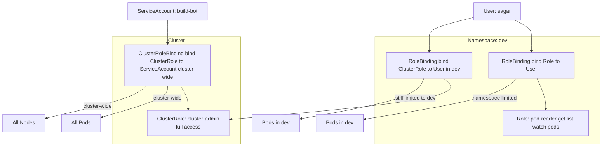

## Controlling access to Kubernetes API


Kubernetes [authorization](https://kubernetes.io/docs/reference/access-authn-authz/authorization/) takes place following authentication.

# Authorization modes 
```
1. AlwaysAllow → every request allowed (testing only).
2. AlwaysDeny → every request denied (testing only).
3. ABAC → Attribute-Based Access Control (legacy).
4. RBAC → Role-Based Access Control (most common in prod).
5. Node → kubelet authorizations to API server.
6. Webhook → delegate to external service (OPA, SSO, custom APIs).
```

# Using [RBAC](https://kubernetes.io/docs/reference/access-authn-authz/rbac/) Authorization
To enable RBAC, start the API server with the --authorization-mode flag set to a comma-separated list that includes RBAC; for example:
```
kube-apiserver --authorization-mode=Example,RBAC
```

RBAC helps with: [Who (Subject) can do What (Verb) on Which (Resource)]
1. Establishing a system for <b>users with different roles</b> to access a set of Kubernetes resources.
2. Controlling </b>processes running in a pod and the operations</b> they can perform via Kubernetes API.
3. Limiting the visibility of certain resources per namespace
   
RBAC consists of three key building blocks.
1. Subject: Users, Groups, ServiceAccounts
2. API Resources: Pod, Deployment, Node, etc
3. Operations/Verbs: Create, List, Watch, Delete, etc

# Creating a subject: 
  ### User/Groups
- Kubernetes doesn't represent a user/group as with an API resource. They are meant to be managed by the Admin which then distributes the credentials to the real identity.
- Follow [this process](https://github.com/Sagar2366/LearnWithSagar/blob/main/CKA/9_authentication_in_kubernetes.md) to create a user that uses an OpenSSL client certificate to authenticate.
  ```
  mkdir cert && cd cert
  openssl genrsa -out sagar.key 2048
  openssl req -new -key sagar.key -out sagar.csr -subj "/CN=sagar/O=SRE"
  openssl x509 -req -in sagar.csr -CA /etc/kubernetes/pki/ca.crt -CAkey /etc/kubernetes/pki/ca.key -CAcreateserial -out sagar.crt -days 365
  kubectl config set-credentials sagar --client-certificate=sagar.crt --client-key=sagar.key
  kubectl config set-context sagar-context --cluster=<<replace-cluster-name>> --user=sagar
  kubectl config use-context sagar-context
  kubectl config current-context
  ```
  
  ### [ServiceAccounts](https://kubernetes.io/docs/concepts/security/service-accounts):
    - A service account is a type of non-human account that, in Kubernetes, provides a distinct identity in a Kubernetes cluster.
    - Application Pods, system components, and entities inside and outside the cluster can use a specific ServiceAccount's credentials to identify as that ServiceAccount. 
    - Some service application running inside of a pod need to interact with the Kubernetes cluster by making request to the API server.
    - Kubernetes uses serviceaccount to authenticate service process with API server thorugh authentication bearer token.
    - Bearer tokens are mounted into pods at well-known locations, and allow in-cluster processes to talk to the API server.
    - Accounts may be explicitly associated with pods using the <b>serviceAccountName</b> field of a PodSpec.
    - This SA token can be assigned to a pod and mapped to RBAC rules.
 
    ### How to use service accounts
    1. Create a ServiceAccount object using a Kubernetes client like kubectl or a manifest that defines the object.
    2. Grant permissions to the ServiceAccount object using an authorization mechanism such as RBAC.
    3. Assign the ServiceAccount object to Pods during Pod creation.
     ```
      kubectl create serviceaccount build-bot
      kubectl create token build-bot
      kubectl get secrets
      kubectl get serviceaccounts
      kubectl describe serviceaccount build-bot
      kubectl run build-observer --image=alpine --restart=Never --serviceaccount=build-bot
    ```
     

  ### Understanding ServiceAccount Token Generation and Authorization
  ```mermaid
    flowchart TD
    P[Pod with serviceAccountName] --> SA[ServiceAccount object in namespace]
    SA --> ST[Secret or Token request API]
    ST --> T[Token generated for ServiceAccount]
    T --> M[Token mounted into Pod filesystem at /var/run/secrets/kubernetes.io/serviceaccount]
    M --> R[Pod process sends API request to kube-apiserver with Bearer token]
    R --> KAS[Kube API Server]

    KAS -->|Token verified against ServiceAccount and bound Role/ClusterRole| AUTHZ[Authorization Check]

    AUTHZ -->|Allowed| OK[Request succeeds]
    AUTHZ -->|Denied| FAIL[Request fails with 403 Forbidden]
   ```
# Understanding [RBAC API Primitives](https://kubernetes.io/docs/reference/access-authn-authz/rbac/)
The RBAC API declares four kinds of Kubernetes object: Role, ClusterRole, RoleBinding and ClusterRoleBinding. 
## Role and ClusterRole
- An RBAC Role or ClusterRole contains rules that represent a set of permissions. 
- Permissions are purely additive (there are no "deny" rules).
- A Role always sets permissions within a particular namespace; when you create a Role, you have to specify the namespace it belongs in.
- ClusterRole, by contrast, is a non-namespaced resource.
  <b>If you want to define a role within a namespace, use a Role; if you want to define a role cluster-wide, use a ClusterRole.</b>

## RoleBinding and ClusterRoleBinding
- A role binding grants the permissions defined in a role to a user or set of users. 
- It holds a list of subjects (users, groups, or service accounts), and a reference to the role being granted.
- A RoleBinding grants permissions within a specific namespace whereas a ClusterRoleBinding grants that access cluster-wide.
- A RoleBinding may reference any Role in the same namespace.
- <b>Alternatively, a RoleBinding can reference a ClusterRole and bind that ClusterRole to the namespace of the RoleBinding. If you want to bind a ClusterRole to all the namespaces in your cluster, you use a ClusterRoleBinding.</b>
- ClusterRoles are cluster-scoped, you can also use them to grant access to: cluster-scoped resources (like nodes), non-resource endpoints (like /healthz), namespaced resources (like Pods), across all namespaces.


### Kubernetes defines a set of [default user-facing roles](https://kubernetes.io/docs/reference/access-authn-authz/rbac/#user-facing-roles): cluster-admin, admin, edit, view and [core-component roles](https://kubernetes.io/docs/reference/access-authn-authz/rbac/#core-component-roles).

1. Roles management
   ```
   kubectl create role pod-reader --verb=get --verb=list,watch --resource=pods
   kubectl create role read-only --verb=listmget,watch --resource=pods,deployments,services
   kubectl get roles
   kubectl describe role pod-reader,read-only
   
   Extra Examples:
   kubectl create role pod-reader --verb=get --resource=pods --resource-name=readablepod --resource-name=anotherpod
   kubectl create role foo --verb=get,list,watch --resource=replicasets.apps
   kubectl create role foo --verb=get,list,watch --resource=pods,pods/status
   kubectl create role my-component-lease-holder --verb=get,list,watch,update --resource=pods --resource-name=my-component
   ```
2. Rolebindings
   ```
   kubectl create rolebinding read-only-binding --role=read-only --user=sagar
   kubectl get rolebindings
   kubectl describe rolebinding read-only-binding

   Practical:
   kubectl config current-context
   kubectl create deployment myapp --image=nginx --port --replicas=2
   kubectl config use-context sagar-context
   kubectl get deployments
   kubectl get replicasets
   kubectl delete deployment myapp
   

   Extra Examples:
   kubectl create rolebinding admin-binding --clusterrole=admin --user=bob --namespace=acme
   kubectl create rolebinding myapp-view-binding --clusterrole=view --serviceaccount=acme:myapp --namespace=acme
   
   ```
   
3. [Checking API access](https://kubernetes.io/docs/reference/access-authn-authz/authorization/#checking-api-access)
```
kubectl auth can-i list pods --as sagar
kubectl auth can-i create deployments --namespace dev
kubectl auth can-i create deployments --namespace prod
kubectl auth can-i list pods \
    --namespace target \
    --as system:serviceaccount:dev:dev-sa
```

4. ClusterRole
   ```
   kubectl create clusterrole pod-reader --verb=get,list,watch --resource=pods
   kubectl get clusterrole
   kubectl describe clusterrole pod-reader

   Extra Examples:
   kubectl create clusterrole foo --verb=get,list,watch --resource=replicasets.apps
   kubectl create clusterrole pod-reader --verb=get --resource=pods --resource-name=readablepod --resource-name=anotherpod
   kubectl create clusterrole "foo" --verb=get --non-resource-url=/logs/*
   kubectl create clusterrole foo --verb=get,list,watch --resource=pods,pods/status
   ```
5. ClusterRoleBinding
   ```
   kubectl create clusterrolebinding root-cluster-admin-binding --clusterrole=cluster-admin --user=sagar
   kubectl create clusterrolebinding myapp-view-binding --clusterrole=view --serviceaccount=acme:myapp
   ```


# Limitations of RBAC
1. Roles and RoleBindings must exist in the same namespace.
2. RoleBindings can exist in separate namespaces to Service Accounts.
3. RoleBindings can link ClusterRoles, but they only grant access to the namespace of the RoleBinding.
4. ClusterRoleBindings link accounts to ClusterRoles and grant access across all resources.
5. ClusterRoleBindings can not reference Roles.

[Command line utilities](https://kubernetes.io/docs/reference/access-authn-authz/rbac/#command-line-utilities)

