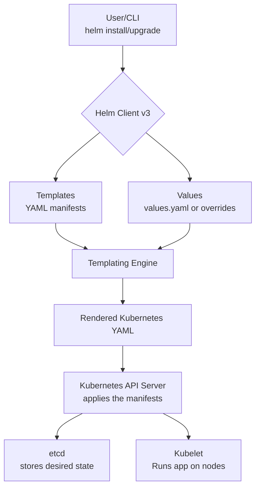

### What is Helm

  * **What is Helm?**

      * Helm is the **package manager for Kubernetes**.
      * Think of it like `apt` for Debian/Ubuntu, `yum` for CentOS, or `Homebrew` for macOS.
      * It bundles complex Kubernetes applications into single, manageable packages called **Charts**.

  * **Core Terminology**

      * **Chart**: A package of pre-configured Kubernetes resource templates. It's the application's blueprint.
      * **Release**: An instance of a Chart deployed into a Kubernetes cluster. You can deploy the same chart multiple times with different configurations (e.g., `prod-db` and `staging-db`).
      * **Repository**: A location where Charts are stored and can be shared.

  * **Why Helm**

      * **Speed & Efficiency**: The exam is timed. Installing or upgrading a complex app with a single `helm` command is much faster than applying 10 separate YAML files with `kubectl`.
      * **Application Lifecycle Management**: CKA tests your ability to manage applications. Helm is a primary tool for **installing, upgrading, rolling back, and deleting** applications.

-----

## Helm v3 High-Level Architecture

    
### Helm Workflow Explained

This is a breakdown of how Helm works, from your command line to the Kubernetes cluster.

---

### **User / CLI**

This is your starting point. You, the user, interact with Helm by running commands in your terminal, such as:

* `helm install`
* `helm upgrade`
* `helm rollback`
* `helm uninstall`

Helm uses your existing `kubeconfig` file to connect to the target Kubernetes cluster, just like `kubectl` does.

---

### **Helm Client (v3)**

The **Helm client** is the program that runs on your local machine. It's the engine that processes your chart and values.

* **Templating Engine**: This is the core of the client. It combines two key things to generate valid Kubernetes YAML manifests:
    1.  The base Kubernetes resource definitions from the `templates/` directory of a chart.
    2.  Configuration values from the `values.yaml` file or any custom values you provide (e.g., via `--set` or `-f`).
* **Release Management**: The client manages the release lifecycle. It stores a history of all changes for a specific release (like a timeline of upgrades and rollbacks) within the cluster, typically as Kubernetes **Secrets** or **ConfigMaps**.

---

### **Kubernetes API Server**

Once the Helm client has generated the final YAML manifests, it sends them to the **Kubernetes API Server**.

* **Receipt**: The API Server receives the YAML, just as if you had run `kubectl apply -f <your-manifests.yaml>`.
* **Application**: It applies these manifests to the cluster, ensuring that the desired state defined in the YAML is achieved. The API Server is responsible for storing this desired state in **etcd** and delegating the creation of Pods and other resources to the **kubelet** on the worker nodes.

### The Anatomy of a Helm Chart

  * **`helm create <chart-name>`**

      * This is the command to scaffold a new chart with a standard, best-practice directory structure.

  * **Key Files and Directories**

      * `Chart.yaml`: Contains metadata about the chart (e.g., `name`, `version`, `description`, `apiVersion`). **This is a required file.**
      * `values.yaml`: Provides the **default configuration values** for the chart. This file makes your chart customizable.
      * `templates/`: A directory containing the Kubernetes manifest files, written in Go template language. This is where the real logic lives.
      * `charts/`: A directory to place chart dependencies (sub-charts).

  ```
 mychart/
│
├── Chart.yaml            # Chart metadata (name, version, description, dependencies)
├── values.yaml           # Default configuration values (can be overridden at install time)
├── charts/               # Stores dependent charts (populated via `helm dependency update`)
├── templates/            # All Kubernetes manifests with Helm templating
│   ├── deployment.yaml       # Defines the Deployment (pods, replicas, containers)
│   ├── service.yaml          # Exposes the app as a Service
│   ├── ingress.yaml          # (Optional) Creates Ingress for external access
│   ├── serviceaccount.yaml   # Defines ServiceAccount for the app
│   ├── hpa.yaml              # Horizontal Pod Autoscaler definition
│   ├── _helpers.tpl          # Helper template functions (labels, names, etc.)
│   └── NOTES.txt             # Post-install message shown after `helm install`
└── .helmignore           # Ignore patterns when packaging the chart (like `.gitignore`)
```

  * **Fundamental Commands**

      * `helm install <release-name> <chart-directory>`: Deploys a chart to the cluster.
      * `helm list` (or `helm ls`): Lists all deployed releases in the current namespace.
      * `helm uninstall <release-name>`: Deletes a release and all of its associated Kubernetes resources.

-----

### Templates, Values, and Dry Runs**

  * **Go Templating**

      * Helm uses the Go template engine to generate valid Kubernetes YAML.
      * Template directives are enclosed in `{{ ... }}`.

  * **The `.Values` Object**

      * This is the primary way to inject custom configuration into your templates.
      * A value defined in `values.yaml` like `replicaCount: 3` is accessed in a template file as `{{ .Values.replicaCount }}`.

  * **CKA Debugging Essentials**

      * **`helm template <release-name> <chart-directory>`**: Renders the chart templates with values and prints the final YAML to your screen without contacting the cluster. **Use this to verify your output before deploying.**
      * **`helm install <release-name> <chart-directory> --dry-run`**: Simulates an installation. It checks if the generated YAML is valid according to the Kubernetes API server but **does not actually create any resources**. This is perfect for catching API errors.

  * **Overriding Default Values**

      * `--set key=value`: Overrides a single value on the command line.
          * *Example*: `helm install my-app ./my-chart --set replicaCount=5`
      * `-f my-values.yaml` or `--values my-values.yaml`: Provide a separate YAML file with your overrides.

-----

### Functions and Pipelines**

  * **Functions**: Pre-defined utilities to transform data inside templates. The syntax is `{{ functionName .Argument }}`.
  * **Pipelines `|`**: A powerful feature that lets you chain functions together. The output of one function becomes the input for the next.
  * **Common & Useful Functions**
      * `quote`: Wraps a string in double quotes. E.g., `{{ .Values.name | quote }}`.
      * `default`: Provides a fallback value if the original is empty. E.g., `{{ .Values.image.tag | default "latest" }}`.
      * `upper`: Converts a string to uppercase.
      * `nindent`: Indents a block of text by a specified number of spaces. Crucial for formatting YAML correctly when using `include`.

-----

### Control Flow - `if/else` and `range`**

  * **`if/else` Blocks**: For conditionally generating blocks of YAML. This is key for creating optional resources.
    ```yaml
    {{- if .Values.ingress.enabled }}
    apiVersion: networking.k8s.io/v1
    kind: Ingress
    # ... rest of the ingress manifest
    {{- end }}
    ```
  * **`range` Action**: Iterates over a list (array) or map in your `values.yaml` to create multiple blocks of content.
    ```yaml
    # In values.yaml:
    # extraPorts:
    #   - 8080
    #   - 8081

    # In service.yaml template:
    ports:
    {{- range .Values.extraPorts }}
      - port: {{ . }}
        targetPort: {{ . }}
    {{- end }}
    ```

-----

### Named Templates & The `_helpers.tpl` File**

  * **The Problem**: You often repeat the same blocks of YAML, like labels, across multiple templates (`deployment.yaml`, `service.yaml`, etc.). This is not DRY (Don't Repeat Yourself).
  * **The Solution**: Named templates, typically defined in `templates/_helpers.tpl`.
  * **`define` Action**: Creates a reusable chunk of template code.
    ```go
    {{/* Define a common set of labels */}}
    {{- define "mychart.labels" -}}
    app.kubernetes.io/name: {{ .Chart.Name }}
    helm.sh/chart: {{ printf "%s-%s" .Chart.Name .Chart.Version | quote }}
    {{- end -}}
    ```
  * **`include` Action**: Injects the named template into your Kubernetes manifest.
    ```yaml
    metadata:
      labels:
        {{- include "mychart.labels" . | nindent 8 }}
    ```

-----

### Managing a Release Lifecycle**

  * **These are the most critical Helm commands for the CKA exam.**
  * **`helm upgrade <release-name> <chart-directory>`**: Upgrades an existing release with a new chart version or new configuration.
      * Use the `--install` flag (`-i`) to create the release if it doesn't exist. This makes the command idempotent: `helm upgrade --install ...`
  * **`helm history <release-name>`**: View the revision history of a release. Every upgrade or rollback creates a new, numbered revision.
  * **`helm rollback <release-name> [REVISION]`**: Revert a release to a previous revision number. If no revision is specified, it rolls back to the previous one. This is your primary tool for recovering from a bad deployment.
  * **`helm get all <release-name>`**: An essential command to inspect the state of a deployed release. It shows you the user-supplied values, the computed values, the generated manifests, and any chart notes.

-----

### Chart Dependencies**

  * **Concept**: A chart can declare that it depends on other charts. For example, your WordPress chart might depend on the official MariaDB chart.
  * **Mechanism**
    1.  List dependencies in the `dependencies` section of `Chart.yaml`, specifying the name, version, and repository URL.
    2.  Run `helm dependency update <chart-path>` to download the dependency charts into your local `charts/` directory as `.tgz` archive files.
  * When you install the parent chart, Helm ensures the dependency charts are installed as well.

-----

### CKA Exam Practice Scenarios

* **Scenario 1: Upgrade a Release**

    * **Task**: A release `webapp-v1` is using image tag `1.9.1`. Upgrade it to use the chart at `/opt/charts/webapp` which defaults to a newer version, and set the image tag specifically to `1.10.3`.
    * **Solution**:  
      ```bash
      helm upgrade webapp-v1 /opt/charts/webapp --set image.tag=1.10.3
      ```

* **Scenario 2: Find and Fix a Bad Value**

    * **Task**: A deployment for the `api-prod` release is not working. Inspect its values and fix the `service.type` which is incorrectly set to `ClusterIP` when it should be `NodePort`.
    * **Solution**:
      1.  ```bash
          helm get values api-prod
          ```
          (To see the current values).
      2.  ```bash
          helm upgrade api-prod <chart-path> --set service.type=NodePort
          ```
          (You'd get the chart path from `helm list -A`).

* **Scenario 3: Roll Back a Failed Upgrade**

    * **Task**: You just upgraded the `database-main` release, creating revision #4. The database pods are now in a `CrashLoopBackOff` state. Roll back the release to the previous working version.
    * **Solution**:
      1.  ```bash
          helm history database-main
          ```
          (To confirm the last good revision was #3).
      2.  ```bash
          helm rollback database-main 3
          ```

* **Scenario 4: Install a Third-Party Chart**

    * **Task**: Deploy external charts for common components like ingress and storage.  
      - Install **Traefik** (Ingress Controller) in a new namespace.  
      - Install the **MinIO Operator** in its own namespace.

    * **Solution**:

      **Traefik:**
      ```bash
      helm repo add traefik https://helm.traefik.io/traefik
      helm repo update
      kubectl create namespace traefik
      helm install traefik traefik/traefik --namespace traefik --create-namespace
      kubectl get all -n traefik
      ```

      **MinIO Operator:**
      ```bash
      helm repo add minio-operator https://operator.min.io
      helm repo update
      kubectl create namespace minio-operator
      helm install operator minio-operator/operator --namespace minio-operator --create-namespace
      kubectl get all -n minio-operator
      ```

       
## Helm Commands Cheat Sheet
       
| Command                                            | Explanation                                                                   |
| -------------------------------------------------- | ----------------------------------------------------------------------------- |
| `helm version`                                     | Check the installed Helm client version.                                      |
| `helm repo add <name> <url>`                       | Add a new Helm chart repository (e.g., Bitnami, stable).                      |
| `helm repo list`                                   | List all added Helm repositories.                                             |
| `helm repo update`                                 | Refresh the list of charts from repos.                                        |
| `helm search repo <chart>`                         | Search for a chart inside configured repositories.                            |
| `helm create <chart-name>`                         | Scaffold a new Helm chart with default files and templates.                   |
| `helm lint <chart-dir>`                            | Validate chart structure and templates.                                       |
| `helm install <release> <chart>`                   | Install a chart with a release name. Example: `helm install myapp ./mychart`. |
| `helm upgrade <release> <chart>`                   | Upgrade an existing release to a new chart version/config.                    |
| `helm rollback <release> <revision>`               | Roll back a release to a previous version.                                    |
| `helm uninstall <release>`                         | Remove a release and delete its resources.                                    |
| `helm list`                                        | List all Helm releases in the current namespace.                              |
| `helm history <release>`                           | Show revision history of a release (useful for rollbacks).                    |
| `helm get values <release>`                        | Display user-supplied and default values for a release.                       |
| `helm get manifest <release>`                      | Show the full rendered Kubernetes manifests applied to the cluster.           |
| `helm template <chart-dir>`                        | Render templates locally without installing (great for debugging).            |
| `helm install <release> <chart> --dry-run --debug` | Simulate an install, render templates, and debug issues without deploying.    |
| `helm dependency update`                           | Download and update chart dependencies listed in `Chart.yaml`.                |
| `helm package <chart-dir>`                         | Package a chart directory into a `.tgz` archive (distributable).              |
