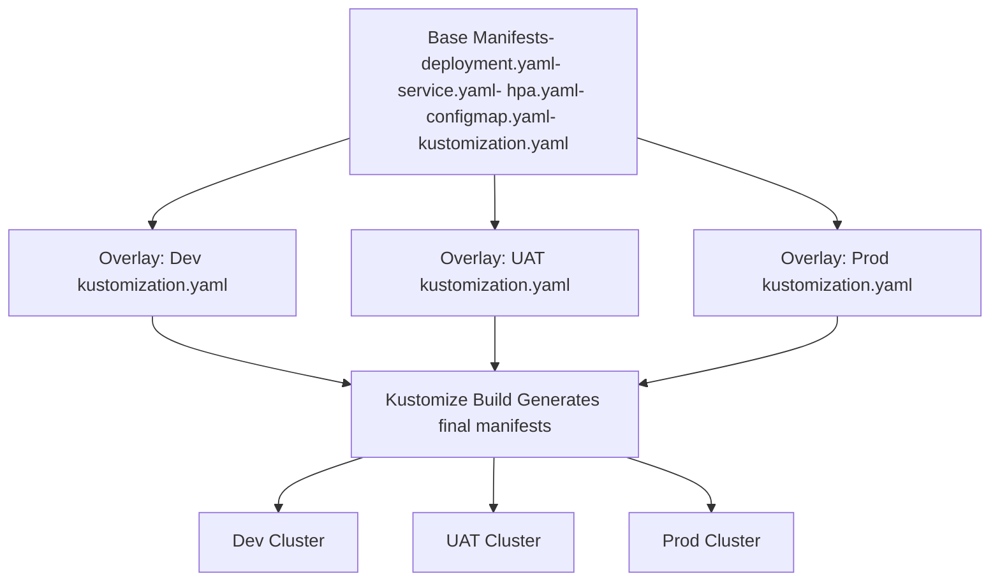

### Kustomize: Kustomize is a **declarative, overlay-based** tool for customizing Kubernetes manifests. It doesn't use a templating language; it modifies existing YAML files

#### Why do we need Kustomize
**Environment-specific customizations**
- Dev vs Test vs Prod often need different replicas, resource limits/requests, secrets/configMaps, annotations, etc.
- Using separate full manifests for each environment leads to duplication and drift. Kustomize helps by overlaying only what's different. 

**Avoid duplication**
- Base manifests avoid having the same repeated chunks across environments.
- If something changes in base (e.g. container image version, selector labels), you change in one place. Overlays only handle differences. 

**Declarative management & versioning**
- All manifests are YAML (no custom templating syntax), easier to review / diff / track in Git. 

**Native integration with kubectl**
- Kustomize is built into kubectl (for versions ≥ ~1.14) via kubectl apply -k or kubectl kustomize. 

**Secret / ConfigMap generation**
- You can generate ConfigMaps and Secrets dynamically via configMapGenerator and secretGenerator. 

**Transformers & Patches**
- You can apply naming prefixes/suffixes, labels, annotations, variable image tags, or patches (strategic merge or JSON patches) so only minimal YAML is changed.




#### Key Components
| Concept              | What it is / Does                                                                                                                                              | Why it matters / Example                                                                                                  |
| -------------------- | -------------------------------------------------------------------------------------------------------------------------------------------------------------- | ------------------------------------------------------------------------------------------------------------------------- |
| **Base**             | Directory containing the “common” Kubernetes manifests (resources) and a kustomization.yaml that refers to them.                                               | Serve as the single source of truth for common configuration across all environments.                                     |
| **Overlay**          | Directory for an environment that refers to base plus overlay patches or overlay resources that change some parts.                                             | E.g. overlay for dev might set `replicas: 2`, overlay for prod might set `replicas: 4`, add rolling update strategy, etc. |
| `kustomization.yaml` | The control file where you list resources, patches, transformers (namePrefix, nameSuffix, labels, etc.), generators, etc.                                      | It is the entry point of Kustomize: tells what to build and how to transform.                                             |
| Transformers         | Built-in features in Kustomize that modify multiple YAML resources in a standard way: e.g. add a common label, add a prefix, change namespace, modify images.  | Good for consistent modifications across many resources without writing patches manually.                                 |
| Patches              | Changes applied to base manifests to tailor them per overlay. Two main kinds: strategic-merge patches, JSON 6902 patches. Can be inline or via separate files. | Patches let you override specific fields without retyping or duplicating whole manifests.                                 |
| Generators           | `configMapGenerator`, `secretGenerator` – to produce configMaps or secrets from key/value or file inputs. Can help avoid storing secrets in plaintext.         | Dynamically generate required configMaps or secrets for environments.                                                     |

#### Installation & Usage Basics

- Kustomize can be used as a standalone binary or via kubectl.

1. Using kubectl: kubectl kustomize or kubectl apply -k <overlay>
2. Using standalone: download/install from its GitHub repo or via package managers (brew, chocolatey, etc.).


---

# Kustomize End-to-End Example

This example demonstrates how to use **Kustomize** to manage a simple Nginx application across multiple environments: **dev**, **uat**, and **prod**.

---

## 1. Create the Project Structure

```bash
mkdir -p kustomize-demo/base
mkdir -p kustomize-demo/overlays/dev
mkdir -p kustomize-demo/overlays/uat
mkdir -p kustomize-demo/overlays/prod
cd kustomize
```

Your folder layout will look like this:

```
├── kustomize
  ├── base
    │   ├── deployment.yaml
    │   ├── service.yaml
    │   ├── kustomization.yaml
    └ overlays
        ├── dev
        │   ├── deployment-dev.yaml
        |   ├── service-dev.yaml
        │   └── kustomization.yaml
        └── prod
            ├── deployment-prod.yaml
            ├── service-prod.yaml
            └── kustomization.yaml
```

---

## 2. Define the Base Manifests

Inside `base/`, create the common deployment and service used across all environments.

### `base/deployment.yaml`

```yaml
apiVersion: apps/v1
kind: Deployment
metadata:
  name: nginx-deployment
spec:
  replicas: 1
  selector:
    matchLabels:
      app: nginx
  template:
    metadata:
      labels:
        app: nginx
    spec:
      containers:
      - name: nginx
        image: nginx:1.21.0
        ports:
        - containerPort: 80
```

### `base/service.yaml`

```yaml
apiVersion: v1
kind: Service
metadata:
  name: nginx-service
spec:
  type: ClusterIP
  ports:
  - port: 80
    targetPort: 80
  selector:
    app: nginx
```

### `base/kustomization.yaml`

```yaml
apiVersion: kustomize.config.k8s.io/v1beta1
kind: Kustomization

resources:
  - deployment.yaml
  - service.yaml
```

---

## 3. Create Overlays for Each Environment

Each overlay points to the base and applies environment-specific changes.

---

### **Dev Overlay**

```bash
cd overlays/dev
```

#### `overlays/dev/kustomization.yaml`

```yaml
apiVersion: kustomize.config.k8s.io/v1beta1
kind: Kustomization

resources:
  - ../../base

namespace: dev
nameSuffix: -dev

commonLabels:
  env: dev

patches:
- patch: |-
    - op: replace
      path: /spec/replicas
      value: 1
  target:
    kind: Deployment
    name: nginx-deployment
```

---

### **UAT Overlay**

```bash
cd ../uat
```

#### `overlays/uat/kustomization.yaml`

```yaml
apiVersion: kustomize.config.k8s.io/v1beta1
kind: Kustomization

resources:
  - ../../base

commonLabels:
  env: uat
namespace: uat
nameSuffix: -uat

patches:
- patch: |-
    - op: replace
      path: /spec/replicas
      value: 2
  target:
    kind: Deployment
    name: nginx-deployment
```

---

### **Prod Overlay**

```bash
cd ../prod
```

#### `overlays/prod/kustomization.yaml`

```yaml
apiVersion: kustomize.config.k8s.io/v1beta1
kind: Kustomization

resources:
  - ../../base

commonLabels:
  env: prod
namespace: prod
nameSuffix: -prod

patches:
- patch: |-
    - op: replace
      path: /spec/replicas
      value: 5
  target:
    kind: Deployment
    name: nginx-deployment

- patch: |-
    - op: add
      path: /spec/strategy
      value:
        type: RollingUpdate
        rollingUpdate:
          maxUnavailable: 1
          maxSurge: 1
  target:
    kind: Deployment
    name: nginx-deployment
```

---

## 4. Build and Preview the Manifests

Navigate back to the root of your project:

```bash
cd ../../../kustomize
```

Run Kustomize to preview manifests for each environment:

* **Dev**

  ```bash
  kubectl kustomize overlays/dev
  ```

* **UAT**

  ```bash
  kubectl kustomize overlays/uat
  ```

* **Prod**

  ```bash
  kubectl kustomize overlays/prod
  ```

Or use the standalone Kustomize binary if installed:

```bash
kustomize build overlays/prod
```

---

## 5. Deploy to Kubernetes

Once you’re happy with the rendered YAML, deploy it to your cluster:

* **Dev**

  ```bash
  kubectl apply -k overlays/dev
  ```

* **UAT**

  ```bash
  kubectl apply -k overlays/uat
  ```

* **Prod**

  ```bash
  kubectl apply -k overlays/prod
  ```

---

## 6. Verify the Deployment

Check pods:

```bash
kubectl get pods -l app=nginx
```

Check services:

```bash
kubectl get svc nginx-service
```

* Dev → 1 replica
* UAT → 2 replicas
* Prod → 5 replicas with rolling updates

-----

### Helm: End-to-End Walkthrough

**Core Concept**: Helm is a **templating-based package manager** for Kubernetes. It uses Go templates and values to generate manifests.

#### Key Components

  * **`Chart`**: A package that contains all necessary resources.
  * **`values.yaml`**: The file for default configuration values.
  * **`templates/`**: Directory where Kubernetes manifest templates live.

#### End-to-End Example

Let's create a similar Nginx deployment using Helm.

**1. Scaffold a new Helm chart.**

```bash
helm create my-nginx-app
cd my-nginx-app
```

**2. Modify `values.yaml` for configuration.**
You'll use this file to manage the image tag and replica count.

`values.yaml`

```yaml
replicaCount: 1

image:
  repository: nginx
  tag: 1.21.0
  pullPolicy: IfNotPresent

service:
  type: ClusterIP
  port: 80
```

**3. Modify `templates/deployment.yaml` to use values.**
The template uses Go template syntax to pull values from `values.yaml`.

`templates/deployment.yaml`

```yaml
apiVersion: apps/v1
kind: Deployment
metadata:
  name: {{ include "my-nginx-app.fullname" . }}
  labels:
    {{- include "my-nginx-app.labels" . | nindent 4 }}
spec:
  replicas: {{ .Values.replicaCount }}
  selector:
    matchLabels:
      app: nginx
  template:
    metadata:
      labels:
        app: nginx
    spec:
      containers:
      - name: {{ .Chart.Name }}
        image: "{{ .Values.image.repository }}:{{ .Values.image.tag }}"
        ports:
        - name: http
          containerPort: 80
```

**4. Install or upgrade the application.**

  * **Dry Run**: To see the final YAML.
    ```bash
    helm template my-nginx-app .
    ```
  * **Install**: To deploy the chart with a release name.
    ```bash
    helm install my-nginx-release .
    ```
  * **Upgrade**: To update the replica count for production.
    ```bash
    helm upgrade my-nginx-release . --set replicaCount=3
    ```
  * **Rollback**: To revert to a previous version if an upgrade fails.
    ```bash
    helm rollback my-nginx-release [REVISION_NUMBER]
    ```
---

## Best Practices for Using Kustomize

* **Keep base minimal and reusable** – only include common manifests (deployments, services, etc.)
* **Overlays should only contain differences** – avoid copying entire manifests into overlays
* **Use generators for ConfigMaps and Secrets** – instead of hardcoding values
* **Leverage `commonLabels` and `commonAnnotations`** – for consistent metadata across resources
* **Prefer JSON6902 patches for precision** – when modifying deeply nested fields
* **Validate rendered manifests** before applying using tools like `kubeval` or `kubeconform`
* **Integrate with GitOps tools** – e.g., ArgoCD or FluxCD, since they have first-class support for Kustomize
* **Avoid disabling ConfigMap/Secret name suffix hashes** – ensures pods restart when config changes
* **Use `namePrefix`/`nameSuffix` carefully** – to avoid breaking dependencies between resources
* **Keep overlays simple** – one overlay per environment is enough in most cases

---

## Kustomize Transformers

Transformers are plugins/features that let you modify multiple resources in a consistent way.

Here’s the list of **built-in transformers**:

| Transformer               | Description                                                                |
| ------------------------- | -------------------------------------------------------------------------- |
| **namePrefix**            | Adds a prefix to all resource names                                        |
| **nameSuffix**            | Adds a suffix to all resource names                                        |
| **namespace**             | Sets namespace for all resources                                           |
| **commonLabels**          | Adds labels to all resources                                               |
| **commonAnnotations**     | Adds annotations to all resources                                          |
| **images**                | Overrides container images (name, tag, digest)                             |
| **replicas**              | Overrides replica counts for Deployments, StatefulSets, etc.               |
| **patchesStrategicMerge** | Applies patches using strategic merge semantics                            |
| **patchesJson6902**       | Applies patches using JSON6902 (RFC 6902) standard                         |
| **patches**               | Unified way to define both JSON6902 and strategic patches (newer versions) |
| **configMapGenerator**    | Generates ConfigMaps from literals or files                                |
| **secretGenerator**       | Generates Secrets from literals or files                                   |
| **vars**                  | Substitute variables in resources                                          |

---

## Kustomize vs Helm

| Feature                    | **Kustomize**                                   | **Helm**                                         |
| -------------------------- | ----------------------------------------------- | ------------------------------------------------ |
| **Approach**               | Base + overlays layering                        | Template rendering with values.yaml              |
| **Learning Curve**         | Low (YAML only)                                 | Higher (Go templating, charts)                   |
| **Reusability**            | Great for environment-specific differences      | Great for packaging and sharing apps             |
| **Ecosystem**              | No central repo, DIY                            | Large public chart ecosystem                     |
| **Native kubectl Support** | Yes (`kubectl apply -k`)                        | No (needs `helm` binary)                         |
| **Dependencies**           | Not supported                                   | Supported (chart dependencies)                   |
| **Secrets Handling**       | Basic (secretGenerator)                         | Advanced (sealed secrets, external plugins)      |
| **Best Use Case**          | Environment customization in GitOps workflows   | App installation and dependency management       |
| **Combine Together?**      | Yes (render Helm charts → patch with Kustomize) | Yes (use Helm for install, Kustomize for tweaks) |
