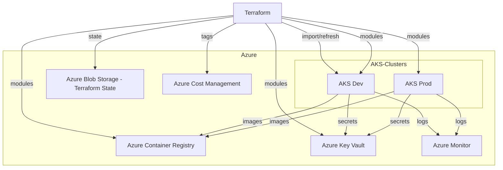

# Enterprise-Grade AKS Platform Deployment Series: Day 1 Kickoff

## Welcome to the Mission!

Attention, platform engineers! You’re diving into a 7-day DevOps heist to build an **enterprise-grade Azure Kubernetes Service (AKS) platform** that’s secure, scalable, and production-ready. Your mission: deploy the OpenTelemetry Demo microservices using Terraform and other cutting-edge tools. Day 1 drops you into a high-stakes scenario where you’ll master **Terraform best practices** to create a rock-solid infrastructure foundation. Each day will unveil a new challenge, building toward a world-class platform so let’s execute this heist with precision!

## Project Overview

Your goal is to create a **multi-environment (dev, stage, prod) AKS platform** that’s automated, resilient, and enterprise-ready. Over the week, you’ll tackle automation, security, observability, and more, with surprises at every turn. Today, you’ll handle a real-world brownfield scenario using Terraform to provision and manage a private AKS infrastructure, mastering best practices like `terraform import`, `terraform refresh`, and modular design.

## Day 1: Milestone 1 – Infrastructure Deployment with Terraform

**Scenario**:  
CloudHeist Inc. acquired a startup that manually deployed an Azure Virtual Network (VNet) and subnet for their AKS dev environment. Your task is to bring this existing VNet under Terraform management, then provision private AKS clusters, Azure Container Registry (ACR), and Azure Key Vault for dev and prod environments. You’ll use `terraform import` to manage the existing VNet, `terraform refresh` to align state, and Terraform workspaces to manage environments, ensuring a secure, private, and compliant infrastructure.

**Objective**:  
Provision a secure, highly available, private AKS infrastructure using Terraform, incorporating a pre-existing VNet, and master best practices like `terraform import`, `terraform refresh`, modules, and workspace management.

**Tasks**:
- **Import Existing Resources**: Import the pre-existing VNet (`cloudheist-vnet`) and subnet (`aks-subnet`) in the `cloudheist-rg` resource group into Terraform state using `terraform import`.
- **State Refresh**: Run `terraform refresh` to align Terraform state with actual Azure resources, ensuring no discrepancies.
- **Modular Terraform**: Create reusable Terraform modules for AKS, networking, ACR, and Key Vault in a `modules/` directory.
- **Workspaces**: Use Terraform workspaces (`dev`, `staging`, `prod`) to manage environment-specific configurations with a single codebase.
- **Private AKS Cluster**:
  - Deploy private AKS clusters with no public IP for the API server, using a private endpoint for communication between the control plane (in AKS-managed resource group) and node pools (in `cloudheist-rg`).
  - Configure Azure CNI and availability zones for high availability.
- **Managed Identity**:
  - Enable system-assigned managed identity on AKS clusters.
  - Grant the managed identity permissions to create Azure Load Balancers, Managed Disks, and other dependent resources.
- **Authentication & Authorization**:
  - Enable Azure AD workload identity federation on AKS, configuring `kubelogin` for authentication.
  - Set up Azure RBAC for Kubernetes authorization, binding roles to Azure AD users or groups.
- **State Management**: Configure a secure remote backend in Azure Blob Storage (`tfstate12345`, container `tfstate`) with encryption and state locking via Azure Table Storage.
- **Provider Configuration**: Define the `azurerm` provider with version constraints in a `terraform` block in `provider.tf`.
- **Key Vault Integration**: Deploy Azure Key Vault with private endpoints, storing sensitive data (e.g., AKS admin credentials) and referencing them via Terraform `data` sources.
- **Provisioners**: Use `local-exec` provisioners to automate post-deployment tasks, like storing AKS kubeconfig in Key Vault.
- **Compliance and Governance**: Apply Azure Policy for AKS compliance (CIS benchmarks) and add Azure tags (`Environment`, `Project`) for cost tracking.

**Terraform Best Practices**:
- **Modularity**: Create reusable Terraform modules for AKS, networking, ACR, and Key Vault to promote DRY principles.
- **Workspaces**: Use `terraform workspace` to manage dev and prod environments, isolating state files.
- **State Security**: Store Terraform state in Azure Blob Storage with encryption and locking to prevent conflicts.
- **Provider Versioning**: Pin `azurerm` provider versions in `provider.tf` to ensure consistent builds.
- **Sensitive Data**: Store secrets in Key Vault, avoiding hardcoding in `.tf` files.
- **Idempotency**: Ensure configurations are idempotent and reusable across environments.
- **State Management**: Use `terraform import` for brownfield resources and `terraform refresh` to align state with reality.
- **Documentation**: Document module inputs/outputs, workspace setup, import process, and state management in `README.md`.

**Deliverables**:
- `infrastructure/` directory with:
  - `main.tf`: Main configuration calling modules.
  - `provider.tf`: Combined backend and provider configuration with a single `terraform` block.
  - `variables.tf`: Variable declarations with types and defaults.
  - `outputs.tf`: Outputs like AKS cluster IDs and Key Vault URIs.
  - `terraform.tfvars`: Global variables.
  - `modules/aks/`, `modules/networking/`, `modules/keyvault/`, `modules/acr/`: Reusable modules with `main.tf`, `variables.tf`, and `outputs.tf`.
  - `environments/dev/`, `environments/prod/`: Environment-specific `terraform.tfvars`.
  - `scripts/import-vnet.sh`: Shell script to import VNet and subnet using `terraform import`.
  - `scripts/refresh-state.sh`: Shell script to run `terraform refresh`.
- Architecture diagram in Mermaid format showing infrastructure components.
- `./README.md` documenting:
  - Terraform setup, module structure, and workspace usage.
  - Detailed steps for `terraform import` and `terraform refresh`.
  - State management, Key Vault integration, workload identity setup, and compliance details.

**Success Criteria**:
- Existing VNet (`cloudheist-vnet`) and subnet (`aks-subnet`) in `cloudheist-rg` are imported into Terraform state using `terraform import`.
- `terraform refresh` aligns state with Azure resources without errors.
- AKS clusters are private (no public API server IP), use private endpoints for control plane communication, and have node pools in `cloudheist-rg` and control plane in AKS-managed resource group.
- System-assigned managed identity is enabled and used for creating Azure Load Balancers, Managed Disks, and other resources.
- Azure AD workload identity is configured with `kubelogin` for authentication, and Kubernetes RBAC is set up with Azure AD role bindings.
- Terraform state is encrypted, locked, and stored in Azure Blob Storage.
- Workspaces manage dev and prod environments with consistent configurations.
- Key Vault stores sensitive data, accessible via private endpoints.
- Provider versions are pinned in `provider.tf`, and infrastructure is tagged for cost tracking with Azure Policy applied for CIS compliance.

**Starter Template**:
```bash
infrastructure/
├── main.tf
├── provider.tf
├── variables.tf
├── outputs.tf
├── terraform.tfvars
├── modules/
│   ├── aks/
│   │   ├── main.tf
│   │   ├── variables.tf
│   │   └── outputs.tf
│   ├── networking/
│   │   ├── main.tf
│   │   ├── variables.tf
│   │   └── outputs.tf
│   ├── keyvault/
│   │   ├── main.tf
│   │   ├── variables.tf
│   │   └── outputs.tf
│   ├── acr/
│   │   ├── main.tf
│   │   ├── variables.tf
│   │   └── outputs.tf
├── environments/
│   ├── dev/
│   │   └── terraform.tfvars
│   ├── prod/
│   │   └── terraform.tfvars
├── scripts/
│   ├── import-vnet.sh
│   └── refresh-state.sh
└── README.md
```
## Architecture Sneak Peek

Here’s the infrastructure you’ll build and manage today, setting the stage for an epic platform:



## What’s Next?

Tomorrow, you’ll tackle the next challenge, diving into automation, security, and resilience. Each day will unlock new tools and techniques, building toward a fully automated, enterprise-grade AKS platform. Stay sharp—the heist is just getting started!

## Getting Started

1. Fork the repository: [LearnWithSagar/DailyChallenges](https://github.com/Sagar2366/LearnWithSagar).
2. Navigate to the `DailyChallenges/ProjectChallengeSeries/project1` directory to understand the problem statement.
3. Create VNet and Subnet Manually, Write Terraform plan and Initialize it: `terraform init` in `infrastructure/`.
4. Set up Terraform workspaces: `terraform workspace new dev`, `terraform workspace new staging` and `terraform workspace new prod`.
5. Import the existing VNet and subnet.
6. Deploy infrastructure with `terraform apply -var-file=environments/dev/terraform.tfvars`.
7. Document your setup in `README.md`, covering module structure, workspace usage, import process, state management, workload identity setup, and compliance.

Good luck, and let’s execute this infrastructure heist flawlessly!
