# ✅ `challenge_solution.md` 

# Day 4: Advanced Git Mastery

**Name:** Swayam Prakash Bhuyan  
**Date:** 11 September 2025  

---

## ✅ Task 1 – Amend a Commit

### Commands used:
```bash
echo "Initial content" > file.txt
git add file.txt
git commit -m "Initial commit"

echo "Updated content" >> file.txt
git add file.txt

git commit --amend -m "feature: Add updated content to file"

git log --oneline -10
```

### Screenshot:

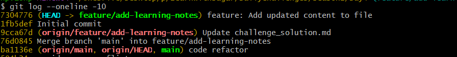

### Diagram:
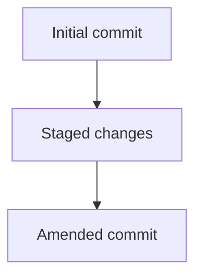

### Result:
The commit message was changed to "feature: Add updated content to file", and the file now includes both initial and updated content without creating a new commit.

---

## ✅ Task 2 – Interactive Rebase

### Commands used:
```bash
echo "Change 1" >> file.txt
git add file.txt
git commit -m "Change 1"

echo "Change 2" >> file.txt
git add file.txt
git commit -m "Change 2"

echo "Change 3" >> file.txt
git add file.txt
git commit -m "Change 3"

git rebase -i HEAD~3
# In the editor: pick Change 1, squash Change 2 and Change 3
git rebase --continue

git log --oneline
```

### Screenshot:

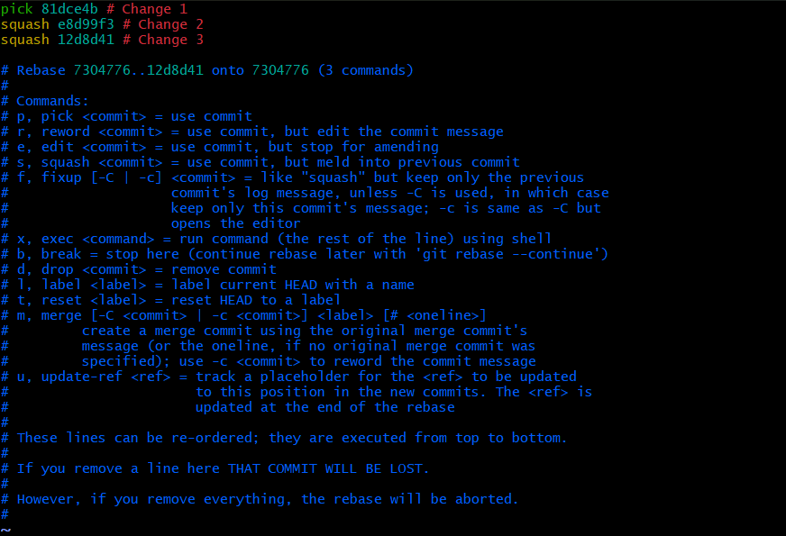
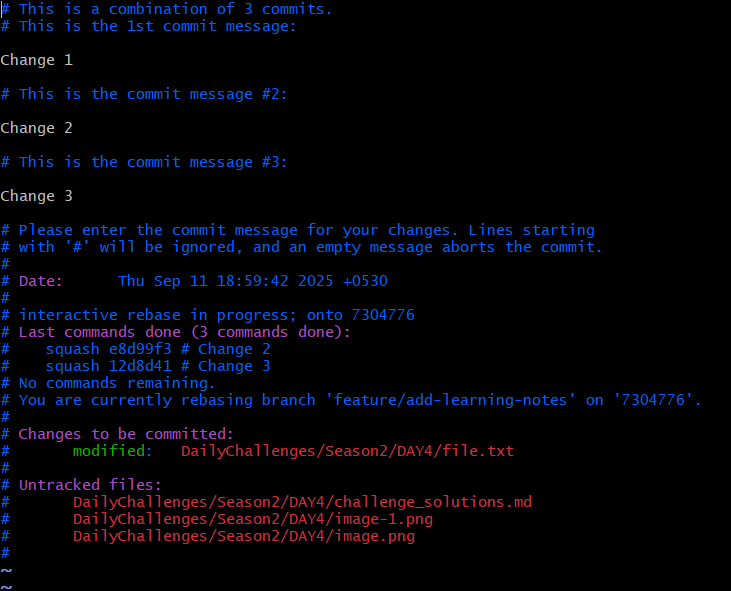

### Diagram:
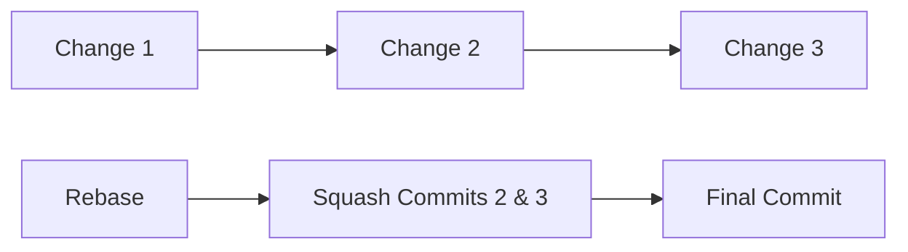

### Result:
The last two commits were combined into one, with the new commit message updated accordingly. The commit history is cleaner and easier to understand.

---

## ✅ Task 3 – Tag a Release

### Commands used:
```bash
git tag -a v2.0.0 -m "Release version 2.0.0"
git push origin --tags

git tag v1.0.0 # Lightweight
```

### Screenshot:

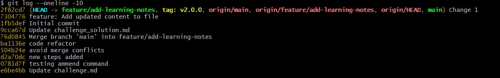

### Diagram:
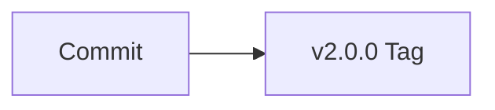

### Result:
A new annotated tag `v2.0.0` was created with a description and pushed to GitHub.

---

## ✅ Task 4 – Sync with Upstream

### Commands used:
```bash
git remote add upstream https://github.com/Sagar2366/LearnWithSagar.git
git fetch upstream
git merge upstream/main
```

### Screenshot:

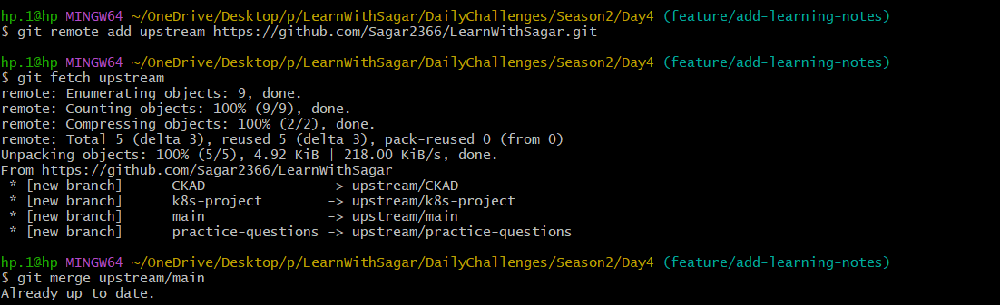

### Diagram:
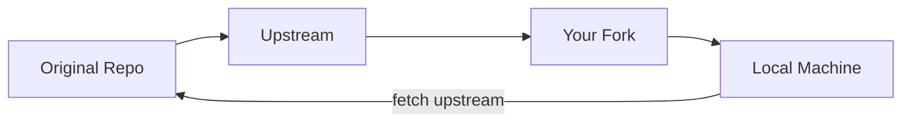

### Result:
The upstream repository's changes were successfully merged into the local repository without losing existing changes.

---

## ✅ Task 5 – Stash and Cherry-Pick

### Commands used:
```bash
echo "Stash content" >> file.txt
git add file.txt

git stash

git checkout -b hotfix

random lines for cherry pick

git cherry-pick <commit-hash>   # Replace <commit-hash> with actual commit ID

git stash pop
```

### Screenshot:

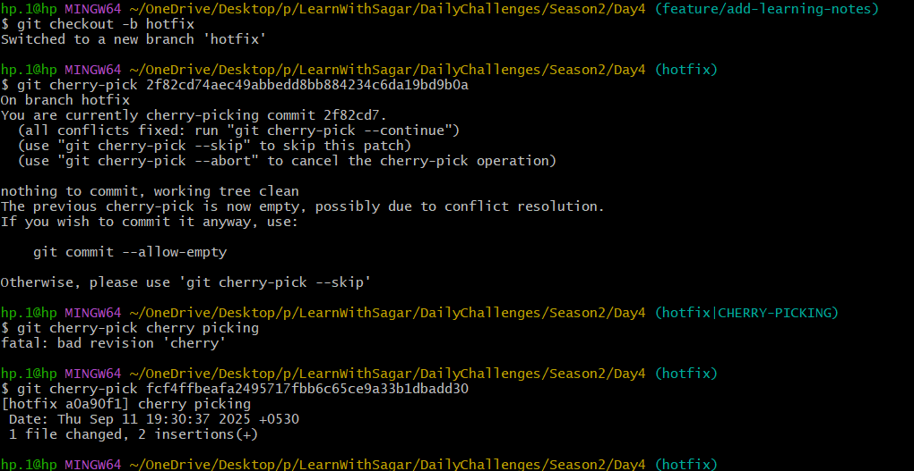

### Diagram:
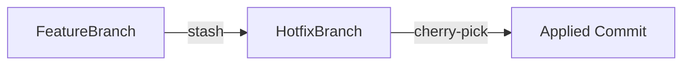

### Result:
Uncommitted changes were safely stored using `git stash`, applied to another branch using `git cherry-pick`, and then restored using `git stash pop`.

---

## ✅ Task 6 – Rebase a Feature Branch

### Commands used:
```bash
git checkout feature/add-learning-notes
git fetch origin
git rebase origin/main

main commits for example test feature

# If conflicts occur:
git add <file>
git rebase --continue

git push --force
```

### **1️⃣ Make sure you are on your feature branch**

```bash
git checkout feature/add-learning-notes
```

* Confirm with:

```bash
git branch
```

---

### **2️⃣ Make a conflicting change in your branch**

* Open a file that also exists in `main`, e.g.:

```bash
vim DailyChallenges/Season2/DAY4/notes.txt
```

* Add some text:

```
Feature branch change: Added a new section here
```

* Save and commit:

```bash
git add DailyChallenges/Season2/DAY4/notes.txt
git commit -m "Feature branch: added new section"
```

---

### **3️⃣ Make a conflicting change in `main`**

* Switch to main branch:

```bash
git checkout main
```

* Edit the same line in the same file:

```bash
vim DailyChallenges/Season2/DAY4/notes.txt
```

* Add:

```
Main branch change: Updated section header
```

* Save and commit:

```bash
git add DailyChallenges/Season2/DAY4/notes.txt
git commit -m "Main branch: updated section header"
```

* Push main if remote exists (optional):

```bash
git push origin main
```

---

### **4️⃣ Go back to your feature branch**

```bash
git checkout feature/add-learning-notes
```

---

### **5️⃣ Start the rebase onto main**

```bash
git rebase main
```

* Git will attempt to reapply your commits on top of `main`
* You will see a **conflict** message like:

```
CONFLICT (content): Merge conflict in DailyChallenges/Season2/DAY4/notes.txt
```

---

### **6️⃣ Resolve the conflict**

* Open the conflicting file:

```bash
vim DailyChallenges/Season2/DAY4/notes.txt
```

* You will see:

```
<<<<<<< HEAD
Feature branch change: Added a new section here
=======
Main branch change: Updated section header
>>>>>>> main
```

* Edit it to keep both changes or choose one:

```
Feature branch change: Added a new section here
Main branch change: Updated section header
```

* Save and exit

---

### **7️⃣ Mark conflict as resolved**

```bash
git add DailyChallenges/Season2/DAY4/notes.txt
```

---

### **8️⃣ Continue the rebase**

```bash
git rebase --continue
```

* Git will apply remaining commits or finish rebase

---

### **9️⃣ Verify the rebase**

```bash
git log --oneline --graph --all
```

* Your feature branch commits are now **on top of main**
* History is linear

---

### ✅ **Optional: Push your branch**

Because rebase rewrites history, you may need to force push:

```bash
git push origin feature/add-learning-notes --force
```

### Screenshot:
 Merge Conflict Scenario: 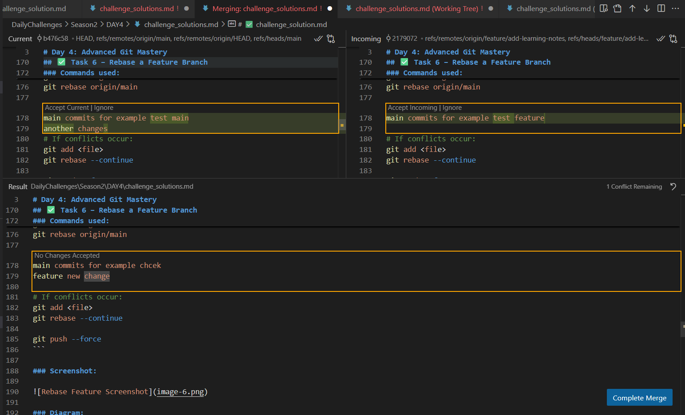


### Diagram:
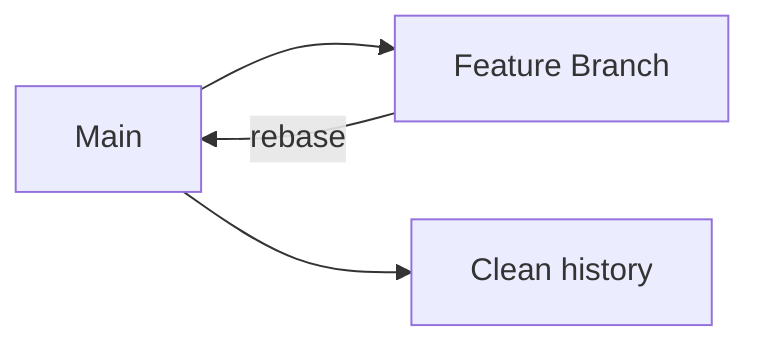

### Result:
The feature branch was rebased onto the main branch, conflicts were resolved, and the history is now linear.

---

## ✅ Task 7 – Undo with Revert

### Commands used:
```bash
git revert <commit-hash>   # Replace <commit-hash> with actual commit ID

git log --oneline
```

### Screenshot:

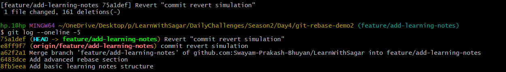

### Diagram:
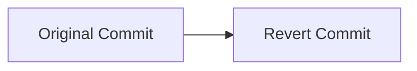

### Result:
A new commit was created that undoes the changes introduced by the specified commit, keeping history safe and intact.

---

## ✅ Task 8 – Branching Strategies

### Gitflow
- Description: A structured workflow for teams with scheduled releases, using feature, release, and hotfix branches.

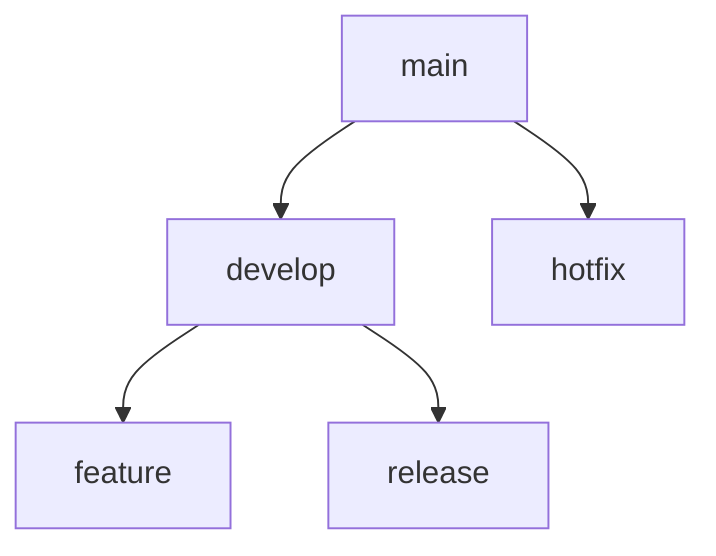

### GitHub Flow
- Description: A lightweight workflow where all work is done in feature branches and merged into main after review.

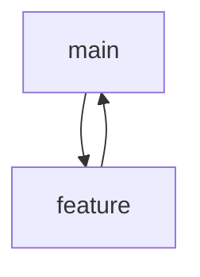

### Trunk-Based Development
- Description: Developers commit directly to the main branch, using feature toggles to manage incomplete features.

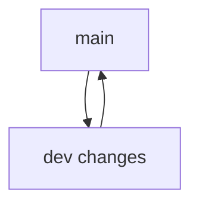

### Chosen Strategies

1. **For a small team with continuous deployment → GitHub Flow**
   **Reason:** It's simple, quick, and reduces overhead while allowing fast deployments.

2. **For a large team with monthly releases → Gitflow**
   **Reason:** It offers a controlled environment with multiple branches that suit scheduled releases and better quality assurance.

---


---

## ✅ Submission Checklist

- ✅ Completed all tasks with commands and explanations
- ✅ Added diagrams for each workflow
- ✅ Inserted screenshots under each command block
- ✅ Pushed code to GitHub
- ✅ Created PR titled **Day 4: Advanced Git Mastery**
- ✅ Shared on LinkedIn with hashtags: `#getfitwithsagar #DevOpsForAll`

---
