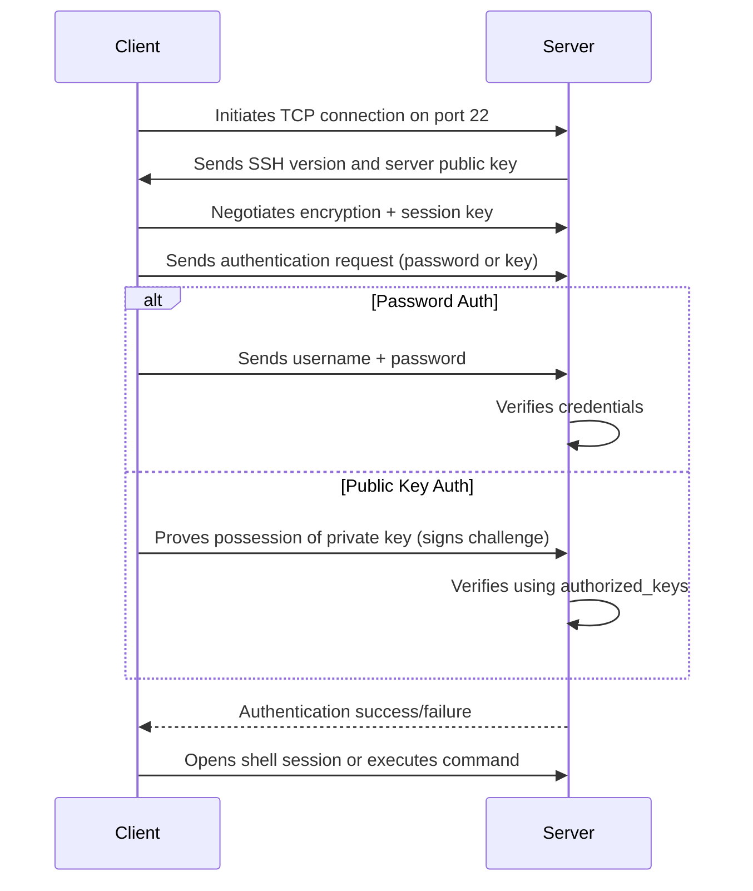
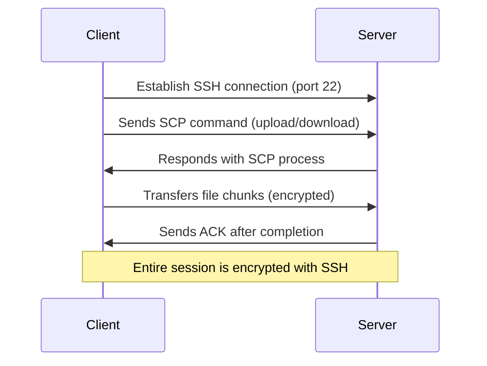
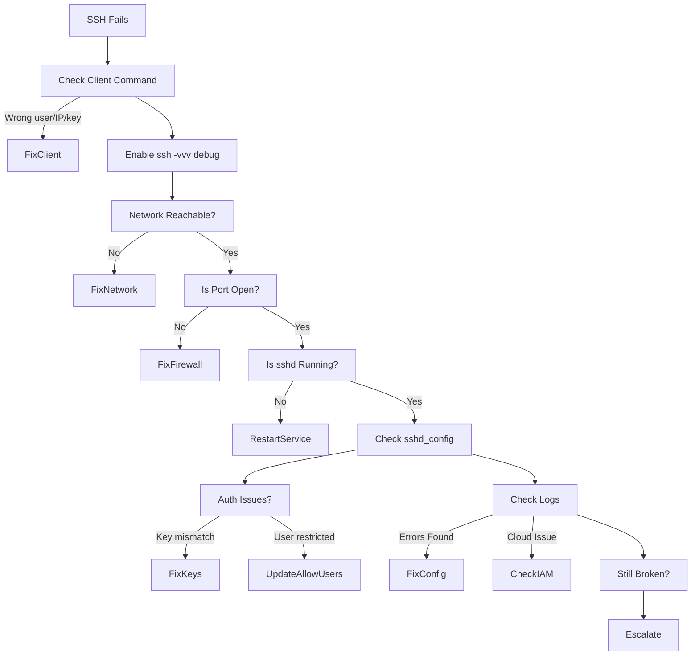

# Daily DevOps + SRE Challenge Series – Season 2
## Day 13: Secure Shell Mastery – SSH, SCP, Hardening & Troubleshooting Like a Pro

### Introduction
Welcome to **Day 13** of the Daily DevOps + SRE Challenge Series – Season 2! 🔐

Today, you’ll master secure remote access and file transfer with **SSH** and **SCP**. You’ll also learn to harden servers, move beyond passwords to keys, and troubleshoot failures like an SRE under pressure. SSH is the backbone of Linux administration, CI/CD deploys, remote debugging, and automated operations.
Fun fact, Google ask these questions for the Cloud Engineer role.

By the end of today, you’ll confidently connect, transfer files safely, lock down your servers, and fix tricky login issues fast.

#### Why This Matters?
- **Security**: SSH done wrong is an open door. Harden it to reduce risk.
- **Reliability**: Key-based access avoids password lockouts and human error.
- **Scale**: Client and server configs let you manage fleets and bastions cleanly.
- **Incident Response**: During outages, fast, correct SSH troubleshooting is vital.
- **Interview Win**: “How do you harden sshd?” and “Why key-based auth?” are common.
- **Real-World Impact**: Disabling password logins and enforcing keys can reduce SSH-related incidents dramatically.

---

### 1. Understanding SSH
- **Definition**: SSH (Secure Shell) is a protocol for secure remote login, command execution, and tunneling over untrusted networks.
- **How it stays secure**:
  - Host keys: Identify the server; clients cache fingerprints in `~/.ssh/known_hosts`.
  - Key exchange + ciphers: Negotiate an encrypted session (confidentiality + integrity).
  - Authentication: Password, public key, or other methods (e.g., MFA).
- **Common use cases**:
  - Admin access: `ssh user@server`
  - Remote commands: `ssh user@server "systemctl status nginx"`
  - File transfers: `scp`, `sftp`, `rsync -e ssh`
  - Port forwarding and tunneling
- **Ports**: Default server port is 22. Many orgs change it (e.g., 2222) and update firewalls accordingly.

---

### 2. Connecting with SSH
Basic commands:
```bash
# Default port
ssh user@hostname

# Specify identity key
ssh -i ~/.ssh/id_ed25519 user@hostname

# Non-default port
ssh -p 2222 user@hostname

# Run a one-off command
ssh user@hostname "uptime && whoami"
```

Helpful client options:
- `-vvv`: Verbose output for troubleshooting (negotiation, auth)
- `-o StrictHostKeyChecking=ask`: Safer first-connection behavior
- `-J bastion`: ProxyJump via bastion (multi-hop)
- ControlMaster/ControlPersist: Multiplex connections for faster repeated SSH

---

### 3. Secure File Transfers: SCP, SFTP, and rsync over SSH
SCP and SFTP both run over SSH (encrypted end-to-end). Modern OpenSSH may implement `scp` via SFTP.

SCP examples:
```bash
# Upload a file
scp ./app.tar.gz user@server:/opt/releases/

# Download a file
scp user@server:/var/log/nginx/access.log ./logs/

# Recursive copy (directory)
scp -r ./static/ user@server:/var/www/static/

# Non-default port
scp -P 2222 ./file.txt user@server:/tmp/
```

SFTP (interactive or batch):
```bash
sftp -P 2222 -i ~/.ssh/id_ed25519 user@server
sftp> put file.txt /opt/data/
sftp> get /opt/data/file.txt
```

rsync over SSH (efficient sync with deltas):
```bash
rsync -az --progress -e "ssh -p 2222 -i ~/.ssh/id_ed25519" ./site/ user@server:/var/www/site/
```

Integrity verification:
```bash
sha256sum file.txt
ssh user@server "sha256sum /opt/data/file.txt"
```

---

### 4. How SSH Works (Mermaid Diagram)


---

### 5. How SCP Works (Mermaid Diagram)


---

### 6. sshd_config Essentials (Server)
Key directives in `/etc/ssh/sshd_config`:
- `Port 2222`: Change from 22 (remember to open firewall)
- `PermitRootLogin no`: Disable direct root login
- `PasswordAuthentication no`: Enforce key-based auth
- `PubkeyAuthentication yes`: Enable key auth
- `MaxAuthTries 3`: Throttle brute-force attempts
- `PermitEmptyPasswords no`: Disallow empty passwords
- `AllowUsers devops_user`: Restrict to allowed accounts (or `AllowGroups`)
- `ClientAliveInterval 300` + `ClientAliveCountMax 2`: Idle session control
- `LogLevel VERBOSE`: Better audit logs
- Optionally harden crypto (modern OpenSSH defaults are strong):
  - `KexAlgorithms curve25519-sha256,curve25519-sha256@libssh.org`
  - `Ciphers chacha20-poly1305@openssh.com,aes256-gcm@openssh.com`
  - `MACs hmac-sha2-512-etm@openssh.com,hmac-sha2-256-etm@openssh.com`

Validate and apply:
```bash
sudo sshd -t                   # syntax check
sudo sshd -T | sort            # effective config
sudo systemctl reload sshd     # safer than restart
```

---

### 7. Passwordless Access & Key Management
Generate a key pair (ed25519 recommended):
```bash
ssh-keygen -t ed25519 -C "you@example.com"
```

Install your public key:
```bash
ssh-copy-id user@server
# or manual:
cat ~/.ssh/id_ed25519.pub | ssh user@server 'mkdir -p ~/.ssh && chmod 700 ~/.ssh && cat >> ~/.ssh/authorized_keys && chmod 600 ~/.ssh/authorized_keys'
```

Login:
```bash
ssh user@server
```

Permissions (avoid auth failures):
```bash
chmod 700 ~/.ssh
chmod 600 ~/.ssh/id_ed25519 ~/.ssh/authorized_keys
```

Use `ssh-agent` to cache decrypted keys:
```bash
eval "$(ssh-agent -s)"
ssh-add ~/.ssh/id_ed25519
```

Tips:
- Use `IdentitiesOnly yes` per host to avoid “Too many authentication failures”
- Always protect private keys with a passphrase and store backups securely

---

### 8. Server Hardening Simulation
🔴 Buggy server config (for lab):
- `PermitRootLogin yes`
- `PasswordAuthentication yes`
- Weak password

⚡ Exploit demonstration (lab-only):
```bash
hydra -l root -P rockyou.txt ssh://server-ip
```

🟢 Hardened fix:
- `PermitRootLogin no`
- `PasswordAuthentication no`
- `PubkeyAuthentication yes`
- `AllowUsers devops_user`
- Change port (e.g., 2222) & update firewall rules

UFW example:
```bash
sudo ufw allow 2222/tcp
sudo ufw delete allow 22/tcp
sudo ufw reload
```

firewalld example:
```bash
sudo firewall-cmd --add-port=2222/tcp --permanent
sudo firewall-cmd --remove-service=ssh --permanent
sudo firewall-cmd --reload
```

---

### 9. Troubleshooting – Google-Style
1) Client-Side
- Correct command: `ssh -i key.pem -p 2222 user@ip`
- Debug with `ssh -vvv`
- Key file permissions:
```bash
chmod 700 ~/.ssh
chmod 600 ~/.ssh/id_* ~/.ssh/authorized_keys
```

2) Network
- Reachability and port:
```bash
ping -c 2 ip || true
nc -zv ip 2222
```
- Firewall/security group rules (local + cloud)

3) Server
- Service and port:
```bash
sudo systemctl status sshd
sudo ss -tulpn | grep -E ':(22|2222)\s'
```
- Config validation:
```bash
sudo sshd -t
sudo sshd -T | sort
```

4) Authentication
- User exists and has valid shell
- `~/.ssh` ownership and modes; `authorized_keys` present
- `AllowUsers/AllowGroups` not blocking login

5) Logs
- Debian/Ubuntu: `/var/log/auth.log`
- RHEL/CentOS/Fedora: `/var/log/secure`
- Journal: `sudo journalctl -u sshd -e`

6) Cloud-Specific
- AWS: Default usernames (`ec2-user`, `ubuntu`, etc.), SG inbound 2222/tcp, PEM permissions
- GCP: OS Login/IAM bindings; project-level keys
- Azure: NSGs; Just-In-Time access

7) Edge Cases
- Fail2ban blocking IP (unban via `fail2ban-client`)
- Host key mismatch (fix `~/.ssh/known_hosts`)
- SELinux enforcing (check AVC denials; `restorecon -Rv /etc/ssh` after changes)

---

### 10. Troubleshooting Flow (Mermaid Diagram)


---

## Practical Tasks: Operation Secure Access – Harden, Validate, and Recover
As an SRE, your job is to enable secure, reliable access while minimizing risk. This lab uses Ubuntu/Debian or RHEL/Fedora. Keep a second console open before changing SSH.

### Setup Prep
1. Create a workspace:
```bash
mkdir -p ~/ssh-lab && cd ~/ssh-lab
```
2. Confirm current connectivity:
```bash
ssh user@server "whoami && hostname"
```

### Task A: Establish Key-Based Login
1. Generate key (if needed):
```bash
ssh-keygen -t ed25519 -C "you@example.com"
```
2. Install your public key:
```bash
ssh-copy-id user@server
```
3. Verify:
```bash
ssh -vvv user@server "echo OK && id -u && hostname"
```
4. Save the line showing “Authentication succeeded (publickey)” to `notes.md`.

### Task B: Harden sshd
1. Open firewall for new port (2222 shown below).
2. Edit `/etc/ssh/sshd_config` to include:
```
Port 2222
PermitRootLogin no
PasswordAuthentication no
PubkeyAuthentication yes
AllowUsers user
MaxAuthTries 3
PermitEmptyPasswords no
ClientAliveInterval 300
ClientAliveCountMax 2
LogLevel VERBOSE
```
3. Validate and reload:
```bash
sudo sshd -t && sudo systemctl reload sshd
```
4. Test new port:
```bash
ssh -p 2222 user@server "echo PORT_OK"
```
5. Remove old port (only after verifying new):
- UFW: `sudo ufw delete allow 22/tcp`
- firewalld: `sudo firewall-cmd --remove-service=ssh --permanent && sudo firewall-cmd --reload`

Document all commands + outputs in `notes.md`.

### Task C: Secure File Transfer Roundtrip
1. Create a file and upload/download:
```bash
echo "hello-ssh" > hello.txt
scp -P 2222 hello.txt user@server:/tmp/hello.txt
scp -P 2222 user@server:/tmp/hello.txt hello.remote.txt
```
2. Verify integrity:
```bash
sha256sum hello.txt hello.remote.txt | tee checksums.txt
```

### Task D (Optional): SFTP-Only Restricted User
1. Create group and user (server):
```bash
sudo groupadd -f sftpusers
sudo useradd -m -G sftpusers -s /usr/sbin/nologin sftpuser
```
2. Prepare chroot:
```bash
sudo mkdir -p /sftp/sftpuser/upload
sudo chown root:root /sftp /sftp/sftpuser
sudo chmod 755 /sftp /sftp/sftpuser
sudo chown sftpuser:sftpusers /sftp/sftpuser/upload
```
3. Add to `/etc/ssh/sshd_config`:
```
Subsystem sftp internal-sftp
Match Group sftpusers
    ChrootDirectory /sftp/%u
    ForceCommand internal-sftp
    AllowTCPForwarding no
    X11Forwarding no
```
4. Validate + reload, then test:
```bash
sudo sshd -t && sudo systemctl reload sshd
ssh -p 2222 sftpuser@server   # should fail (no shell)
sftp -P 2222 sftpuser@server  # should succeed
```

### Task E: Induce and Fix Failures (Troubleshooting)
Pick at least one, capture `ssh -vvv` and server logs, and document your fix:
- Wrong key permissions: fix with `chmod 600 ~/.ssh/id_*`
- Blocked port: fix firewall rules and retest with `nc -zv`
- Misconfigured `AllowUsers`: correct user and reload
- Host key mismatch: remove offending line in `~/.ssh/known_hosts`

---

## Submission Guidelines
- Store your findings and execution steps in a markdown file (`solution.md`).
- Include:
  - Final `/etc/ssh/sshd_config`
  - Commands and outputs for Tasks A–C (and D/E if attempted)
  - Notes from troubleshooting (`ssh -vvv` snippets and relevant server logs)
- Submit it in your GitHub repository and share the link.
- Post your experience on social media with **#getfitwithsagar #SRELife #DevOpsForAll**.
- Tag us in your posts for visibility and networking.

---

## Join Our Community
To make the most of this journey, connect with fellow learners:
- **Discord** – Ask questions and collaborate: https://discord.gg/mNDm39qB8t
- **Google Group** – Get updates and discussions: https://groups.google.com/forum/#!forum/daily-devops-sre-challenge-series/join
- **YouTube** – Watch solution videos and tutorials: https://www.youtube.com/@Sagar.Utekar

---

## Stay Motivated!
Every challenge you complete brings you closer to mastering Git, DevOps, and SRE practices. Keep pushing your limits and collaborating with the community.

Happy Learning!

**Best regards,**  
Sagar Utekar
