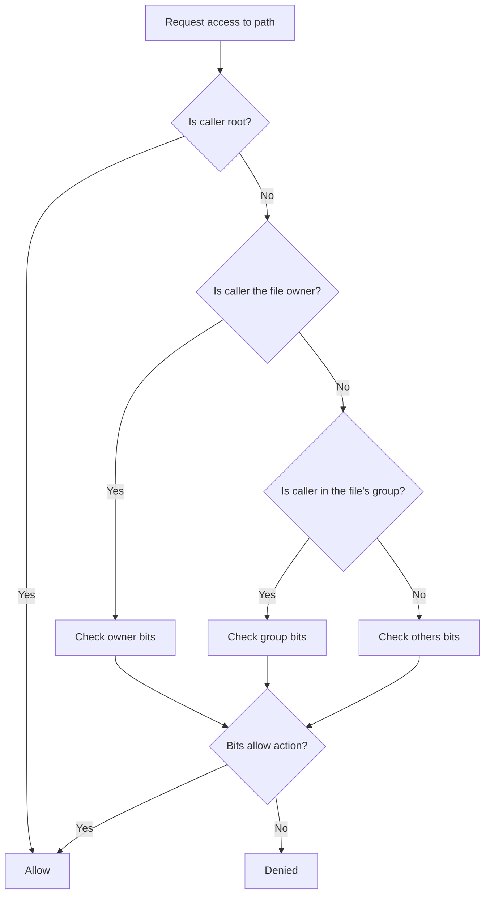
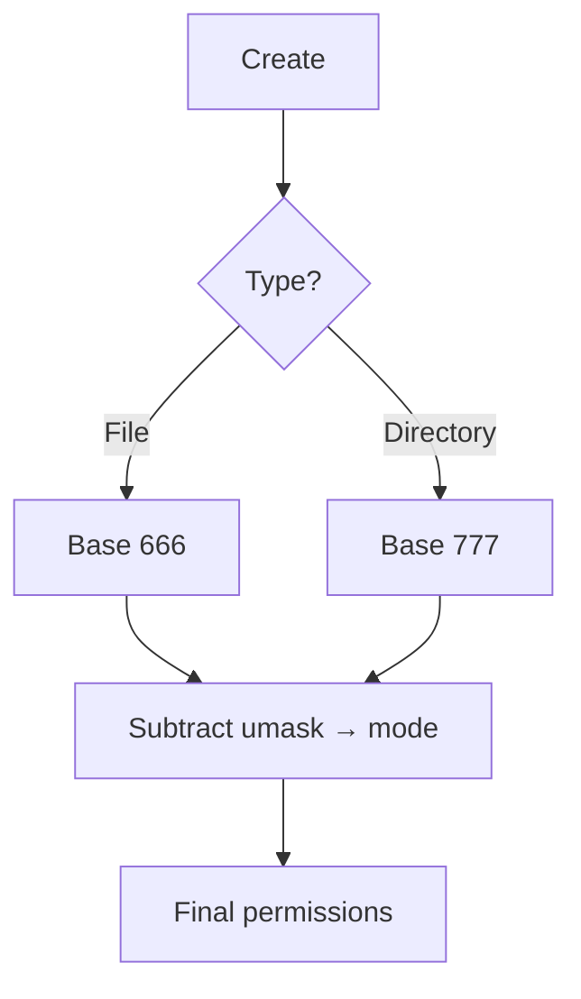

# Daily DevOps + SRE Challenge Series – Season 2
## Day 14: Linux Users, Groups, and Permissions – Essentials for DevOps/SRE

### Introduction
Welcome to Day 14 of the Daily DevOps + SRE Challenge Series – Season 2! 

Today you’ll learn the core skills for managing users, groups, and file permissions in Linux. We’ll stay focused on the 20% that covers 80% of real DevOps/SRE work: creating users, adding them to groups, fixing “Permission denied” issues, and setting up safe shared directories for teams.

By the end of this challenge, you’ll be able to:
- Create and manage users and groups safely
- Read and change permissions with confidence
- Fix ownership/permission issues that break apps and deployments
- Build a team directory that “just works” for collaboration

Why this matters
- Security: Avoid overexposed files and risky defaults
- Reliability: Services run only when ownership/modes are correct
- Collaboration: The right group setup saves time and tickets
- Troubleshooting: “Permission denied” is one of the most common production errors

---

### 1) The Essentials You’ll Use Daily

Users and groups (who can do what)
- Users have a username, UID, home, and shell
- Groups let multiple users share access without changing file owners

Quick commands
```bash
# Users
sudo useradd -m -s /bin/bash riya
sudo passwd riya
id riya
groups riya

# Groups
sudo groupadd devops
sudo usermod -aG devops riya    # append (-a) to Group (-G)
getent group devops
```

Ownership (who owns a file/dir)
```bash
sudo chown user:group path
sudo chown -R www-data:www-data /var/www/html
```

Permissions (what actions are allowed)
- r (read), w (write), x (execute/traverse)
- Apply to: owner (u), group (g), others (o)
- Numeric: r=4, w=2, x=1 → 640 = u=rw, g=r, o=-

Common modes you’ll set
```bash
chmod 640 file        # configs readable by app group, not world
chmod 750 dir         # app can enter/execute; group can traverse; others blocked
chmod 755 dir         # world-readable directory (no write)
```

Team-friendly directories
- setgid (2) on a directory makes new files inherit the directory’s group
```bash
sudo chmod 2775 /projects/teamspace
```

Sticky bit (shared scratch areas like /tmp)
```bash
sudo chmod 1777 /shared    # users can’t delete others’ files
```

Tip: For most team folders, set owner to root:team, apply 2770/2775, and add members to the team group.

---

### 2) Two Short Mermaid Diagrams

Permission evaluation (simple mental model)


umask (why new files default to 644 and dirs to 755)


---

### 3) Practical Scenarios (Do These)

Scenario A: Create users and a devops group
```bash
# Users
for u in riya amit neha; do sudo useradd -m -s /bin/bash "$u" || true; done
# Group
sudo groupadd devops || true
# Add users to group
for u in riya amit neha; do sudo usermod -aG devops "$u"; done
# Verify
for u in riya amit neha; do id "$u"; done
```

Scenario B: Team workspace that “just works”
Goal: Everyone in devops can create/edit files in /projects/infra; others blocked.
```bash
sudo mkdir -p /projects/infra
sudo chown root:devops /projects/infra
sudo chmod 2770 /projects/infra     # setgid ensures new files use group devops
# Test (from different users): create files and edit each other’s files
```

Scenario C: Fix a broken web app folder
Symptom: Nginx can’t read /var/www/html (403/404).
```bash
# Debian/Ubuntu typical web user
sudo chown -R www-data:www-data /var/www/html
sudo find /var/www/html -type d -exec chmod 755 {} \;
sudo find /var/www/html -type f -exec chmod 644 {} \;
```

Scenario D: Quick account hygiene
```bash
# Lock an unused account
sudo usermod -L guest
# Set password policy for riya
sudo chage -M 90 -m 7 -W 14 riya
# See current policy
chage -l riya
```

Scenario E: Troubleshoot “Permission denied”
Checklist:
- ls -ld path; stat file
- namei -l /deep/nested/path (shows each directory’s x bit)
- id user (group membership)
- If it’s a team dir, ensure setgid and group membership are correct
Commands:
```bash
namei -l /srv/app/config/app.env
id appsvc
ls -ld /srv /srv/app /srv/app/config
```

Optional (nice to know, not required today):
- Default ACLs for always-on group write in team dirs:
```bash
sudo apt-get install -y acl 2>/dev/null || true
sudo setfacl -m g:devops:rwx /projects/infra
sudo setfacl -d -m g:devops:rwx /projects/infra
getfacl /projects/infra
```

---

## Practical Tasks: Build, Share, Fix

Do these and capture the commands and outputs.

Task 1: Users and group
- Create users riya, amit, neha
- Create devops group and add the users
- Save id outputs to ~/perm-lab/users.txt

Task 2: Team directory
- Create /projects/infra as root:devops with 2770
- Show that files created by any member are editable by others
- Save ls -l and a short note to ~/perm-lab/teamspace.md

Task 3: Fix permissions
- Simulate a broken app dir /opt/app owned by root:root with mode 600
- Create appsvc user (no password needed)
- Fix to appsvc:appsvc, dirs 750, files 640
- Prove appsvc can read configs; others cannot
- Save commands and stat outputs to ~/perm-lab/appfix.md

Task 4: One troubleshooting case
- Break something intentionally (e.g., remove x from a parent directory)
- Use namei -l to find the missing execute bit and fix it
- Save before/after to ~/perm-lab/troubleshoot.md

Deliverables
- A markdown file solution.md with:
  - Commands and outputs for Tasks 1–4
  - 3–5 bullet notes on what you learned

---

## Submission Guidelines
- Store your findings and execution steps in solution.md
- Submit it in your GitHub repository and share the link
- Post your experience on social media with #getfitwithsagar #SRELife #DevOpsForAll
- Tag us in your posts for visibility and networking

---

## Join Our Community
- Discord – Ask questions and collaborate: https://discord.gg/mNDm39qB8t
- Google Group – Get updates and discussions: https://groups.google.com/forum/#!forum/daily-devops-sre-challenge-series/join
- YouTube – Watch solution videos and tutorials: https://www.youtube.com/@Sagar.Utekar

---

## Stay Motivated!
Keep it simple. Master the basics. You’ll use these commands every week in real DevOps/SRE work.

Happy Learning!

Best regards,  
Sagar Utekar
