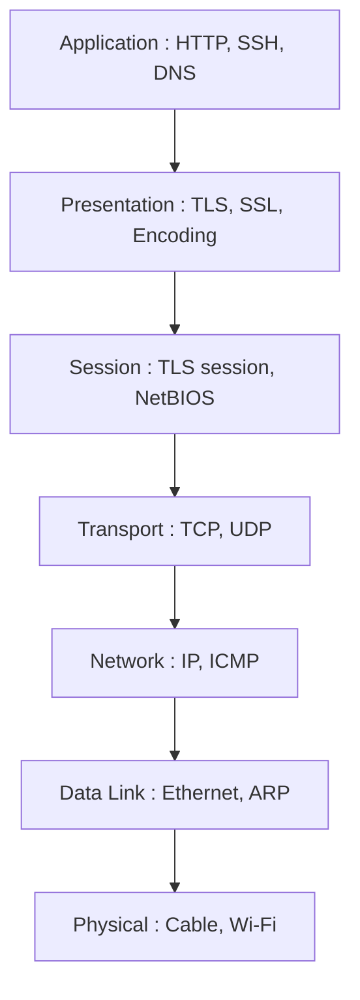
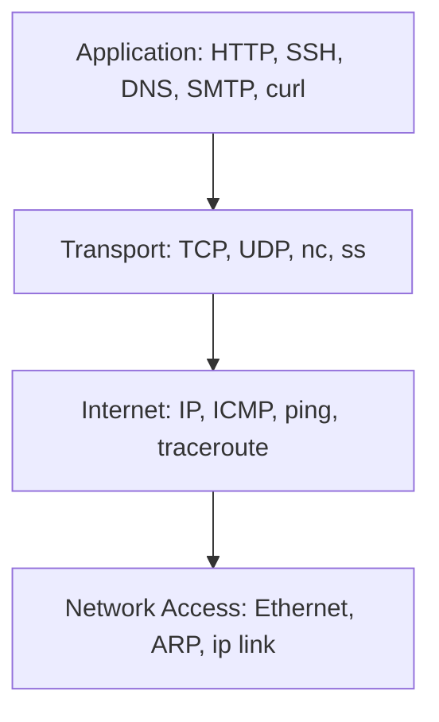

# Daily DevOps + SRE Challenge Series – Season 2  
## Day 15: OSI & TCP/IP Model Foundations for DevOps/SRE

### Introduction
Welcome to Day 15 of the Daily DevOps + SRE Challenge Series - Season 2!

Today marks the start of your Networking for DevOps journey. Before diving into commands and configs, you'll build a strong mental model of how networking actually works layer by layer. Understanding the OSI and TCP/IP models will make you a faster troubleshooter, a better cloud/network engineer, and help you communicate clearly with your team.

By the end of today, you'll be able to:
- Draw and describe both the OSI and TCP/IP models
- Map common protocols and tools (ping, SSH, HTTP, DNS, etc.) to the right layer
- Explain where most real-world DevOps/SRE problems occur
- Use this model to guide troubleshooting (“where is it broken?”)

Why this matters:
- Troubleshooting: Pinpoint failures (e.g., “Is it a firewall or DNS issue?”)
- Communication: Clearly explain problems to network, security, and cloud teams
- Design: Choose the right tool or protocol for any scenario
- Interviews: “At what layer does X work?” is a common question

---

### 1) The OSI & TCP/IP Models

#### OSI Model (7 Layers) and Data Formats

| Layer         | Number | Example Protocols           | Example Tools      | Data Unit (PDU)           |
|---------------|--------|----------------------------|--------------------|---------------------------|
| Application   | 7      | HTTP, SSH, DNS, SMTP       | curl, ssh, dig     | Data / Message            |
| Presentation  | 6      | SSL/TLS, ASCII, JPEG       | openssl            | Data                      |
| Session       | 5      | NetBIOS, RPC, TLS session  |                    | Data                      |
| Transport     | 4      | TCP, UDP                   | nc, ss, netstat    | Segment (TCP) / Datagram (UDP) |
| Network       | 3      | IP, ICMP                   | ip, ping, traceroute | Packet                  |
| Data Link     | 2      | Ethernet, ARP, MAC         | ip link, arp       | Frame                     |
| Physical      | 1      | Cables, Wi-Fi, fiber       | ethtool, ip link   | Bit                       |

#### TCP/IP Model (4 Layers)

| Layer         | OSI Layer(s)             | Example Protocols/Tools      |
|---------------|--------------------------|------------------------------|
| Application   | 7, 6, 5                  | HTTP, SSH, DNS, TLS, curl    |
| Transport     | 4                        | TCP, UDP, nc, ss             |
| Internet      | 3                        | IP, ICMP, ping, traceroute   |
| Network Access| 2, 1                     | Ethernet, ARP, ip link, ethtool|

---

### 2) Visual Diagrams

#### OSI Model Overview

#### TCP/IP Model & Protocol Mapping

---

### 3) Hands-On Challenge

#### Scenario A: Draw & Map the Layers

- Draw both models (on paper or using a tool)
- List at least 2 protocols and 2 tools for each layer (see tables above)
- Save a photo/image/markdown table in your solution

#### Scenario B: Protocol Mapping Exercise

Given these tools/protocols, map each to its layer(s):  
- ping  
- ssh  
- dig  
- curl  
- nc  
- ip addr  
- arp  
- openssl  
- traceroute  
- tcpdump  

Fill out a table like:
| Tool/Protocol | OSI Layer(s) | TCP/IP Layer | Description |
|---------------|--------------|--------------|-------------|
| ping          | 3, 1         | Internet     | Tests IP reachability using ICMP |
| ssh           | 7, 4         | Application, Transport | Secure shell (needs network and transport) |
| ...           | ...          | ...          | ...         |

#### Scenario C: Mini Incident Simulation

A developer says:  
> “I can’t reach the app at http://10.10.10.20:5000 from my laptop. Ping fails, but DNS resolves.”

Your task:
1. Identify which layer(s) might be failing based on symptoms
2. List which commands/tools you would use in order to troubleshoot—from bottom to top

Document your answer in solution.md.

---

### 4) What to Watch For (Common Gotchas)
- Not every protocol is at only one layer (e.g., DNS = Application, but depends on Transport/Network)
- Some tools work at multiple layers (e.g., tcpdump sees almost everything!)
- Real-world cloud infra may “hide” some layers (e.g., you don’t see cables, but you still check link status in VMs)
- The PDU (data format) matters for troubleshooting (e.g., "packet loss" is different from "frame error")

---

## Submission Guidelines
- Create `solution.md` including:
  - Your diagrams/tables for OSI & TCP/IP models
  - Completed protocol mapping table
  - Your troubleshooting approach for the mini incident
  - 3–5 short bullet points on what you learned

- Push to your GitHub repo and share the link
- Post your experience with #getfitwithsagar #SRELife #DevOpsForAll and tag us

---

## Join Our Community
- Discord – Ask questions and collaborate: https://discord.gg/mNDm39qB8t
- Google Group – Updates and discussions: https://groups.google.com/forum/#!forum/daily-devops-sre-challenge-series/join
- YouTube – Tutorials: https://www.youtube.com/@Sagar.Utekar

---

## Stay Motivated!
A solid mental model makes every future network problem easier. Build your foundation today!

Happy Learning!

Best regards,  
Sagar Utekar
