# Day 15 — Linux Networking Challenges (Daily DevOps + SRE Challenge Series — Season 2)

---

## Introduction

Welcome to Day 15 of the Daily DevOps + SRE Challenge Series – Season 2! 🎉

Today, you'll dive into essential **Linux networking skills** through practical, story-based scenarios. You'll configure IP addresses, set up namespaces, simulate routing, and debug traffic issues—all on your local machine without any complex setup. By the end, you'll:

* Understand and troubleshoot the **OSI & TCP/IP layers** in real-world failures.
* Configure **IPv4/IPv6 addressing**, resolve subnetting conflicts, and simulate enterprise VPC designs.
* Master **ARP behavior**, from cache flushing to spoofing attacks.
* Gain hands-on skills to debug outages with tools like `iptables`, `ip`, and `tcpdump`.

---

## Why This Matters?

Networking is the backbone of everything—cloud apps, Kubernetes clusters, even CI/CD pipelines. If you can't debug connectivity, you'll get stuck in outages fast.

* **Real-World Edge:** Most outages aren't due to servers crashing—they're due to misconfigured routes, DNS failures, or firewall issues.
* **SRE Superpower:** Knowing the **why ping works but app fails** scenario makes you 10x faster in production war rooms.
* **Cloud Readiness:** VPC, subnets, and dual-stack IPv4/IPv6 configs are daily tasks for AWS/GCP/Azure engineers.
* **Interview Gold:** "Why can two hosts ping but not load HTTP?" or "How do you debug duplicate IP conflicts?"—classic SRE questions.
* **Security Awareness:** ARP spoofing and wrong subnet masks are real threats in production, not just lab theory.

---

## Real-World Save 🌍

At a fintech startup, payments randomly failed for EU customers. Engineers could **ping servers but HTTP calls kept timing out**. Debugging revealed a firewall rule blocking port 443 on just one subnet. Fixing that restored global transactions. Knowing **layer-by-layer troubleshooting** saved millions in lost revenue.

---

# Theory (detailed) — **do not skip**

> Below: full theory for the four topics you asked for. Read fully before doing labs.

---

## OSI & TCP/IP Models — Introduction

**What is it?**
OSI (Open Systems Interconnection) is a conceptual 7-layer model that describes how data moves through networked systems. TCP/IP model is a simpler practical model used in the Internet (4 layers). These help you think logically about where failures happen.

**Why learn it?**
Because when something breaks (web app not loading, DNS failing, packets dropping), you must ask: *which layer broke?* — physical, link (MAC), IP (routing), TCP/UDP (ports), or the app (HTTP/DNS). This narrows down troubleshooting steps.

---

### OSI layers (simple, one-line each)

1. **Physical (L1)** — cables, radio waves, NIC hardware.
2. **Data Link (L2)** — frames, MAC addresses, switches, ARP.
3. **Network (L3)** — IP addressing and routing.
4. **Transport (L4)** — TCP/UDP, ports, connection reliability.
5. **Session (L5)** — sessions, dialogs (rarely directly debugged).
6. **Presentation (L6)** — encoding/encryption (TLS sits around here).
7. **Application (L7)** — HTTP, DNS, SSH—the services users interact with.

**TCP/IP Stack mapping (practical):**

* Link (L1–L2) — ARP, Ethernet
* Internet (L3) — IP, routing
* Transport (L4) — TCP, UDP
* Application (L7) — HTTP, DNS, SSH

---

### Key concepts & simple analogies

* **IP = house number** — tells you *where* to go.
* **MAC = person's face** — used to deliver inside the same building (LAN).
* **Ports (TCP/UDP) = apartment door numbers** — same house, many services.
* **Firewall = security guard at door** — can block specific ports/protocols.

---

### Typical tools & what they tell you

* `ping` (ICMP) → L3 reachability test.
* `arp` / `ip neigh` → L2 IP→MAC mapping.
* `ip addr`, `ip route` → addresses & routes (L3).
* `ss -tuln` / `nc` → ports and services (L4).
* `tcpdump` → raw packet capture (L2–L4).
* `iptables` or `nft` → firewall rules (L4-L3 policies).
* `traceroute` → shows path (L3/hops), but depends on ICMP/TCP/UDP responses.

---

### Troubleshooting mental model (simple process)

1. **Is the NIC up?** (`ip link`) — Physical/L1
2. **Can I reach IP?** (`ping`) — Network/L3
3. **Is the service listening?** (`ss -ltnp`, `nc`) — Transport/L4 & App/L7
4. **Is DNS resolving?** (`dig`, `nslookup`) — App/L7
5. **Capture packets** (`tcpdump`) — inspect headers (MAC, IP, TCP flags).
6. **Check firewall rules** (`iptables -L`, `nft list ruleset`).

---

### Mermaid diagrams (OSI / TCP-IP overview)

OSI stack:

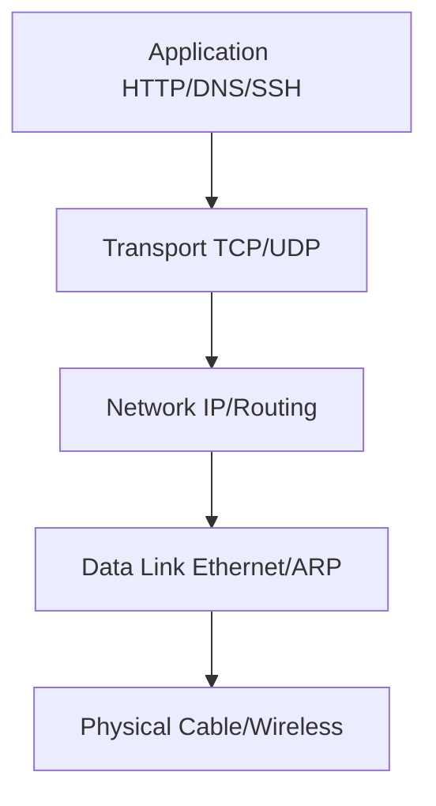

Packet debugging flow:


---

## IP Addressing (IPv4 & IPv6) — Introduction

**What is it?**
IP addresses uniquely identify hosts on a network. IPv4 is 32-bit (e.g., `192.168.1.10`), IPv6 is 128-bit (e.g., `2001:db8::1`).

**Why important?**
If you don't know addressing basics, you'll misconfigure masks, gateways, or try to reach the wrong network. IP addressing also affects routing, ACLs, NAT — everything SREs care about.

---

### IPv4 basics

* **Format:** dotted decimal `a.b.c.d` (32 bits).
* **CIDR prefix:** `/24` means top 24 bits are network — addresses inside are on same subnet.
* **Private ranges:**

  * `10.0.0.0/8`
  * `172.16.0.0/12`
  * `192.168.0.0/16`
* **Special addresses:** `0.0.0.0` (this host), `127.0.0.1` (loopback), network & broadcast addresses.

**How to compute host counts:**

* `/24` → 256 addresses (254 hosts usable).
* `/26` → 64 addresses (62 hosts usable).

---

### IPv6 basics

* **Format:** hex groups `2001:db8::1` (128 bits).
* **Scopes:** Link-local (`fe80::/10`), global unicast (public), loopback (`::1`).
* **Advantages:** large address space, simpler auto-configuration (SLAAC), better routing aggregation.

---

### Subnet mask & network boundary (simple)

* Mask tells whether destination IP is on your local network or needs to be sent to a router.
* Example: `192.168.1.10/24` and `192.168.1.20/24` are local; `192.168.2.1` is remote.

---

### Useful commands

* Show addresses: `ip addr show`
* Show routes: `ip route show`
* Add address: `ip addr add 10.0.0.2/24 dev eth0`
* IPv6 show: `ip -6 addr show`
* Disable IPv4 (namespace): `sysctl -w net.ipv4.conf.all.disable_ipv4=1`

---

### Routing decision (simple)

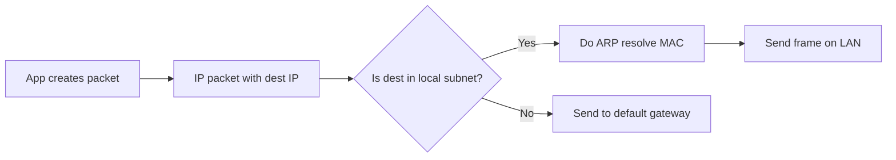

---

## Subnetting & CIDR — Introduction

**What is it?**
CIDR (Classless Inter-Domain Routing) describes networks by prefix length (`/24`, `/26`) and enables flexible splitting of IP space. Subnetting divides a big network into smaller networks.

**Why learn it?**
To allocate IPs to teams, limit broadcast domains, design VPCs, and avoid overlaps when merging networks.

---

### How CIDR works (simple)

*  `10.0.0.0/24` → addresses `10.0.0.0`–`10.0.0.255`.
* Splitting `10.0.0.0/24` into `/26` yields:

  * `10.0.0.0/26` (0–63)
  * `10.0.0.64/26` (64–127)
  * `10.0.0.128/26` (128–191)
  * `10.0.0.192/26` (192–255)

---

### Common tasks

* **Divide network** for teams → use /26, /27 etc.
* **Plan VPC** blocks to avoid future overlap.
* **Detect overlaps** before merging nets.

---

### Overlap problems (simple)

* If Net A thinks IP is local (on-link) and Net B thinks same IP is remote, packets can be dropped or blackholed. The fix: **renumber** or **NAT** at boundary.

---

### Subnet split

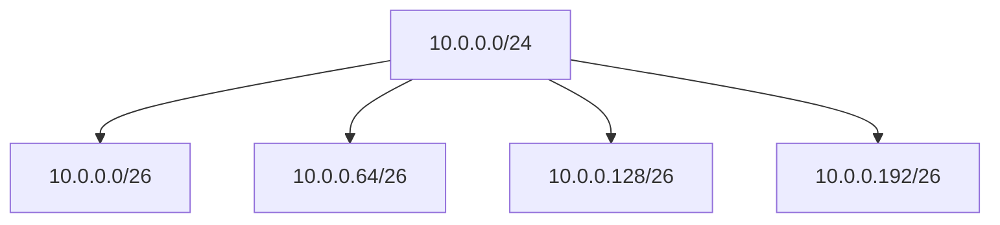

---

## ARP (Address Resolution Protocol) — Introduction

**What is it?**
ARP maps IPv4 addresses to MAC addresses inside a LAN. It's how IP packets get delivered to the correct NIC inside the same broadcast domain.

**Why ARP matters?**
If ARP is wrong or spoofed, your traffic can go to the wrong machine, be dropped, or be intercepted.

---

### ARP normal flow (simple)

1. Host A wants to send to IP X.
2. If it has no MAC for X in ARP cache, it sends **ARP Who-has X tell A** (broadcast).
3. The owner replies **ARP is-at MAC**.
4. Host A caches and sends frames to that MAC.

---

### ARP cache and states

* Entries expire — kernel keeps freshness flags (`REACHABLE`, `STALE`, etc.).
* Commands: `ip neigh show`, `arp -n`, `arping -I <iface> <ip>`

---

### ARP security problems

* **Duplicate IP:** Two hosts claim same IP → flapping / inconsistent replies.
* **ARP spoofing/poisoning:** Attacker sends fake ARP replies linking victim/gateway IP to attacker's MAC → MITM.
* **Mitigations:** static ARP entries (for critical hosts), switch DAI, encryption (TLS).

---

### ARP sequence

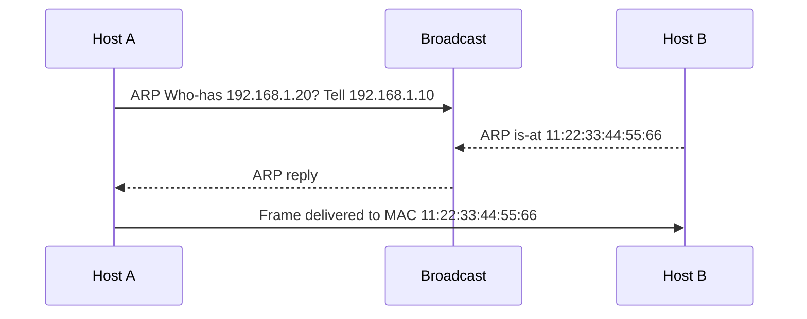

---

## Additional Theory Concepts

### DNS (Domain Name System) — Introduction

**What is it?**
DNS translates human-readable domain names (like google.com) to IP addresses. It uses a hierarchical, distributed database.

**Why learn it?**
Because most network connections start with a DNS lookup. If DNS fails, your application fails—even if the target server is reachable by IP.

---

### How DNS works (simple)

1. Application requests resolution (e.g., browser asks for google.com).
2. The request is sent to a DNS resolver (usually provided by ISP or public ones like 8.8.8.8).
3. The resolver queries the root servers, then TLD servers, then authoritative servers for the domain.
4. The IP address is returned and cached.

---

### Key concepts

- **Record types:** A (IPv4), AAAA (IPv6), CNAME (alias), MX (mail), etc.
- **Port:** UDP 53 (queries), TCP 53 (large responses or zone transfers).
- **Tools:** `dig`, `nslookup`, `host`.

---

### Common issues

- Misconfigured `/etc/resolv.conf`
- Firewall blocking UDP 53
- Slow DNS responses (high latency)

---

### DNS lookup

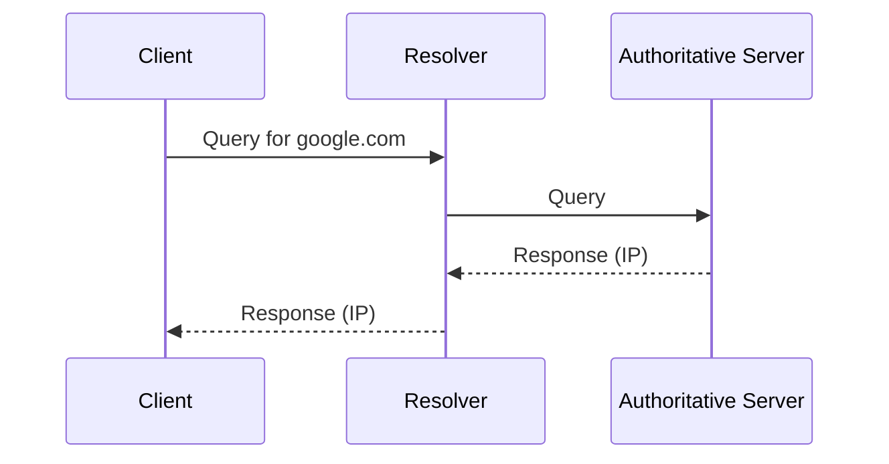

---

### MTU (Maximum Transmission Unit) — Introduction

**What is it?**
MTU is the maximum size of a packet that can be transmitted without fragmentation over a network interface.

**Why learn it?**
If packets are too large for a link, they get fragmented (which adds overhead) or dropped (which breaks connectivity). This is common in VPNs and tunnels.

---

### How MTU works (simple)

- Each link has an MTU (e.g., Ethernet is 1500 bytes).
- If a packet is larger than the MTU, it is fragmented into smaller packets (if allowed) or an ICMP "need to fragment" error is sent.
- **Path MTU Discovery (PMTUD)** is the process of determining the smallest MTU along the path to avoid fragmentation.

---

### Common issues

- MTU mismatch between endpoints or intermediate links causes black holes for large packets.
- VPNs reduce effective MTU due to encapsulation overhead.

---

### PMTUD

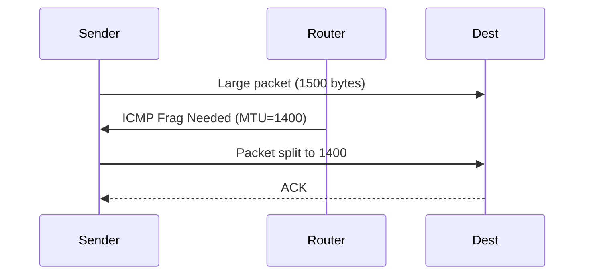

---

### Routing (Multiple NICs, Policy Routing) — Introduction

**What is it?**
Routing decides which interface to use to send a packet. Policy routing allows routing decisions based on more than just the destination IP (e.g., source IP, protocol).

**Why learn it?**
Multi-homed hosts (multiple NICs) may have complex routing requirements. Wrong routing can cause asymmetric paths or failures.

---

### How routing works (simple)

- The kernel uses the routing table to decide the next hop.
- Default route (0.0.0.0/0) is used when no specific route matches.
- **Metric** is used to choose between multiple routes to the same destination (lower is better).
- **Policy routing** uses multiple routing tables selected by rules (e.g., from a certain source IP, use a different table).

---

### Common commands

- `ip route show`
- `ip rule list` (for policy routing)
- `ip route add ... metric ...`
- `ip rule add from <IP> table <table>`

---

### Routing decision

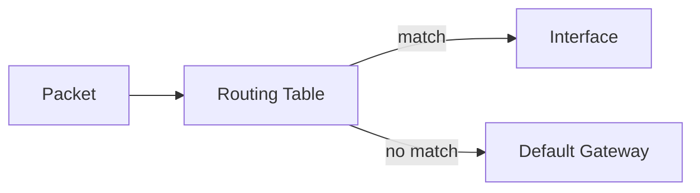

---
---
---
---

## Challenges

🔹 **1. OSI & TCP/IP Models**

**Ping works, but HTTP fails**
Run python3 -m http.server 8080 in one namespace/VM.
From another, ping works but block TCP port 8080 using iptables.
👉 Mimics: "Why I can ping the server but the website isn't loading?"

**Solution:**

```bash
# Setup
ip netns add srv; ip netns add cli
ip link add veth-s type veth peer name veth-c
ip link set veth-s netns srv; ip link set veth-c netns cli
ip netns exec srv ip addr add 10.0.0.1/24 dev veth-s
ip netns exec cli ip addr add 10.0.0.2/24 dev veth-c
ip netns exec srv ip link set veth-s up; ip netns exec cli ip link set veth-c up
ip netns exec srv python3 -m http.server 8080 &

# Test
ip netns exec cli ping -c2 10.0.0.1           # ✅ works
ip netns exec cli curl -m3 10.0.0.1:8080      # ✅ works

# Break (block TCP/8080)
ip netns exec srv iptables -A INPUT -p tcp --dport 8080 -j DROP
ip netns exec cli curl -m3 10.0.0.1:8080      # ❌ timeout

# Interpretation: L3 OK; L4/L7 blocked by firewall.
# Fix
ip netns exec srv iptables -D INPUT -p tcp --dport 8080 -j DROP
```

**Flow diagram (packet journey → break → fix):**

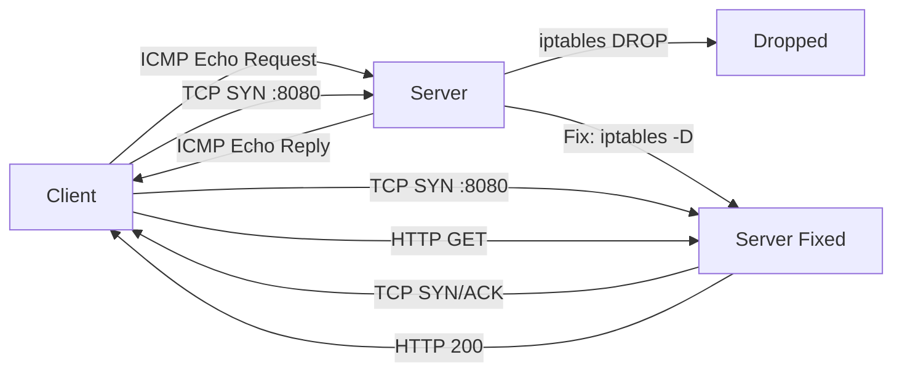

*Note:* ping uses ICMP (L3). curl uses TCP (L4) + HTTP (L7). iptables blocked TCP/8080 — that's why ping succeeded but web failed.

---

**DNS Layer Check**
Disable /etc/resolv.conf or block UDP 53.
Test browsing (curl google.com fails, but curl 142.250.182.14 works).
👉 Mimics: "App fails because DNS is misconfigured."

**Solution:**

```bash
# Setup one namespace as client
ip netns add ns1; ip netns exec ns1 ip link set lo up

# Break DNS safely (in namespace only)
ip netns exec ns1 iptables -A OUTPUT -p udp --dport 53 -j DROP

# Test
ip netns exec ns1 curl -m3 http://google.com        # ❌ fails (could not resolve)
ip netns exec ns1 curl -m3 http://142.250.182.14    # ✅ works (direct IP)

# Interpretation: IP path fine; DNS resolution broken.
# Fix
ip netns exec ns1 iptables -D OUTPUT -p udp --dport 53 -j DROP
```

**Flow diagram:**

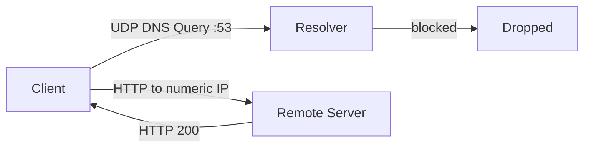

*Note:* block DNS (UDP/53) prevents name resolution; direct IP works.

---

**MTU Mismatch**
Set MTU on one interface to 1400 and the other to 900.
Try large file transfer with scp.
👉 Mimics: "Packets drop due to MTU mismatch in VPN tunnels."

**Solution:**

```bash
# Setup
ip netns add a; ip netns add b
ip link add va type veth peer name vb
ip link set va netns a; ip link set vb netns b
ip netns exec a ip addr add 10.1.1.1/24 dev va
ip netns exec b ip addr add 10.1.1.2/24 dev vb
ip netns exec a ip link set va up mtu 1400
ip netns exec b ip link set vb up mtu 900

# Test small vs large
ip netns exec a ping -c2 10.1.1.2                 # ✅ often works
ip netns exec a ping -M do -s 1200 10.1.1.2       # ❌ fails due to MTU

# (Optional TCP test)
ip netns exec b nc -l -p 9000 >/dev/null &
head -c 200000 </dev/urandom | ip netns exec a nc 10.1.1.2 9000   # may stall

# Interpretation: PMTU/fragmentation issue.
# Fix (align MTUs)
ip netns exec b ip link set vb mtu 1400
```

**Flow diagram:**

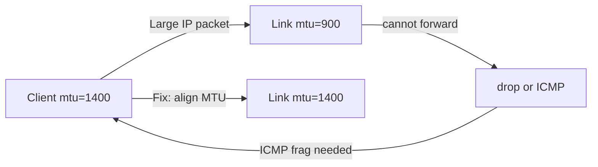

---

**Layer 2 vs Layer 3 Failure**
Assign two machines same subnet but no switch/bridge between them.
👉 Mimics: "Why hosts on same subnet can't reach each other?"

**Solution:**

```bash
# Setup (two separate links with no shared L2 domain)
ip netns add n1; ip netns add n2
ip link add v1 type veth peer name v1p
ip link add v2 type veth peer name v2p
ip link set v1 netns n1; ip link set v2 netns n2
ip netns exec n1 ip addr add 192.168.50.1/24 dev v1
ip netns exec n2 ip addr add 192.168.50.2/24 dev v2
ip netns exec n1 ip link set v1 up; ip netns exec n2 ip link set v2 up

# Test
ip netns exec n1 ping -c2 192.168.50.2    # ❌ fails (no L2 connectivity)

# Interpretation: Same subnet needs shared L2 (bridge/switch).
# Fix: create bridge and attach peers (host side v1p & v2p)
ip link add br0 type bridge; ip link set br0 up
ip link set v1p master br0; ip link set v2p master br0
ip netns exec n1 ping -c2 192.168.50.2    # ✅ works now
```

**Flow diagram:**

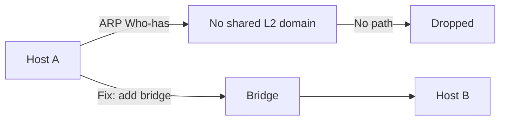

---

**Layer-wise Debugging**
Capture traffic with tcpdump. Try ICMP, TCP, UDP one by one.
👉 Helps visualize OSI/TCP-IP model in action.

**Solution:**

```bash
# Setup two namespaces
ip netns add c1; ip netns add c2
ip link add t1 type veth peer name t2
ip link set t1 netns c1; ip link set t2 netns c2
ip netns exec c1 ip addr add 10.9.0.1/24 dev t1
ip netns exec c2 ip addr add 10.9.0.2/24 dev t2
ip netns exec c1 ip link set t1 up; ip netns exec c2 ip link set t2 up

# Start capture on c2
ip netns exec c2 tcpdump -i t2 -n &

# Generate traffic from c1
ip netns exec c1 ping -c2 10.9.0.2                 # ICMP
ip netns exec c2 python3 -m http.server 8081 &     # TCP server
ip netns exec c1 curl -m3 10.9.0.2:8081            # TCP
ip netns exec c1 sh -lc 'echo hi | nc -u 10.9.0.2 9001'  # UDP

# Interpretation: See L2 (eth), L3 (IP), L4 (ICMP/TCP/UDP) in capture.
```

**Flow diagram (example capture view):**

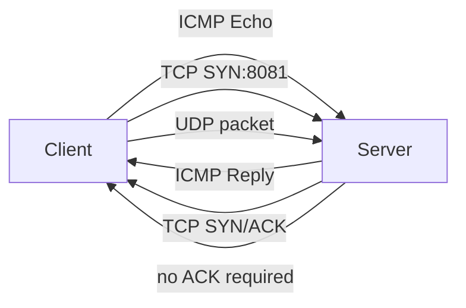

---

🔹 **2. IP Addressing (IPv4, IPv6)**

**Duplicate IP Conflict**
Assign 192.168.1.10 to two hosts. Ping from a third host → observe flapping replies.
👉 Mimics: "Two servers misconfigured with same IP."

**Solution:**

```bash
# Setup three namespaces on a bridge
ip netns add h1; ip netns add h2; ip netns add h3
ip link add br0 type bridge; ip link set br0 up

# Connect h1
ip link add h1v type veth peer name h1p
ip link set h1v netns h1; ip link set h1p master br0
ip netns exec h1 ip addr add 192.168.1.10/24 dev h1v; ip netns exec h1 ip link set h1v up

# Connect h2
ip link add h2v type veth peer name h2p
ip link set h2v netns h2; ip link set h2p master br0
ip netns exec h2 ip addr add 192.168.1.10/24 dev h2v; ip netns exec h2 ip link set h2v up

# Connect h3
ip link add h3v type veth peer name h3p
ip link set h3v netns h3; ip link set h3p master br0
ip netns exec h3 ip addr add 192.168.1.30/24 dev h3v; ip netns exec h3 ip link set h3v up

# Test from h3
ip netns exec h3 arping -I h3v -c 3 192.168.1.10   # 🔁 multiple MACs/replies (flap)
ip netns exec h3 ping -c4 192.168.1.10             # ❗ inconsistent replies

# Interpretation: Duplicate IP causing ARP instability.
# Fix: give h2 a unique IP, e.g.
ip netns exec h2 ip addr flush dev h2v
ip netns exec h2 ip addr add 192.168.1.11/24 dev h2v
```

**Flow diagram:**

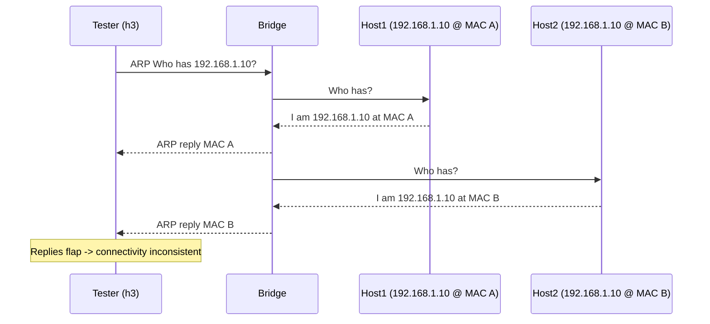

---

**IPv6 Only Network**
Assign IPv6 addresses only (`2001:db8::1/64`). Disable IPv4 → try reaching services.
👉 Mimics: "Transitioning to IPv6 in enterprise."

**Solution:**

```bash
# Setup
ip netns add v6a; ip netns add v6b
ip link add v6aif type veth peer name v6bif
ip link set v6aif netns v6a; ip link set v6bif netns v6b
ip netns exec v6a ip -6 addr add 2001:db8::1/64 dev v6aif
ip netns exec v6b ip -6 addr add 2001:db8::2/64 dev v6bif
ip netns exec v6a ip link set v6aif up; ip netns exec v6b ip link set v6bif up

# Disable IPv4 on both interfaces
ip netns exec v6a sysctl -w net.ipv4.conf.all.disable_ipv4=1
ip netns exec v6b sysctl -w net.ipv4.conf.all.disable_ipv4=1

# Test IPv6 reachability
ip netns exec v6a ping -6 -c2 2001:db8::2        # ✅ works
# Try reaching an IPv4-only IP from v6a (will fail)
ip netns exec v6a ping -6 -c2 142.250.182.14     # ❌ cannot (v4 only target)

# Interpretation: IPv6-only cannot reach IPv4-only services.
# Fix: deploy dual-stack or NAT64/DNS64.
```

**Flow diagram:**

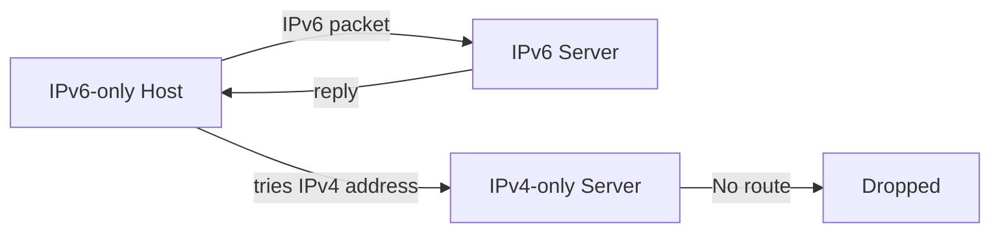

---

**Wrong Subnet Mask**
Host A: 192.168.1.10/24, Host B: 192.168.1.20/16. Traffic works one way but not the other.
👉 Mimics: "Subnet mask mismatch during manual config."

**Solution:**

```bash
# Setup
ip netns add A; ip netns add B
ip link add av type veth peer name bv
ip link set av netns A; ip link set bv netns B
ip netns exec A ip addr add 192.168.1.10/24 dev av
ip netns exec B ip addr add 192.168.1.20/16 dev bv
ip netns exec A ip link set av up; ip netns exec B ip link set bv up

# Test both ways
ip netns exec A ping -c2 192.168.1.20    # may ❌ (A expects router)
ip netns exec B ping -c2 192.168.1.10    # may ✅ (B thinks on-link)

# Interpretation: Asymmetric routing due to mask mismatch.
# Fix: make both /24 or both /16 consistently.
```

**Flow diagram:**

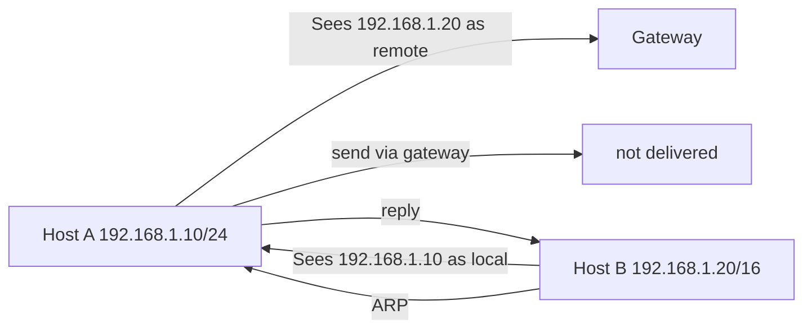

---

**Multiple NICs Routing**
One host with 192.168.1.10 (LAN) and 10.0.0.10 (WAN). Configure routing → see which NIC is chosen.
👉 Mimics: "Multi-homed servers with wrong default gateway."

**Solution:**

```bash
# Setup one namespace with two NICs via two bridges
ip netns add mh
ip link add br1 type bridge; ip link set br1 up
ip link add br2 type bridge; ip link set br2 up

ip link add mhv1 type veth peer name tap1
ip link add mhv2 type veth peer name tap2
ip link set mhv1 netns mh; ip link set mhv2 netns mh
ip link set tap1 master br1; ip link set tap2 master br2
ip netns exec mh ip addr add 192.168.1.10/24 dev mhv1
ip netns exec mh ip addr add 10.0.0.10/24 dev mhv2
ip netns exec mh ip link set mhv1 up; ip netns exec mh ip link set mhv2 up

# Default route selection
ip netns exec mh ip route add default via 10.0.0.1 dev mhv2 metric 100
ip netns exec mh ip route add default via 192.168.1.1 dev mhv1 metric 200
ip netns exec mh ip route show

# Policy routing example (force source-based egress)
ip netns exec mh ip rule add from 192.168.1.10/32 table 100
ip netns exec mh ip route add default via 192.168.1.1 dev mhv1 table 100
ip netns exec mh ip rule list
```

**Flow diagram:**

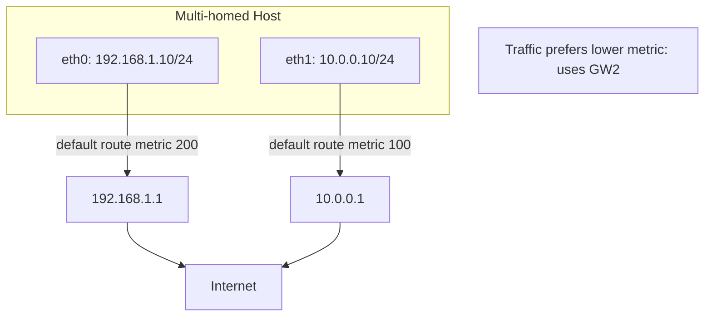

*Note:* The host will prefer the route with lower metric (100) for most traffic. Policy routing can override this based on source IP.

---

This completes the full networking challenge with comprehensive theory and practical exercises. The additional theory sections cover DNS, MTU, and routing concepts that are essential for complete networking understanding.