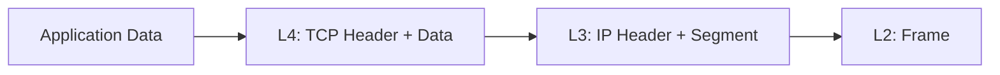

---

# **Day 17: OSI Layer 3 – The Network Layer (IP, Subnets, Routing)**

### **The Internetworking Layer: From Local to Global**

---

## **🚀 Why This Matters More Than Ever**

You've mastered the local talk (L2) and the physical signals (L1). But the real magic of the internet happens when a request from your phone in Delhi can find a server in São Paulo, passing through dozens of unknown networks in milliseconds.

**Layer 3 makes this possible.** It's the post office of the digital world. As an SRE or DevOps engineer, you don't just use this layer—you **design, secure, and troubleshoot** it. Every VPC, every firewall rule, every Kubernetes network policy, and every connectivity ticket ultimately boils down to Layer 3 concepts.

> **"It's never DNS... until it is. It's never networking... until it is. And then it's everything."**

---

## **1. Core Concepts Demystified**

### **1.1 The IP Address: Your Digital Passport**

*   **What it is:** A logical, hierarchical address assigned to a network interface. Unlike a MAC address (permanent, factory-assigned), an IP address is logical and can change based on location (network).
*   **The Hierarchy:** This is the key to scalability. An IP address isn't just a random number; it has a **network portion** (like a zip code) and a **host portion** (like a street address). This allows routers to make decisions based only on the network portion, ignoring the specific host.
*   **IPv4 vs. IPv6: The Great Transition**
    *   **IPv4 (e.g., `192.168.1.10`):** 32-bit, ~4.3 billion addresses. Exhausted. Kept alive by NAT (Network Address Translation).
    *   **IPv6 (e.g., `2001:0db8:85a3:0000:0000:8a2e:0370:7334`):** 128-bit, essentially unlimited addresses. Built for the modern internet (security, auto-configuration, efficiency).

### **1.2 Subnetting & CIDR: Drawing the Maps**

*   **The Problem:** Throwing all devices into one giant network (e.g., 16 million hosts with `10.0.0.0/8`) is a broadcast storm nightmare and a security disaster.
*   **The Solution: Subnetting.** Dividing a large network into smaller, manageable sub-networks.
*   **CIDR (Classless Inter-Domain Routing):** The notation that defines the network/host split. `192.168.1.10/24`
    *   The `/24` is the **prefix length**. It means the first 24 bits are the network ID.
    *   **Subnet Mask:** The same concept, in dotted-decimal. `/24` = `255.255.255.0`.
    *   **The Golden Rule:** Two devices can talk directly **only if they are on the same subnet.** If not, they need a router.

**Quick Subnetting Reference:**
| CIDR | Subnet Mask | Usable Hosts | Use Case |
| :--- | :--- | :--- | :--- |
| `/32` | `255.255.255.255` | 1 | Single host (loopback, AWS security groups) |
| `/30` | `255.255.255.252` | 2 | Point-to-point links (e.g., WAN connections) |
| `/24` | `255.255.255.0` | 254 | Common small LANs |
| `/16` | `255.255.0.0` | 65,534 | Large private networks (e.g., corporate) |
| `/8` | `255.0.0.0` | 16.7M | Huge legacy networks |

### **1.3 The Default Gateway: The Door to the World**

*   The IP address of the **router** that sits on your local subnet. Your device's routing table says: "If you don't have a specific route for the destination, send the packet to this guy. He'll know what to do."

### **1.4 Routing: The Path-Finding Algorithm**

*   **The Routing Table:** A list of rules on every networked device. Run `ip route show` to see yours. It answers the question: "To send a packet to IP X, which next hop or interface should I use?"
*   **How Routes are Added:**
    *   **Directly Connected:** Added automatically when you configure an IP address on an interface (`proto kernel`).
    *   **Statically Configured:** Manually added by an admin (`ip route add ...`).
    *   **Dynamically Learned:** Added by routing protocols (BGP, OSPF) that routers use to talk to each other and share network information.

---

## **2. The IP Packet Deep Dive (The L3 Envelope)**

The segment from Layer 4 is encapsulated into an IP Packet. Its header is the critical information for delivery.

| Field | Purpose | Why it Matters to You |
| :--- | :--- | :--- |
| **Version** | 4 or 6 | Determines which IP protocol stack to use. |
| **Source IP** | Origin Address | Used for reply routing. Can be spoofed (security risk!). |
| **Destination IP** | Final Address | The ultimate target the packet must reach. |
| **TTL (Time to Live)** | Hop Limit | Decremented by each router. Prevents infinite loops. A `traceroute` works by manipulating TTL. |
| **Protocol** | TCP (6), UDP (17), etc. | Tells the receiving host's OS which L4 protocol to hand the payload to. |
| **Flags / Fragment Offset** | Packet Fragmentation | If a packet is too large for a network link (MTU), it may be split into fragments. Often causes performance issues. |



---

## **3. Layer 3 in Action: Devices & Their Cloud Equivalents**

| Concept | Physical World | Virtual/Cloud World | Key Purpose |
| :--- | :--- | :--- | :--- |
| **Router** | Cisco, Juniper Box | **VPC Route Table**, **Virtual Network Gateway** | Connect different IP networks and make forwarding decisions. |
| **L3 Switch** | Switch with routing features | (Same as Router) | High-speed, hardware-based routing within a data center. |
| **Firewall** | Palo Alto, Fortinet Box | **Security Groups (Host-Based)**, **NACLs (Subnet-Based)**, **Cloud Firewall** | Filter traffic based on L3 (IPs) and L4 (Ports) rules. |
| **Load Balancer** | F5 BIG-IP | **ALB/NLB (AWS), GLB (GCP), Load Balancer (Azure)** | Distribute traffic based on IP and port to backend targets. |
| **Gateway** | Internet Router | **Internet Gateway (IGW), NAT Gateway** | Provide a controlled path between private networks and the internet. |

---

## **4. The SRE's Toolkit: Essential Linux Commands**

| Task | Command | Example & Output Snippet |
| :--- | :--- | :--- |
| **Show IP Config** | `ip addr show` or `ip a` | `inet 192.168.1.5/24 brd 192.168.1.255 scope global eth0` |
| **Show Routing Table** | `ip route show` or `ip r` | `default via 192.168.1.1 dev eth0 proto static` <br> `192.168.1.0/24 dev eth0 proto kernel scope link src 192.168.1.5` |
| **Test Reachability** | `ping <target>` | `64 bytes from 8.8.8.8: icmp_seq=1 ttl=118 time=15.3 ms` |
| **Trace the Path** | `traceroute <target>` <br> or `tracepath` | `1: _gateway (192.168.1.1) 1.102ms` <br> `2: 100.65.18.177 (100.65.18.177) 9.123ms` |
| **Check Listening Ports** | `ss -tuln` | `tcp LISTEN 0 128 0.0.0.0:22 0.0.0.0:*` <br> `(SSH listening on all IPs)` |
| **Manage Routes** | `sudo ip route add <route>` <br> `sudo ip route del <route>` | `sudo ip route add 10.10.0.0/24 via 192.168.1.254` |
| **Clear ARP Cache** | `ip neigh flush all` | Useful after changing network config to clear old MAC/IP mappings. |

---

## **5. Guided Hands-On Lab: Become Your Own Router**

### **Lab Setup (VirtualBox/VMware)**
1.  Create **three** VMs.
2.  Set their network adapters to **Internal Network** (e.g., named `LAB_NET`).
3.  Boot them up. They will have no IP addresses initially.

### **Step 1: Configure the "Router"**
*   On VM1 (`router`), configure two virtual interfaces.
    ```bash
    sudo ip addr add 192.168.10.1/24 dev eth0
    sudo ip addr add 192.168.20.1/24 dev eth1
    ```
*   Enable IP forwarding on `router` (this turns a Linux host into a router).
    ```bash
    echo 1 | sudo tee /proc/sys/net/ipv4/ip_forward
    ```

### **Step 2: Configure the "Clients"**
*   On VM2 (`client-a`), set its IP and default gateway.
    ```bash
    sudo ip addr add 192.168.10.10/24 dev eth0
    sudo ip route add default via 192.168.10.1
    ```
*   On VM3 (`client-b`), set its IP and default gateway.
    ```bash
    sudo ip addr add 192.168.20.20/24 dev eth0
    sudo ip route add default via 192.168.20.1
    ```

### **Step 3: Test the Connectivity**
*   From `client-a`, ping `client-b`'s IP.
    ```bash
    ping 192.168.20.20
    ```
*   **It should work!** You have successfully built a routed network. The `router` VM received the ping from `client-a` on its `192.168.10.1` interface, checked its routing table, and forwarded it out the `192.168.20.1` interface to `client-b`.

---

## **6. Real-World Scenarios & Debugging**

### **Scenario 1: The Cloud VPC Mystery**
**Problem:** A VM in `subnet-private` can't pull updates from the internet, but a VM in `subnet-public` can.

**Your Investigation:**
1.  **Check Route Tables:** `subnet-private`'s route table likely has a default route (`0.0.0.0/0`) pointing to a **NAT Gateway**, not an Internet Gateway. An IGW gives a public IP; a NAT Gateway allows private instances to initiate outbound connections without being directly exposed.
2.  **Check NACLs:** Is there a rule in `subnet-private`'s NACL allowing outbound traffic on ports 80/443 and the return ephemeral ports (1024-65535)?
3.  **Check Security Groups:** Does the SG attached to the private VM allow outbound traffic to `0.0.0.0/0`?

### **Scenario 2: The Hybrid Cloud Tunnel**
**Problem:** Your on-premise application (`10.10.10.5`) cannot connect to a cloud database (`10.20.30.5`) after a maintenance window.

**Your Investigation:**
1.  **Traceroute is your friend:** `traceroute 10.20.30.5` from on-prem. Where does it stop?
2.  **Check the VPN/Direct Connect:** Is the BGP session up? Are the routes being advertised correctly from the cloud side to your on-premise router?
3.  **Check Firewall Rules:** Have the ACLs on the cloud VPC or on-premise firewall been modified? Is traffic allowed bidirectionally on the database port?

---

## **7. Mini Incident Simulation**

**Alert:** `Web servers in availability zone 1a are failing health checks from the load balancer in 1b.`

You jump into a web server and find:
```bash
$ ip addr show eth0
inet 10.0.1.25/20 brd 10.0.15.255 scope global eth0

$ ip route show
10.0.0.0/20 dev eth0 proto kernel scope link src 10.0.1.25
default via 10.0.0.1 dev eth0
```

The load balancer's IP is `10.0.16.105`.

**Your Tasks:**
1.  **Calculate the subnets.** The server is in `10.0.0.0/20`. What is the range of this subnet? *(Hint: The next subnet is `10.0.16.0/20`)*.
2.  **Diagnose the issue:** Based on the subnet, is the load balancer's IP in the same subnet as the web server?
3.  **Explain the consequence:** Where will the web server send packets destined for the load balancer? Can they reach it?
4.  **Propose the fix:** This is a VPC design error. What should the netmask have been to allow all resources in the VPC to communicate directly?

---

## **8. Advanced Gotchas for SREs**

*   **MTU & Fragmentation:** If your VPN or overlay network (like Docker's) has a smaller MTU than your underlying network, packets will fragment, crushing performance. Solution: Enable **MTU Path Discovery** or set the MTU manually.
*   **Asymmetric Routing:** The request goes through Firewall A, but the response comes back through Firewall B. Since Firewall B didn't see the connection initiation, it drops the packet. Common in multi-cloud and complex routing setups.
*   **ECMP (Equal-Cost Multi-Path):** Multiple paths to the same destination. Great for bandwidth, terrible for stateful firewalls and packet ordering.
*   **Network Namespaces:** Modern orchestration (Kubernetes, Docker) uses network namespaces to create isolated network stacks. A `ping` from the host might work, but not from inside a container because it's in a different namespace with its own routes and interfaces. Use `nsenter` or `kubectl exec` to debug.

---

## **9. Submission Guidelines: Prove Your Mastery**

Push a file named `day17solution.md` to your GitHub repo.

**Include:**

1.  **Screenshots:** Output of the `ip a` and `ip r` commands from your main machine.
2.  **Hands-on Proof:** Output from the "Become Your Own Router" lab showing a successful ping between the two client VMs.
3.  **Incident Response:** Your detailed answers to the four questions in the **Mini Incident Simulation** (Section 7).
4.  **Reflection:** Write a paragraph explaining a networking issue you've faced or anticipate facing in your work and how a deep understanding of Layer 3 would help you resolve it.

**Share your journey:**
`#getfitwithsagar #100DaysOfSRE #OSIMastery #Layer3DeepDive #CloudNetworking`

---
