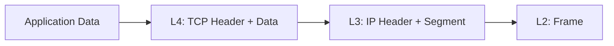

# **Day 17: OSI Layer 3 – The Network Layer (IP, Subnets, Routing)**

## **The Internetworking Layer: From Local to Global**

---

## **Why This Matters More Than Ever**

You've mastered local talk (L2) and physical signals (L1). But true internet magic happens when a request from your laptop in Delhi finds a server in São Paulo, traversing dozens of unknown networks within milliseconds.

**Layer 3 makes this possible.** It's the post office of the digital world. As an SRE or DevOps engineer, you don't just use this layer—you **design, secure, and troubleshoot** it. Every VPC, firewall rule, Kubernetes network policy, and connectivity ticket ultimately boils down to Layer 3 concepts.

> **"It's never DNS... until it is. It's never networking... until it is. And then it's everything."**

---

## 1. **Core Concepts Demystified**

### 1.1 **The IP Address: Your Digital Passport**
- **What it is:** A logical, hierarchical address assigned to a network interface. Unlike a MAC address (permanent, factory-assigned), an IP address is logical and changes with network location.
- **The Hierarchy:** An IP has a **network portion** (like a zip code) and a **host portion** (like a street address). Routers use the network portion to make forwarding decisions.
- **IPv4 vs. IPv6:**  
    - **IPv4** (e.g. `192.168.1.10`): 32-bit, ~4.3B addresses, running out, kept alive by NAT.
    - **IPv6** (e.g. `2001:db8::7334`): 128-bit, essentially unlimited, with built-in security and auto-configuration.

### 1.2 **Subnetting & CIDR: Drawing the Maps**
- **The Problem:** One giant network is noisy and insecure.
- **The Solution: Subnetting.** Divide large networks into smaller, manageable subnets.
- **CIDR (Classless Inter-Domain Routing):**  
  - `192.168.1.10/24` means first 24 bits are the network.
  - **Subnet Mask:** `/24` = `255.255.255.0`
  - **Golden Rule:** Two devices can talk directly **only if on the same subnet**; otherwise, they need a router.

**Quick Subnetting Reference:**

| CIDR | Subnet Mask | Usable Hosts | Use Case |
| :--- | :--- | :--- | :--- |
| `/32` | `255.255.255.255` | 1 | Single host (loopback, SGs) |
| `/30` | `255.255.255.252` | 2 | Point-to-point links |
| `/24` | `255.255.255.0` | 254 | Small LANs |
| `/16` | `255.255.0.0` | 65,534 | Large private networks |
| `/8` | `255.0.0.0` | 16.7M | Huge legacy networks |

### 1.3 **The Default Gateway: Your Door to the World**
- The router on your subnet. Your device's routing table says, "If you're unsure where to send a packet, give it to the gateway."

### 1.4 **Routing: The Path-Finding Algorithm**
- **The Routing Table:** Every device has one.  
  - `ip route show` displays yours.
  - Answers: "To reach IP X, which next hop/interface should I use?"
- **How Routes are Added:**
  - **Direct:** When you assign an IP.
  - **Static:** Manually set by admins.
  - **Dynamic:** Learned from routing protocols (BGP, OSPF) by routers.

---

## 2. **The IP Packet Deep Dive (The L3 Envelope)**

The Layer 4 segment is wrapped in an IP Packet. The header carries delivery-critical info.

| Field | Purpose | Why it Matters |
| :--- | :--- | :--- |
| **Version** | 4 or 6 | IPv4 vs. IPv6 stack |
| **Source IP** | Sender | Used for replies, can be spoofed (security!) |
| **Destination IP** | Receiver | Where the packet is headed |
| **TTL** | Hop Limit | Decremented each router; prevents loops. `traceroute` manipulates TTL. |
| **Protocol** | TCP (6), UDP (17), etc. | Tells OS which L4 protocol to use. |
| **Flags/Fragment Offset** | Fragmentation | Large packets split—can cause issues.|



---

## 3. **Layer 3 Devices & Cloud Equivalents**

| Concept | Physical | Virtual/Cloud | Purpose |
| :--- | :--- | :--- | :--- |
| **Router** | Cisco/Juniper router | VPC Route Table, Virtual Gateway | Connect networks, forward packets |
| **L3 Switch** | Switch with routing | Same as Router | High-speed routing in datacenter |
| **Firewall** | Palo Alto/Fortinet | Security Groups, NACLs | Filter traffic at IP/port level |
| **Load Balancer** | F5 BIG-IP | ALB/NLB (AWS), GLB (GCP) | Distribute traffic to backends |
| **Gateway** | Internet Router | Internet Gateway, NAT Gateway | Connect private networks to Internet |

---

## 4. **SRE's Toolkit: Essential Linux Commands**

| Task | Command | Example Output |
| :--- | :--- | :--- |
| Show IP config | `ip addr show` | `inet 192.168.1.5/24 ...` |
| Show routing table | `ip route show` | `default via 192.168.1.1 dev eth0 ...` |
| Test reachability | `ping <target>` | `64 bytes from ...` |
| Trace packet path | `traceroute <target>` or `tracepath` | `1: _gateway ...` |
| Check open ports | `ss -tuln` | `tcp LISTEN ...` |
| Manage routes | `sudo ip route add/del ...` | `sudo ip route add 10.10.0.0/24 via 192.168.1.254` |
| Clear ARP cache | `ip neigh flush all` | (After config changes) |

---

## 5. **Guided Hands-On Lab: Become Your Own Router**

### **Lab Setup (VirtualBox/VMware)**
1. Create **three** VMs.
2. Set their network adapters to **Internal Network** (e.g., `LAB_NET`).
3. Boot them up (they’ll have no IP initially).

### **Step 1: Configure the "Router"**
On VM1 (`router`):
```bash
sudo ip addr add 192.168.10.1/24 dev eth0
sudo ip addr add 192.168.20.1/24 dev eth1
echo 1 | sudo tee /proc/sys/net/ipv4/ip_forward
```

### **Step 2: Configure the "Clients"**
On VM2 (`client-a`):
```bash
sudo ip addr add 192.168.10.10/24 dev eth0
sudo ip route add default via 192.168.10.1
```
On VM3 (`client-b`):
```bash
sudo ip addr add 192.168.20.20/24 dev eth0
sudo ip route add default via 192.168.20.1
```

### **Step 3: Test the Connectivity**
From `client-a`:
```bash
ping 192.168.20.20
```
- If it works: you built a routed network! The router VM forwards between subnets.

---

## 6. **Layer 3 in Action – App, Proxy, & Load Balancer Troubleshooting**

### **Mini Project: How Does My Traffic Flow?**

**Setup:**
1. **Deploy Simple Apps:**  
   - Start two instances of a basic app (Python Flask, Node.js, or simply `python -m http.server`) on two different VMs/containers or on different ports.
2. **Configure NGINX as Load Balancer/Reverse Proxy:**  
   - On a third VM/host, install NGINX and configure it to proxy traffic to the two app backends.

**Sample `nginx.conf` for reverse proxy:**
```nginx
http {
    upstream myapp {
        server 192.168.10.10:8000;
        server 192.168.20.20:8000;
    }
    server {
        listen 80;
        location / {
            proxy_pass http://myapp;
        }
    }
}
```
3. **Test Access:**  
   - Use `curl` or a browser to access the app via NGINX (`http://<nginx-ip>`).

**Experiment:**
4. **Simulate Failure:**  
   - Stop one backend app (`kill` the process or `docker stop`) and access via NGINX again.
5. **Debug Traffic Flow:**  
   - Use `ip route`, `ss -tuln`, `ping`, `traceroute`, and review NGINX logs.
   - What does NGINX do when a backend is down? Does the traffic route to the healthy instance?

**Questions:**
- How does NGINX know where to send traffic?
- What changes at Layer 3 when a backend is down?
- How do you localise the failure using network commands?
- How does this all appear in your troubleshooting outputs?

**Submission:**
- Include:
    - Your NGINX config
    - Outputs from `ip route`, `ss -tuln`, and relevant logs
    - A short analysis of what you observed and how Layer 3 knowledge helped you debug

---

## 7. **Real-World Scenarios & Debugging**

### **Scenario 1: The Cloud VPC Mystery**
**Problem:** A VM in `subnet-private` can't pull updates from the internet, but a VM in `subnet-public` can.

**Investigation:**
1. **Check Route Tables:** Is the default route in `subnet-private`’s table pointing to a **NAT Gateway**?
2. **Check NACLs/Security Groups:** Is outbound traffic (80/443, 1024-65535) allowed?
3. **Check if the subnet has a route to an Internet Gateway or NAT?**

### **Scenario 2: The Hybrid Cloud Tunnel**
**Problem:** On-prem app (`10.10.10.5`) cannot reach cloud DB (`10.20.30.5`) after maintenance.

**Investigation:**
1. **Traceroute:** Where does it stop?
2. **VPN/Direct Connect:** Is BGP up, routes advertised?
3. **Firewalls:** Are ACLs allowing the right traffic?

---

## 8. **Mini Incident Simulation**

**Alert:** Web servers in availability zone 1a fail health checks from the load balancer in 1b.

You check a web server:
```bash
$ ip addr show eth0
inet 10.0.1.25/20 brd 10.0.15.255 scope global eth0

$ ip route show
10.0.0.0/20 dev eth0 proto kernel scope link src 10.0.1.25
default via 10.0.0.1 dev eth0
```
The load balancer's IP is `10.0.16.105`.

**Tasks:**
1. Calculate the subnet range for `10.0.0.0/20`. Is the LB in the same subnet?
2. Where will the web server send packets destined for the LB?
3. Can packets reach it directly? Why or why not?
4. Propose a fix so all resources are routable without a router.

---

## 9. **Advanced Gotchas for SREs**

- **MTU & Fragmentation:** VPNs or overlays with smaller MTU can fragment packets, hurting performance. Enable MTU Path Discovery or set MTU manually.
- **Asymmetric Routing:** Requests go through firewall A, responses out firewall B—B may drop them. Beware in multi-path topologies.
- **ECMP:** Multiple equal-cost paths can confuse stateful firewalls and impact packet order.
- **Network Namespaces:** Containers/pods have isolated stacks. A `ping` from the host may work, but not from inside a container due to separate routing tables. Debug with `nsenter` or `kubectl exec`.

---

## 10. **Submission Guidelines: Prove Your Mastery**

**Push `day17solution.md` to your GitHub repo.**

**Include:**
1. **Screenshots:** Output of `ip a` and `ip r` from your main machine.
2. **Hands-on Proof:** Output from the "Become Your Own Router" lab showing successful ping.
3. **App & LB Lab:** NGINX config, command outputs, and a brief analysis of your troubleshooting.
4. **Incident Response:** Detailed answers for the Mini Incident Simulation.
5. **Reflection:** A paragraph on a networking issue you’ve faced (or might face) and how Layer 3 knowledge helps.

**Share your journey:**  
`#getfitwithsagar #100DaysOfSRE #OSIMastery #Layer3DeepDive #CloudNetworking`

---

## 11. **Community & Support**

- [Discord](https://discord.gg/mNDm39qB8t)
- [Google Group](https://groups.google.com/forum/#!forum/daily-devops-sre-challenge-series/join)
- [YouTube](https://www.youtube.com/@Sagar.Utekar)

---

**Master Layer 3, and you’ll never be lost in the network again!**

Happy learning and exploring,  
Sagar Utekar
