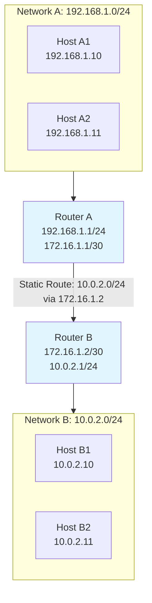
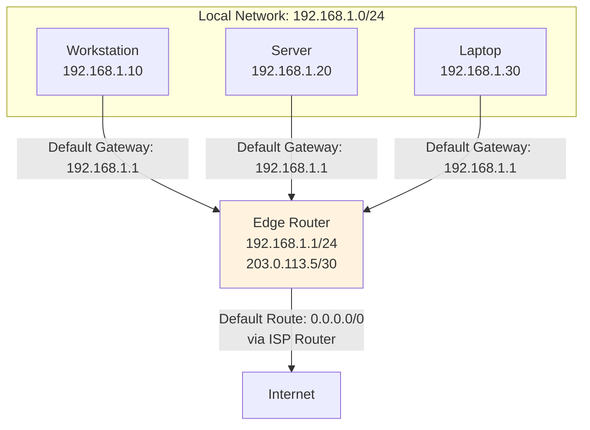
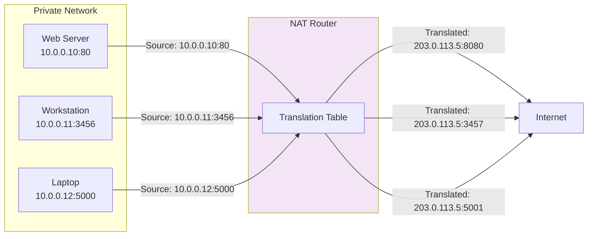
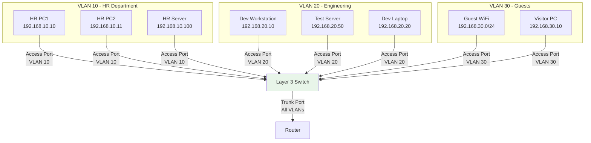

# Day 17 — Routing & Switching Basics (Daily DevOps + SRE Challenge Series — Season 2)

---

## 🌟 Introduction

Welcome to **Day 3** of the Daily DevOps + SRE Challenge Series – Season 2!

Today we dive into the **Routing & Switching basics** every DevOps/SRE must master: **Static Routing, Default Gateways, NAT/PAT, and VLANs.** These are the invisible highways of networking that ensure packets get from point A to point B securely, efficiently, and reliably.

Instead of just reading theory, you'll solve **real-world, production-style challenges** with Linux commands, diagrams, and troubleshooting steps - all within a single virtual machine using network namespaces.

---

## 🚀 Why Does This Matter?

* **Connectivity**: Without routing, packets never leave your subnet.
* **Security**: NAT/PAT and VLANs are used everywhere in enterprises to hide internal networks and isolate services.
* **Reliability**: Correct default gateway configs prevent outages.
* **Scale**: VLANs + static/dynamic routing make it possible to manage thousands of users and workloads.
* **Interview Edge**: Common questions include *"What is a default gateway?"*, *"Explain NAT vs PAT"*, and *"How do VLANs improve security?"*

---

## 🔥 Real-World Save

* A SaaS startup lost internet access for **6 hours** because the **wrong default gateway** was configured on a new subnet.
* A fintech company reduced **public IP usage by 90%** using **PAT**.
* A data center was compromised because **VLANs weren't properly isolated** — attackers jumped between networks.
* A global team avoided a costly outage by documenting **static routes** during a WAN migration.

---

## 📘 Theory Section

### 🔹 Static Routing

Static routing involves manually configuring routes on network devices to specify the path network traffic should take to reach specific destinations. Unlike dynamic routing protocols that automatically exchange routing information, static routes are fixed and don't adapt to network changes unless manually modified.



---

### 🔹 Default Gateway

The default gateway serves as the "gateway of last resort." When a device needs to send traffic to a destination network not explicitly listed in its routing table, it forwards the packet to the default gateway.



---

### 🔹 NAT & PAT

Network Address Translation (NAT) and Port Address Translation (PAT) are methods to remap IP address space by modifying network address information in packet headers while in transit.



---

### 🔹 VLANs

Virtual LANs (VLANs) create logically separate networks within a physical network infrastructure. VLANs operate at Layer 2 of the OSI model and provide segmentation, security, and broadcast containment.



---

## ⚡ Hands-On Challenges with Solutions (Single VM Edition)

### Prerequisites: Setup Network Namespaces
First, let's create the network namespaces that will simulate different devices:

```bash
# Create network namespaces
sudo ip netns add client1
sudo ip netns add client2
sudo ip netns add router

# Create virtual Ethernet pairs
sudo ip link add veth0 type veth peer name veth1
sudo ip link add veth2 type veth peer name veth3

# Move interfaces to appropriate namespaces
sudo ip link set veth0 netns client1
sudo ip link set veth1 netns router
sudo ip link set veth2 netns client2
sudo ip link set veth3 netns router

# Configure IP addresses
sudo ip netns exec client1 ip addr add 192.168.1.10/24 dev veth0
sudo ip netns exec router ip addr add 192.168.1.1/24 dev veth1
sudo ip netns exec client2 ip addr add 10.0.2.10/24 dev veth2
sudo ip netns exec router ip addr add 10.0.2.1/24 dev veth3

# Bring interfaces up
sudo ip netns exec client1 ip link set veth0 up
sudo ip netns exec router ip link set veth1 up
sudo ip netns exec client2 ip link set veth2 up
sudo ip netns exec router ip link set veth3 up
sudo ip netns exec client1 ip link set lo up
sudo ip netns exec client2 ip link set lo up
sudo ip netns exec router ip link set lo up
```

---

### 🔹 Static Routing (5 Challenges)

1️⃣ **Configure static routes between namespaces**

```bash
# On router namespace
sudo ip netns exec router ip route add 192.168.1.0/24 dev veth1
sudo ip netns exec router ip route add 10.0.2.0/24 dev veth3

# On client1 namespace (add route to network 10.0.2.0/24 via router)
sudo ip netns exec client1 ip route add 10.0.2.0/24 via 192.168.1.1

# On client2 namespace (add route to network 192.168.1.0/24 via router)
sudo ip netns exec client2 ip route add 192.168.1.0/24 via 10.0.2.1

# Test connectivity
sudo ip netns exec client1 ping 10.0.2.10 -c 3
sudo ip netns exec client2 ping 192.168.1.10 -c 3
```

2️⃣ **Add multiple static routes and analyze preference**

```bash
# Create an alternative path (simulated)
sudo ip netns exec router ip route add 10.0.2.0/24 dev veth3 metric 100
sudo ip netns exec router ip route add 10.0.2.0/24 dev veth3 metric 200

# View routing table and analyze preference
sudo ip netns exec router ip route show
```

3️⃣ **Break a static route intentionally and troubleshoot**

```bash
# Remove the route
sudo ip netns exec client1 ip route del 10.0.2.0/24

# Test connectivity (should fail)
sudo ip netns exec client1 ping 10.0.2.10 -c 2

# Troubleshoot with traceroute
sudo ip netns exec client1 traceroute 10.0.2.10

# Fix the route
sudo ip netns exec client1 ip route add 10.0.2.0/24 via 192.168.1.1
```

4️⃣ **Compare static vs dynamic routing concepts**

```bash
# Examine current static routes
sudo ip netns exec router ip route show

# Compare with what dynamic routing would provide
echo "Static routing: Manual configuration, no overhead"
echo "Dynamic routing: Automatic updates, better for large networks"
```

5️⃣ **Document the namespace routing topology**

```bash
# Show all interfaces and their addresses
sudo ip netns exec client1 ip addr show
sudo ip netns exec client2 ip addr show
sudo ip netns exec router ip addr show

# Show routing tables
sudo ip netns exec client1 ip route show
sudo ip netns exec client2 ip route show
sudo ip netns exec router ip route show
```

---

### 🔹 Default Gateway (5 Challenges)

1️⃣ **Set up default gateway in namespace**

```bash
# Create a simulated internet namespace
sudo ip netns add internet
sudo ip link add veth4 type veth peer name veth5
sudo ip link set veth4 netns router
sudo ip link set veth5 netns internet
sudo ip netns exec router ip addr add 203.0.113.1/24 dev veth4
sudo ip netns exec internet ip addr add 203.0.113.2/24 dev veth5
sudo ip netns exec router ip link set veth4 up
sudo ip netns exec internet ip link set veth5 up

# Set default gateway on router
sudo ip netns exec router ip route add default via 203.0.113.2

# Set default gateway on clients
sudo ip netns exec client1 ip route add default via 192.168.1.1
sudo ip netns exec client2 ip route add default via 10.0.2.1
```

2️⃣ **Remove/modify gateway and test**

```bash
# Remove default gateway
sudo ip netns exec client1 ip route del default

# Test connectivity (should fail)
sudo ip netns exec client1 ping 203.0.113.2 -c 2

# Restore gateway
sudo ip netns exec client1 ip route add default via 192.168.1.1
```

3️⃣ **Multiple gateways with metrics**

```bash
# Add multiple default routes with different metrics
sudo ip netns exec client1 ip route add default via 192.168.1.1 metric 100
sudo ip netns exec client1 ip route add default via 192.168.1.1 metric 200

# Show routing table to see preference
sudo ip netns exec client1 ip route show
```

4️⃣ **Capture packets going through gateway**

```bash
# Start packet capture on router
sudo ip netns exec router timeout 10 tcpdump -i veth1 icmp &

# Generate traffic from client1
sudo ip netns exec client1 ping 203.0.113.2 -c 3
```

5️⃣ **Troubleshoot wrong gateway configuration**

```bash
# Intentionally set wrong gateway
sudo ip netns exec client1 ip route del default
sudo ip netns exec client1 ip route add default via 192.168.1.99

# Test connectivity (should fail)
sudo ip netns exec client1 ping 203.0.113.2 -c 2

# Diagnose the issue
sudo ip netns exec client1 ip route show
sudo ip netns exec client1 traceroute 203.0.113.2

# Fix the gateway
sudo ip netns exec client1 ip route del default
sudo ip netns exec client1 ip route add default via 192.168.1.1
```

---

### 🔹 NAT & PAT (5 Challenges)

1️⃣ **Configure NAT on the router namespace**

```bash
# Enable IP forwarding on router
sudo ip netns exec router sysctl -w net.ipv4.ip_forward=1

# Configure NAT using iptables
sudo ip netns exec router iptables -t nat -A POSTROUTING -o veth4 -j MASQUERADE
sudo ip netns exec router iptables -A FORWARD -i veth1 -o veth4 -j ACCEPT
sudo ip netns exec router iptables -A FORWARD -i veth4 -o veth1 -m state --state ESTABLISHED,RELATED -j ACCEPT

# Test NAT functionality
sudo ip netns exec client1 ping 203.0.113.2 -c 3
```

2️⃣ **Test PAT with multiple hosts**

```bash
# Simulate multiple clients making connections
sudo ip netns exec client1 ping 203.0.113.2 -c 2 &
sudo ip netns exec client2 ping 203.0.113.2 -c 2 &

# Check NAT translations
sudo ip netns exec router iptables -t nat -L -n -v
```

3️⃣ **Test iptables NAT configuration**

```bash
# Check NAT table
sudo ip netns exec router iptables -t nat -L

# Verify NAT is working by checking connection tracking
sudo ip netns exec router conntrack -L
```

4️⃣ **Capture NAT packets**

```bash
# Capture packets on the external interface
sudo ip netns exec router timeout 10 tcpdump -i veth4 -n &

# Generate traffic from clients
sudo ip netns exec client1 ping 203.0.113.2 -c 3
```

5️⃣ **Troubleshoot NAT failure**

```bash
# Disable IP forwarding to simulate NAT failure
sudo ip netns exec router sysctl -w net.ipv4.ip_forward=0

# Test connectivity (should fail)
sudo ip netns exec client1 ping 203.0.113.2 -c 2

# Check sysctl settings
sudo ip netns exec router sysctl net.ipv4.ip_forward

# Re-enable and verify
sudo ip netns exec router sysctl -w net.ipv4.ip_forward=1
sudo ip netns exec client1 ping 203.0.113.2 -c 2
```

---

### 🔹 VLAN Basics (5 Challenges)

1️⃣ **Create VLAN interfaces in namespaces**

```bash
# Create VLAN interfaces on router
sudo ip netns exec router ip link add link veth1 name veth1.10 type vlan id 10
sudo ip netns exec router ip link add link veth1 name veth1.20 type vlan id 20
sudo ip netns exec router ip addr add 192.168.10.1/24 dev veth1.10
sudo ip netns exec router ip addr add 192.168.20.1/24 dev veth1.20
sudo ip netns exec router ip link set veth1.10 up
sudo ip netns exec router ip link set veth1.20 up

# Create VLAN interfaces on client1 (VLAN 10)
sudo ip netns exec client1 ip link add link veth0 name veth0.10 type vlan id 10
sudo ip netns exec client1 ip addr add 192.168.10.10/24 dev veth0.10
sudo ip netns exec client1 ip link set veth0.10 up

# Create VLAN interfaces on client2 (VLAN 20)
sudo ip netns exec client2 ip link add link veth2 name veth2.20 type vlan id 20
sudo ip netns exec client2 ip addr add 192.168.20.10/24 dev veth2.20
sudo ip netns exec client2 ip link set veth2.20 up
```

2️⃣ **Configure inter-VLAN routing**

```bash
# Enable IP forwarding on router
sudo ip netns exec router sysctl -w net.ipv4.ip_forward=1

# Test inter-VLAN connectivity
sudo ip netns exec client1 ping 192.168.20.10 -c 3
sudo ip netns exec client2 ping 192.168.10.10 -c 3
```

3️⃣ **Misconfigure VLAN and troubleshoot**

```bash
# Put client2 in wrong VLAN
sudo ip netns exec client2 ip link del veth2.20
sudo ip netns exec client2 ip link add link veth2 name veth2.30 type vlan id 30
sudo ip netns exec client2 ip addr add 192.168.30.10/24 dev veth2.30
sudo ip netns exec client2 ip link set veth2.30 up

# Test connectivity (should fail)
sudo ip netns exec client1 ping 192.168.30.10 -c 2

# Troubleshoot
sudo ip netns exec client1 ip addr show
sudo ip netns exec client2 ip addr show
sudo ip netns exec router ip addr show

# Fix the configuration
sudo ip netns exec client2 ip link del veth2.30
sudo ip netns exec client2 ip link add link veth2 name veth2.20 type vlan id 20
sudo ip netns exec client2 ip addr add 192.168.20.10/24 dev veth2.20
sudo ip netns exec client2 ip link set veth2.20 up
```

4️⃣ **Explore VLAN tagging**

```bash
# Capture VLAN tagged packets
sudo ip netns exec router timeout 10 tcpdump -i veth1 -e vlan &

# Generate VLAN traffic
sudo ip netns exec client1 ping 192.168.20.10 -c 2
```

5️⃣ **Document multi-VLAN setup**

```bash
# Show VLAN configuration
echo "VLAN 10: 192.168.10.0/24 (Client1)"
echo "VLAN 20: 192.168.20.0/24 (Client2)"
echo "Router interfaces:"
sudo ip netns exec router ip addr show | grep -E "(veth1.10|veth1.20)"
echo "Client interfaces:"
sudo ip netns exec client1 ip addr show veth0.10
sudo ip netns exec client2 ip addr show veth2.20
```

---

## ✅ Deliverables

* Document your solutions in `solution.md` with:
  * All commands executed
  * Output observations and screenshots
  * Network diagrams of your namespace setup
* Push to your GitHub repository
* Share your experience with hashtags:
  **#getfitwithsagar #SRELife #DevOpsForAll**

---

## 🌍 Community Links

* **Discord**: [https://discord.gg/mNDm39qB8t](https://discord.gg/mNDm39qB8t)
* **Google Group**: [https://groups.google.com/forum/#!forum/daily-devops-sre-challenge-series/join](https://groups.google.com/forum/#!forum/daily-devops-sre-challenge-series/join)
* **YouTube**: [https://www.youtube.com/@Sagar.Utekar](https://www.youtube.com/@Sagar.Utekar)

---

🔥 Keep routing, keep switching, and happy exploring!
— *Sagar Utekar*
