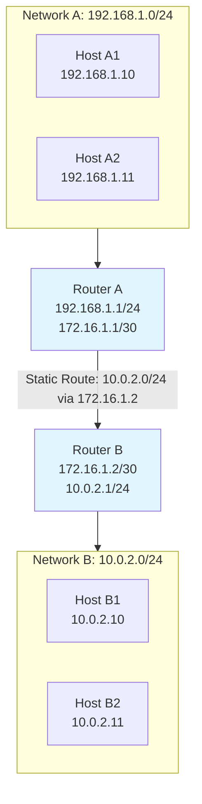
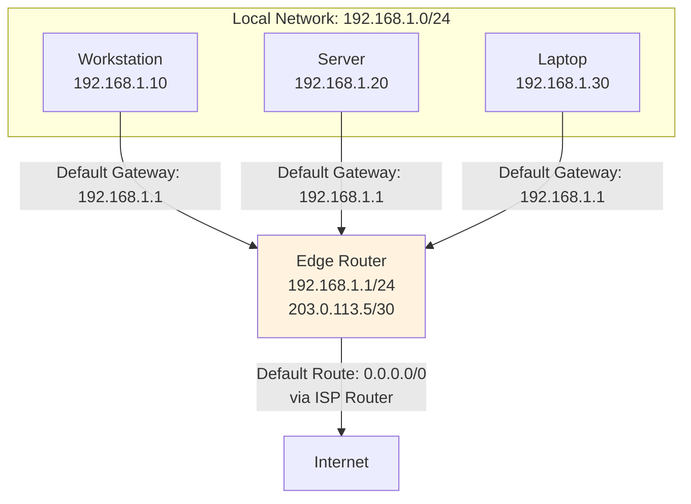
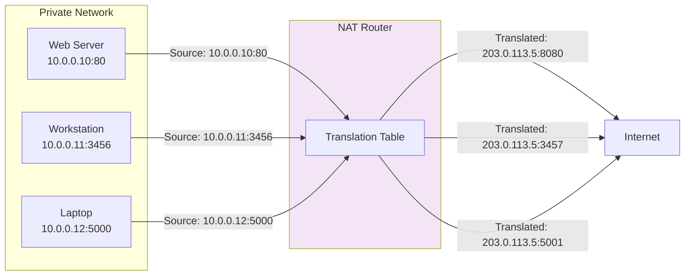
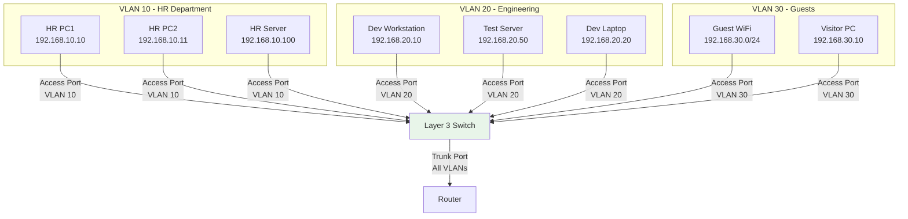

# Day 17 — Routing & Switching Basics (Daily DevOps + SRE Challenge Series — Season 2)

---

## 🌟 Introduction

Welcome to **Day 3** of the Daily DevOps + SRE Challenge Series – Season 2!

Today we dive into the **Routing & Switching basics** every DevOps/SRE must master: **Static Routing, Default Gateways, NAT/PAT, and VLANs.** These are the invisible highways of networking that ensure packets get from point A to point B securely, efficiently, and reliably.

Instead of just reading theory, you'll solve **real-world, production-style challenges** with Linux commands, diagrams, and troubleshooting steps.

---

## 🚀 Why Does This Matter?

* **Connectivity**: Without routing, packets never leave your subnet.
* **Security**: NAT/PAT and VLANs are used everywhere in enterprises to hide internal networks and isolate services.
* **Reliability**: Correct default gateway configs prevent outages.
* **Scale**: VLANs + static/dynamic routing make it possible to manage thousands of users and workloads.
* **Interview Edge**: Common questions include *"What is a default gateway?"*, *"Explain NAT vs PAT"*, and *"How do VLANs improve security?"*

---

## 🔥 Real-World Save

* A SaaS startup lost internet access for **6 hours** because the **wrong default gateway** was configured on a new subnet.
* A fintech company reduced **public IP usage by 90%** using **PAT**.
* A data center was compromised because **VLANs weren't properly isolated** — attackers jumped between networks.
* A global team avoided a costly outage by documenting **static routes** during a WAN migration.

---

## 📘 Theory Section

### 🔹 Static Routing

Static routing involves manually configuring routes on network devices (routers, firewalls, or even servers) to specify the path network traffic should take to reach specific destinations. Unlike dynamic routing protocols (OSPF, BGP) that automatically exchange routing information, static routes are fixed and don't adapt to network changes unless manually modified.

**Key Characteristics:**
- **Administrative Distance**: Static routes typically have a lower AD (1) than dynamic routes, making them preferred
- **Persistence**: Usually remain in routing table until manually removed
- **No Overhead**: Unlike dynamic protocols, they don't consume bandwidth for route advertisements
- **Scalability Limitation**: Manual configuration becomes impractical in large, complex networks

**Common Use Cases:**
- Default routes for internet connectivity
- Backup routes for redundant connections
- Stub networks with single exit points
- Security-sensitive paths where dynamic routing might be exploited



**Technical Details:**
When a packet arrives at Router A destined for Network B (10.0.2.0/24), Router A checks its routing table. The static route instructs it to forward the packet to Router B (172.16.1.2). Router B then delivers it to the appropriate host in Network B.

The reverse path requires a complementary static route on Router B pointing to Router A for Network A (192.168.1.0/24), ensuring bidirectional communication.

---

### 🔹 Default Gateway

The default gateway (also called default route) is a special type of static route that serves as the "gateway of last resort." When a device needs to send traffic to a destination network not explicitly listed in its routing table, it forwards the packet to the default gateway.

**Technical Implementation:**
- Represented as 0.0.0.0/0 in CIDR notation (matches any destination)
- Essential for client devices to reach beyond their local subnet
- Critical for internet connectivity in most network setups



**Technical Details:**
When Workstation (192.168.1.10) needs to communicate with a server on the internet (e.g., 8.8.8.8), it performs these steps:
1. Compares destination IP (8.8.8.8) with its own IP and subnet mask
2. Determines the destination is outside its local network
3. Forwards the packet to its configured default gateway (192.168.1.1)
4. The edge router then routes the packet toward the internet

Without a proper default gateway configuration, devices can only communicate within their local subnet.

---

### 🔹 NAT & PAT

Network Address Translation (NAT) and Port Address Translation (PAT) are methods to remap IP address space by modifying network address information in packet headers while in transit. This allows multiple devices to share a single public IP address.

**NAT Types:**
1. **Static NAT**: One-to-one mapping between private and public IPs
2. **Dynamic NAT**: Pool of public IPs mapped to private IPs as needed
3. **PAT/NAT Overload**: Many private IPs to one public IP using port differentiation



**Technical Details:**
PAT (the most common form of NAT) works by:
1. Maintaining a translation table mapping internal (private IP, port) to external (public IP, port)
2. When an internal device initiates outbound traffic, the router:
   - Replaces the source private IP with the public IP
   - Replaces the source port with a unique port number
   - Records this mapping in its translation table
3. When inbound traffic arrives, the router:
   - Checks the destination port against its translation table
   - Rewrites the destination IP and port to the internal values
   - Forwards the packet to the internal device

This process allows thousands of internal devices to share a single public IP address while maintaining session state.

---

### 🔹 VLANs

Virtual LANs (VLANs) create logically separate networks within a physical network infrastructure. VLANs operate at Layer 2 of the OSI model and provide segmentation, security, and broadcast containment.

**VLAN Benefits:**
- **Security**: Isolation between sensitive departments (HR, Finance)
- **Performance**: Reduced broadcast traffic
- **Flexibility**: Logical grouping regardless of physical location
- **Management**: Simplified network administration



**Technical Details:**
VLANs work through IEEE 802.1Q tagging, where a 4-byte tag is inserted into Ethernet frames to identify VLAN membership. This allows:

1. **Access Ports**: Connect end devices to a single VLAN (untagged)
2. **Trunk Ports**: Carry multiple VLANs between switches/routers (tagged)
3. **Inter-VLAN Routing**: Layer 3 devices route between VLANs

Without VLANs, all devices on a physical network would belong to the same broadcast domain, creating security risks and performance issues as networks scale.

---

## ⚡ Hands-On Challenges with Solutions

---

### 🔹 Static Routing (5 Challenges)

1️⃣ **Configure a static route between two routers and test connectivity**

```bash
# On Router A
ip route add 10.0.2.0/24 via 192.168.1.2
# Verify
ping 10.0.2.1
```

2️⃣ **Add multiple static routes and analyze preference**

```bash
ip route add 10.0.3.0/24 via 192.168.1.2 metric 100
ip route add 10.0.3.0/24 via 192.168.1.3 metric 200
ip route show
```

👉 Lower metric = higher preference.

3️⃣ **Break a static route intentionally**

```bash
ip route del 10.0.2.0/24
ping 10.0.2.1   # should fail
```

👉 Use `ip route` and `traceroute` to debug.

4️⃣ **Compare static vs dynamic routing**

* Static = manual, simple, no overhead.
* Dynamic = automatic updates, scales better (OSPF, BGP).

5️⃣ **Document branch-to-HQ static routing topology**
👉 Draw with Mermaid or tools like draw\.io.

---

### 🔹 Default Gateway (5 Challenges)

1️⃣ **Set up default gateway on Linux**

```bash
ip route add default via 192.168.1.1
ping 8.8.8.8
```

2️⃣ **Remove/modify gateway**

```bash
ip route del default
ping 8.8.8.8   # fails
```

3️⃣ **Multiple gateways with metrics**

```bash
ip route add default via 192.168.1.1 metric 100
ip route add default via 192.168.1.2 metric 200
```

4️⃣ **Capture packets via gateway**

```bash
sudo tcpdump -i eth0 icmp
```

👉 Shows pings exiting via gateway.

5️⃣ **Troubleshoot wrong gateway**

* Symptom: Can ping local but not internet.
* Fix: Correct default gateway in `/etc/netplan/*` or `/etc/network/interfaces`.

---

### 🔹 NAT & PAT (5 Challenges)

1️⃣ **Configure NAT on Linux**

```bash
sudo iptables -t nat -A POSTROUTING -o eth0 -j MASQUERADE
```

2️⃣ **PAT with multiple hosts**
👉 NAT maps each host's **port** to the shared public IP.
Check with `curl ifconfig.me` from 2 VMs.

3️⃣ **iptables NAT test**

```bash
curl -4 ifconfig.me   # shows public IP
```

4️⃣ **Capture NAT packets**

```bash
sudo tcpdump -i eth0 port 80
```

5️⃣ **Troubleshoot NAT failure**

* Check IP forwarding:

```bash
sysctl net.ipv4.ip_forward
```

* Verify firewall rules.

---

### 🔹 VLAN Basics (5 Challenges)

1️⃣ **Create VLANs on a switch (Linux bridge example)**

```bash
sudo ip link add link eth0 name eth0.10 type vlan id 10
sudo ip addr add 192.168.10.1/24 dev eth0.10
```

2️⃣ **Inter-VLAN routing (Router-on-a-stick)**

```bash
# Router with sub-interfaces
ip addr add 192.168.10.1/24 dev eth0.10
ip addr add 192.168.20.1/24 dev eth0.20
```

3️⃣ **Misconfigure VLAN and troubleshoot**
👉 Put two devices in different VLANs, they won't talk.
Fix: put them in the same VLAN or configure routing.

4️⃣ **Explore VLAN tagging (802.1Q)**

```bash
sudo tcpdump -e -i eth0 vlan
```

---

## ✅ Deliverables

* Write solutions in `solution.md` with:

  * Commands run
  * Observations
  * Screenshots/diagrams
* Push to your GitHub repo & share link.
* Post your experience with hashtags:
  **#getfitwithsagar #SRELife #DevOpsForAll**

---

## 🌍 Community Links

* **Discord**: [https://discord.gg/mNDm39qB8t](https://discord.gg/mNDm39qB8t)
* **Google Group**: [https://groups.google.com/forum/#!forum/daily-devops-sre-challenge-series/join](https://groups.google.com/forum/#!forum/daily-devops-sre-challenge-series/join)
* **YouTube**: [https://www.youtube.com/@Sagar.Utekar](https://www.youtube.com/@Sagar.Utekar)

---

🔥 Keep routing, keep switching, and happy exploring!
— *Sagar Utekar*