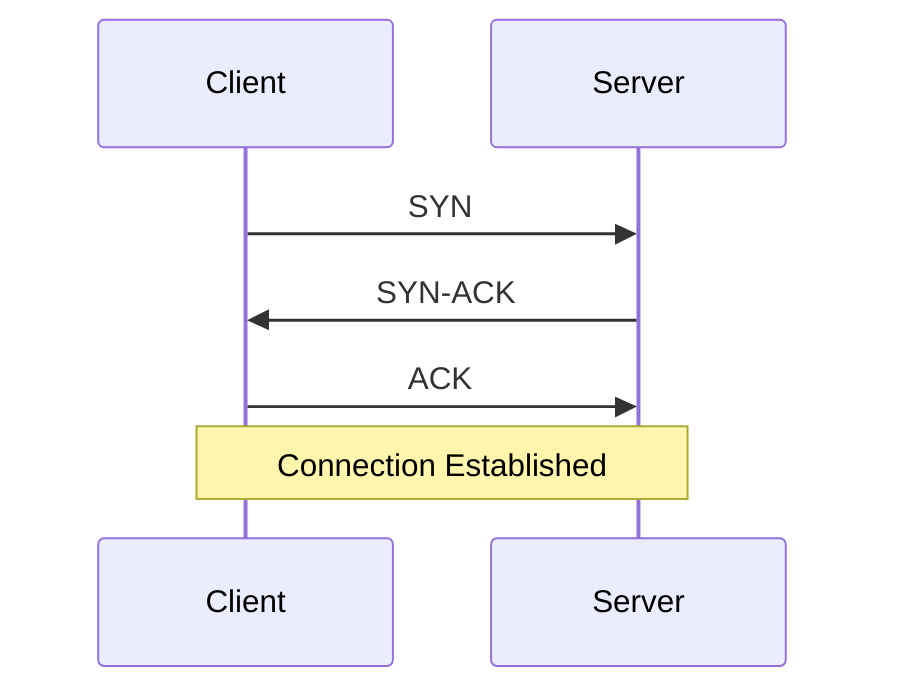
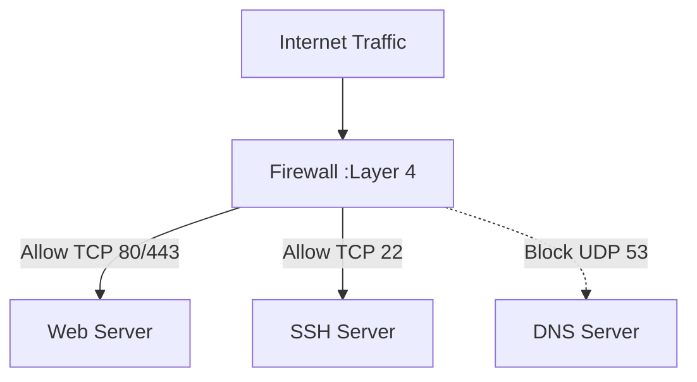

# **Day 18: OSI Layer 4 – The Transport Layer (TCP, UDP, Ports, and Real-World Debugging)**

---

## **Why Layer 4 is a Game Changer for SREs & DevOps**

Once packets have their addresses (Layer 3), they need to get delivered **reliably** (or not!), in the right **order** (or not!), and to the correct **application**. That’s **Layer 4**: the Transport Layer.  
Here, you’ll unlock the secrets behind TCP and UDP, ports, connection states, and how to debug the issues that puzzle even experienced engineers.

> “It’s always the firewall… unless it’s the ephemeral port range, or TCP state bloat, or a rogue UDP flood. Layer 4 is where the real fun (and pain!) starts.”

---

## 1. **Core Concepts Simplified (All-in-One Table)**

| Topic / Protocol      | TCP                                                       | UDP                                   |
|---------------------- |-----------------------------------------------------------|---------------------------------------|
| **Type**              | Reliable, connection-oriented                             | Unreliable, connectionless            | 
| **Guarantees**        | Delivery, order, integrity                                | No guarantees                         | 
| **Handshake?**        | Yes (SYN, SYN-ACK, ACK)                                   | No                                    |                         
| **Teardown?**         | Yes (FIN/ACK)                                             | No                                    |                         
| **Overhead**          | Higher (more checks, slower)                              | Lower (faster, less checks)           |                         
| **Common Uses**       | Web, SSH, SMTP, DB                                        | DNS, VoIP, games, streaming           |                         
| **Connection State?** | Yes (tracks state, can get stuck)                         | No                                    |                         
| **Good For**          | Anything needing accuracy and order                       | Real-time, stateless, speed           |                        

> **Tip:**  
> - Use TCP for reliability (web, SSH, DB).  
> - Use UDP for speed (DNS, games).  
> - Ports help traffic reach the right app.

---

## 2. **TCP Three-Way Handshake (Connection Establishment)**



### ** Layer 4 Packet Filtering**


---

## 3. **Layer 4 in the Cloud & Modern Architectures**

- **Security Groups & Firewalls:**  
  Control access by IP **and** port. Layer 4 rules are often the first line of defense.
- **Load Balancers:**  
  - **L4 load balancer:** Routes based on IP:port (TCP/UDP). Faster, less aware of app logic.
  - **L7 (Application) load balancer:** Routes based on HTTP, cookies, etc.
- **NAT & Port Mapping:**  
  Translate internal IP:port to public IP:port. Essential for internet access and microservices.

---

## 4. **SRE’s Command-Line Toolkit**

| Task | Command | Example Output |
|------|---------|---------------|
| List connections | `ss -tuln` or `netstat -tuln` | Show listening TCP/UDP ports |
| Show connection states | `ss -s` or `netstat -an` | SYN_SENT, ESTABLISHED, etc. |
| Check open ports | `lsof -i :PORT` | Processes using a port |
| Test TCP | `nc -vz HOST PORT` | Success/failure of connection |
| Test UDP | `nc -vu HOST PORT` | Send/receive data |
| Capture packets | `sudo tcpdump -i eth0 port 80` | Live packet dump |
| Analyze with Wireshark | Open `.pcap` | Visualize TCP handshakes, retransmits |

---

## 5. **Hands-On Lab: Layer 4 in Action**

### **Lab 1: TCP/UDP Connections with Netcat**

**A. TCP Echo Test**
1. On one terminal, run a TCP server:
    ```bash
    nc -l 9000
    ```
2. On another terminal, connect as a client:
    ```bash
    nc 127.0.0.1 9000
    ```
3. Type messages – verify bidirectional communication.
4. Observe connection with:
    ```bash
    ss -tna | grep 9000
    ```

**B. UDP Echo Test**
1. On one terminal, run a UDP server:
    ```bash
    nc -lu 9001
    ```
2. On another terminal, send a UDP message:
    ```bash
    echo "hello" | nc -u 127.0.0.1 9001
    ```
3. UDP is stateless—observe the difference in `ss -una | grep 9001`.

---

### **Lab 2: TCP Handshake & State Machine with tcpdump**

1. In one terminal, start a simple TCP server (e.g., Python):
    ```bash
    python3 -m http.server 8080
    ```
2. In another, start packet capture:
    ```bash
    sudo tcpdump -i lo tcp port 8080 -w handshake.pcap
    ```
3. In a third, connect:
    ```bash
    curl http://localhost:8080
    ```
4. Stop tcpdump. Open `handshake.pcap` in Wireshark and analyze:
    - Find SYN, SYN-ACK, ACK packets (3-way handshake)
    - See FIN/ACK for teardown

5. List TCP connection states:
    ```bash
    ss -tan state all | grep 8080
    ```

---

## 6. **Mini Incident Simulation**

**Scenario:**  
Your web app is intermittently failing to connect to its database. The app logs show `Connection refused` and `Too many open files`.  
You run:

```bash
ss -s
ss -tan | grep 5432
ulimit -n
```
- You see hundreds of connections in `TIME_WAIT` to port 5432, and `ulimit -n` is 1024.

**Tasks:**
1. What is `TIME_WAIT` and why does it happen?
2. How can too many connections in `TIME_WAIT` cause failures?
3. What are two ways to mitigate this issue (at the OS/app level)?
4. What Layer 4 lesson does this teach for SREs?

---

## 7. **Common SRE Pitfalls & Gotchas**

- **Ephemeral Port Exhaustion:**  
  Too many outgoing connections can exhaust source ports. Tweak ephemeral range and app keepalive settings.
- **Firewall/Security Group Rules:**  
  Ensure correct protocol (TCP vs. UDP) and port are allowed—port 53/UDP ≠ port 53/TCP!
- **Stateless vs. Stateful Load Balancing:**  
  Sticky sessions can break if not handled at Layer 4.
- **NAT & Connection Tracking:**  
  NAT device may drop idle connections or run out of state table slots.
- **Socket Options:**  
  Tuning `tcp_tw_reuse`, `tcp_fin_timeout`, and `ulimit` can help, but can also cause subtle bugs.

---

## 8. **Submission Guidelines**

**Push a file named `solution.md` to your repo. Include:**

1. **Screenshots/outputs** of:
    - `ss -tuln` and `ss -s` or `netstat -an`
    - Your netcat and tcpdump/Wireshark experiments
2. **Mini Incident Simulation:**
    - Your answers and reasoning
3. **Reflection:**  
    - Share a real or hypothetical Layer 4 troubleshooting story and how this knowledge would help you.

**Share your journey:**  
`#getfitwithsagar #DevOpsChallenge`

---

## 9. **Community & Support**

- [Discord](https://discord.gg/mNDm39qB8t)
- [Google Group](https://groups.google.com/forum/#!forum/daily-devops-sre-challenge-series/join)
- [YouTube](https://www.youtube.com/@Sagar.Utekar)

---

**Master Layer 4, and you’ll unlock a new level of systems intuition. Every outage, fix, and performance boost starts making sense.**

Happy hacking and troubleshooting,  
Sagar Utekar
