---

# **Day 18 – Firewalls & Security 🔥**

---

## 📌 Introduction

Hello Learners,

Welcome to **Day 18 of the Daily DevOps + SRE Challenge Series – Season 2!** 🚀

Today, we’re diving into one of the **pillars of system and network security** — **firewalls, security groups, and TLS/SSL**. You’ll understand how Linux firewalls protect your servers, how cloud platforms enforce access policies, and how encryption safeguards your data in transit.

This challenge will sharpen your **network defense skills** so you can prevent intrusions, lock down access, and troubleshoot connectivity issues like a battle-hardened SRE.

---

## 🛠️ Lab Setup Instructions

To complete the hands-on challenges, you will need an environment to work in. Choose one of the following setups:

**Option A: Local Virtual Machine (Recommended)**
1.  **Software:** Install VirtualBox or VMware.
2.  **OS Image:** Download a Linux ISO (e.g., Ubuntu Server 22.04 LTS).
3.  **Setup:**
    *   Create a new VM with at least 1 CPU, 2GB RAM, and 20GB disk space.
    *   Install the OS. During installation, ensure you install the `openssh-server` package.
    *   Once installed, boot the VM and note its IP address (`ip a`).
    *   You can now SSH into your VM from your host machine for practice.

**Option B: Cloud Instance (e.g., AWS EC2, DigitalOcean Droplet)**
1.  **Create an Account:** Sign up for a cloud provider that offers a free tier (AWS, GCP, Azure, DigitalOcean).
2.  **Launch a Instance:** Create a new virtual machine instance (e.g., an AWS EC2 t2.micro instance with Ubuntu 22.04).
3.  **Security Groups:** During setup, note the Security Group settings. For now, allow SSH (port 22) from your IP and All ICMP - IPv4 (for ping).
4.  **Access:** Use the provided key pair to SSH into your instance.

**Post-Setup (For both options):**
*   Update your package lists: `sudo apt update && sudo apt upgrade -y`
*   Install necessary tools: `sudo apt install -y iptables-persistent nginx tcpdump` (Confirm 'Yes' to save current IPv4 rules when prompted).

---

## 🚀 Why it matters

*   **Security First:** Firewalls and TLS form the **first line of defense** against attacks.
*   **Reliability:** A single wrong iptables rule can cut off production traffic — knowing how to **debug and fix quickly** is essential.
*   **Cloud-native DevOps:** Security groups are a must-know for AWS, GCP, Azure engineers.
*   **Compliance:** Most orgs require **encryption in transit (TLS/SSL)** and restricted access.
*   **Interview Edge:** Expect “What’s the difference between iptables and security groups?” or “How does TLS handshake work?” in SRE/DevOps interviews.

---

## 🔥 Real-world save stories

*   An SRE accidentally blocked SSH for the entire engineering team with a wrong `iptables -F` — recovery was only possible because a **cloud console out-of-band access** was enabled.
*   A fintech startup avoided **man-in-the-middle attacks** by moving from HTTP to **TLS with Let’s Encrypt**, cutting down risks overnight.
*   At scale, switching from **stateless packet filtering to stateful inspection** reduced false positives and prevented accidental drops of long-lived connections.

---

## 📘 Theory with Mermaid diagrams

### 🔹 Firewall Workflow

```mermaid
flowchart TD
    Client[Client Request] --> FW[Firewall Rules]
    FW -->|Allowed| Server[Application Server]
    FW -->|Blocked| Drop[Packet Dropped 🚫]
```



**Detailed Explanation:**
A firewall is a network security system that monitors and controls incoming and outgoing network traffic based on predetermined security rules. It acts as a barrier between a trusted internal network and untrusted external networks, like the Internet.

*   **Packet Filtering:** The core function. The firewall inspects each **packet** of data (looking at headers for source/destination IP, port, and protocol) and compares it against a set of **rules**.
*   **Rule Evaluation:** Rules are processed in order. A packet is checked against the first rule; if it matches, the specified action (e.g., `ACCEPT`, `DROP`) is taken. If not, it moves to the next rule. If no rules match, a default policy (usually `DROP`) is applied.
*   **Actions:**
    *   **ACCEPT:** Allows the packet to proceed.
    *   **DROP:** Silently discards the packet as if it never arrived. This is more secure than rejecting.
    *   **REJECT:** Discards the packet but sends an error message (e.g., a TCP reset packet) back to the sender. This is more polite but reveals the existence of the firewall.

---

### 🔹 Stateful vs Stateless Filtering


**Detailed Explanation:**
This diagram highlights the critical difference between stateful and stateless firewalls.

*   **Stateless Firewalls (Packet Filters):**
    *   **How they work:** They examine each packet in isolation, with no memory of previous packets. A rule like `ACCEPT TCP port 22` would allow *any* packet destined for port 22, whether it's a new connection attempt or a response to a previous one.
    *   **The Problem:** To allow legitimate responses, you'd have to open ports for all *potential* return traffic, creating a larger attack surface. They are simple and fast but lack context, making them vulnerable to spoofing attacks and less secure.

*   **Stateful Firewalls (The Modern Standard):**
    *   **How they work:** They maintain a **state table** that tracks the state of all active connections (e.g., `NEW`, `ESTABLISHED`, `RELATED`). This is the "memory" shown in the diagram.
    *   **The Advantage:** The firewall understands if a packet is starting a new connection or is part of an existing one. A simple rule like `ACCEPT ESTABLISHED,RELATED` traffic can allow return traffic for any outgoing connection, without needing specific rules for every return port. This is more secure and easier to manage. For example, if an internal client connects to a web server, the firewall automatically allows the return packets (SYN-ACK, etc.) back through, even if the default policy is to `DROP` incoming traffic.

---

### 🔹 TLS Handshake Simplified (Corrected)
*Fixed the sequence to accurately reflect the key exchange and cipher setup.*

```mermaid
sequenceDiagram
    participant C as Client
    participant S as Server

    Note over C, S: TLS Handshake

    C->>S: ClientHello (Supported Ciphers, Client Random)
    S->>C: ServerHello (Selected Cipher, Server Random)<br>Server Certificate
    Note right of C: Client validates certificate
    C->>S: PreMaster Secret<br>(encrypted with Server's public key)
    Note over S, C: Both sides generate<br>Session Keys from<br>ClientRandom, ServerRandom,<br>and PreMaster Secret
    C->>S: ChangeCipherSpec (Finished)
    S->>C: ChangeCipherSpec (Finished)

    Note over C, S: Secure Session Established 🔐<br>Encrypted Application Data
```



**Detailed Explanation:**
The Transport Layer Security (TLS) handshake is a critical process that enables secure communication over a network by authenticating the server (and optionally the client) and establishing a shared secret key for symmetric encryption.

1.  **`ClientHello`:** The client initiates the handshake by sending a message containing the TLS versions it supports, a list of suggested cipher suites (cryptographic algorithms), and a random string of bytes (`Client Random`).

2.  **`ServerHello` & Certificate:** The server responds with its chosen TLS version and cipher suite from the client's list. It also sends its own `Server Random` and its **SSL Certificate**. This certificate contains the server's public key and is signed by a trusted Certificate Authority (CA), allowing the client to verify the server's identity.

3.  **Key Exchange (PreMaster Secret):** The client verifies the server's certificate. If trusted, it generates a `PreMaster Secret`, encrypts it with the server's public key (from the certificate), and sends it back. **Only the server possessing the corresponding private key can decrypt this secret.**

4.  **Session Keys Generated:** Both the client and server now independently generate the same **session keys** (symmetric keys for encryption/decryption) using the `Client Random`, `Server Random`, and `PreMaster Secret`. The PreMaster Secret is immediately discarded on both sides. This ensures **Forward Secrecy**.

5.  **`ChangeCipherSpec` & `Finished`:** Both parties send a `ChangeCipherSpec` message to signal that subsequent messages will be encrypted with the newly established session keys. A `Finished` message is sent encrypted to verify that the handshake was successful and the keys are working correctly.

6.  **Secure Communication:** The handshake is complete. All subsequent application data (HTTP, etc.) is encrypted and authenticated using the symmetric session keys, ensuring **confidentiality** and **integrity**.

---

## ⚡ Hands-on challenges (with commands + troubleshooting)

### **1. Packet Filtering vs Stateful Inspection**

1.  Explain difference between **stateless vs stateful firewalls** in your own words.
2.  Block all ICMP traffic using `sudo iptables -A INPUT -p icmp -j DROP` and test with `ping`.
3.  Allow only **established SSH connections** with:
    ```bash
    sudo iptables -A INPUT -m conntrack --ctstate ESTABLISHED,RELATED -j ACCEPT
    ```
4.  Use `sudo tcpdump -i any icmp` or `sudo tcpdump -i any port 22` to observe packets and analyze behavior.
5.  Document **pros/cons** of stateless vs stateful filtering.

---

### **2. iptables / nftables Basics**

1.  Flush existing rules (be careful!): `sudo iptables -F`
2.  Set default policy to ACCEPT for now: `sudo iptables -P INPUT ACCEPT`
3.  Now, set a default DROP policy and allow only SSH (22) and HTTP (80):
    ```bash
    sudo iptables -P INPUT DROP
    sudo iptables -A INPUT -p tcp -m multiport --dports 22,80 -j ACCEPT
    sudo iptables -A INPUT -j DROP
    ```
4.  Save and persist rules with `sudo iptables-save | sudo tee /etc/iptables/rules.v4`.
5.  Convert the same config into **nftables syntax** (research or use `iptables-translate`).
6.  Flush all rules using `sudo iptables -F` → observe what breaks (troubleshooting!).
7.  Compare performance and future-readiness of iptables vs nftables.

---

### **3. Security Groups (Cloud)**

1.  Create a **Security Group** that allows SSH only from your IP.
2.  Block all **outbound traffic** → test how apps fail when they need outbound internet.
3.  Allow HTTP/HTTPS only → test with `curl http://` and `curl https://`.
4.  Explain how **Security Groups differ from host firewalls**.
5.  Design a **3-tier architecture Security Group model**:
    *   Web → App → DB, with only necessary ports open.

---

### **4. TLS/SSL Basics**

1.  Generate a **self-signed certificate** with:
    ```bash
    sudo openssl req -x509 -nodes -days 365 -newkey rsa:2048 -keyout /etc/ssl/private/nginx-selfsigned.key -out /etc/ssl/certs/nginx-selfsigned.crt
    ```
2.  Configure Nginx to serve HTTPS using the cert. Edit `/etc/nginx/sites-available/default`:
    ```nginx
    server {
        listen 443 ssl;
        ssl_certificate /etc/ssl/certs/nginx-selfsigned.crt;
        ssl_certificate_key /etc/ssl/private/nginx-selfsigned.key;
        root /var/www/html;
        index index.html index.htm;
    }
    ```
3.  Restart Nginx: `sudo systemctl restart nginx`
4.  Verify cert details with:
    ```bash
    echo | openssl s_client -connect localhost:443 2>/dev/null | openssl x509 -noout -text
    ```
5.  Draw the **TLS Handshake** sequence with a Mermaid diagram.
6.  Compare **Let’s Encrypt vs Commercial Certs** – when would you choose each?

---

## ✅ Deliverables

*   Create `solution.md` documenting:
    *   Your firewall configs (`iptables/nftables`).
    *   Security group screenshots or rules.
    *   TLS cert commands + verification outputs.
    *   Mermaid diagrams.
*   Push the file to your GitHub repo.
*   Share your learnings on social media with:
    **#getfitwithsagar #SRELife #DevOpsForAll**

---

## 🌍 Community links

*   Discord: [Join Here](https://discord.gg/mNDm39qB8t)
*   Google Group: [Subscribe Here](https://groups.google.com/forum/#!forum/daily-devops-sre-challenge-series/join)
*   YouTube: [Watch Tutorials](https://www.youtube.com/@Sagar.Utekar)

---
