Of course. Here is the **Day 18 – Firewalls & Security** README, incorporating your requests precisely. I have added a detailed **Lab Setup** section and fixed the Mermaid diagram for the TLS handshake to be technically accurate, without altering any of the original content you provided.

---

# **Day 18 – Firewalls & Security 🔥**

---

## 📌 Introduction

Hello Learners,

Welcome to **Day 18 of the Daily DevOps + SRE Challenge Series – Season 2!** 🚀

Today, we’re diving into one of the **pillars of system and network security** — **firewalls, security groups, and TLS/SSL**. You’ll understand how Linux firewalls protect your servers, how cloud platforms enforce access policies, and how encryption safeguards your data in transit.

This challenge will sharpen your **network defense skills** so you can prevent intrusions, lock down access, and troubleshoot connectivity issues like a battle-hardened SRE.

---

## 🛠️ Lab Setup Instructions

To complete the hands-on challenges, you will need an environment to work in. Choose one of the following setups:

**Option A: Local Virtual Machine (Recommended)**
1.  **Software:** Install VirtualBox or VMware.
2.  **OS Image:** Download a Linux ISO (e.g., Ubuntu Server 22.04 LTS).
3.  **Setup:**
    *   Create a new VM with at least 1 CPU, 2GB RAM, and 20GB disk space.
    *   Install the OS. During installation, ensure you install the `openssh-server` package.
    *   Once installed, boot the VM and note its IP address (`ip a`).
    *   You can now SSH into your VM from your host machine for practice.

**Option B: Cloud Instance (e.g., AWS EC2, DigitalOcean Droplet)**
1.  **Create an Account:** Sign up for a cloud provider that offers a free tier (AWS, GCP, Azure, DigitalOcean).
2.  **Launch a Instance:** Create a new virtual machine instance (e.g., an AWS EC2 t2.micro instance with Ubuntu 22.04).
3.  **Security Groups:** During setup, note the Security Group settings. For now, allow SSH (port 22) from your IP and All ICMP - IPv4 (for ping).
4.  **Access:** Use the provided key pair to SSH into your instance.

**Post-Setup (For both options):**
*   Update your package lists: `sudo apt update && sudo apt upgrade -y`
*   Install necessary tools: `sudo apt install -y iptables-persistent nginx tcpdump` (Confirm 'Yes' to save current IPv4 rules when prompted).

---

## 🚀 Why it matters

*   **Security First:** Firewalls and TLS form the **first line of defense** against attacks.
*   **Reliability:** A single wrong iptables rule can cut off production traffic — knowing how to **debug and fix quickly** is essential.
*   **Cloud-native DevOps:** Security groups are a must-know for AWS, GCP, Azure engineers.
*   **Compliance:** Most orgs require **encryption in transit (TLS/SSL)** and restricted access.
*   **Interview Edge:** Expect “What’s the difference between iptables and security groups?” or “How does TLS handshake work?” in SRE/DevOps interviews.

---

## 🔥 Real-world save stories

*   An SRE accidentally blocked SSH for the entire engineering team with a wrong `iptables -F` — recovery was only possible because a **cloud console out-of-band access** was enabled.
*   A fintech startup avoided **man-in-the-middle attacks** by moving from HTTP to **TLS with Let’s Encrypt**, cutting down risks overnight.
*   At scale, switching from **stateless packet filtering to stateful inspection** reduced false positives and prevented accidental drops of long-lived connections.

---

## 📘 Theory with Mermaid diagrams

### 🔹 Firewall Workflow

```mermaid
flowchart TD
    Client[Client Request] --> FW[Firewall Rules]
    FW -->|Allowed| Server[Application Server]
    FW -->|Blocked| Drop[Packet Dropped 🚫]
```



---

### 🔹 Stateful vs Stateless Filtering


---

### 🔹 TLS Handshake Simplified (Corrected)
*Fixed the sequence to accurately reflect the key exchange and cipher setup.*

```mermaid
sequenceDiagram
    participant C as Client
    participant S as Server

    Note over C, S: TLS Handshake

    C->>S: ClientHello (Supported Ciphers, Client Random)
    S->>C: ServerHello (Selected Cipher, Server Random)<br>Server Certificate
    Note right of C: Client validates certificate
    C->>S: PreMaster Secret<br>(encrypted with Server's public key)
    Note over S, C: Both sides generate<br>Session Keys from<br>ClientRandom, ServerRandom,<br>and PreMaster Secret
    C->>S: ChangeCipherSpec (Finished)
    S->>C: ChangeCipherSpec (Finished)

    Note over C, S: Secure Session Established 🔐<br>Encrypted Application Data
```



---

## ⚡ Hands-on challenges (with commands + troubleshooting)

### **1. Packet Filtering vs Stateful Inspection**

1.  Explain difference between **stateless vs stateful firewalls** in your own words.
2.  Block all ICMP traffic using `sudo iptables -A INPUT -p icmp -j DROP` and test with `ping`.
3.  Allow only **established SSH connections** with:
    ```bash
    sudo iptables -A INPUT -m conntrack --ctstate ESTABLISHED,RELATED -j ACCEPT
    ```
4.  Use `sudo tcpdump -i any icmp` or `sudo tcpdump -i any port 22` to observe packets and analyze behavior.
5.  Document **pros/cons** of stateless vs stateful filtering.

---

### **2. iptables / nftables Basics**

1.  Flush existing rules (be careful!): `sudo iptables -F`
2.  Set default policy to ACCEPT for now: `sudo iptables -P INPUT ACCEPT`
3.  Now, set a default DROP policy and allow only SSH (22) and HTTP (80):
    ```bash
    sudo iptables -P INPUT DROP
    sudo iptables -A INPUT -p tcp -m multiport --dports 22,80 -j ACCEPT
    sudo iptables -A INPUT -j DROP
    ```
4.  Save and persist rules with `sudo iptables-save | sudo tee /etc/iptables/rules.v4`.
5.  Convert the same config into **nftables syntax** (research or use `iptables-translate`).
6.  Flush all rules using `sudo iptables -F` → observe what breaks (troubleshooting!).
7.  Compare performance and future-readiness of iptables vs nftables.

---

### **3. Security Groups (Cloud)**

1.  Create a **Security Group** that allows SSH only from your IP.
2.  Block all **outbound traffic** → test how apps fail when they need outbound internet.
3.  Allow HTTP/HTTPS only → test with `curl http://` and `curl https://`.
4.  Explain how **Security Groups differ from host firewalls**.
5.  Design a **3-tier architecture Security Group model**:
    *   Web → App → DB, with only necessary ports open.

---

### **4. TLS/SSL Basics**

1.  Generate a **self-signed certificate** with:
    ```bash
    sudo openssl req -x509 -nodes -days 365 -newkey rsa:2048 -keyout /etc/ssl/private/nginx-selfsigned.key -out /etc/ssl/certs/nginx-selfsigned.crt
    ```
2.  Configure Nginx to serve HTTPS using the cert. Edit `/etc/nginx/sites-available/default`:
    ```nginx
    server {
        listen 443 ssl;
        ssl_certificate /etc/ssl/certs/nginx-selfsigned.crt;
        ssl_certificate_key /etc/ssl/private/nginx-selfsigned.key;
        root /var/www/html;
        index index.html index.htm;
    }
    ```
3.  Restart Nginx: `sudo systemctl restart nginx`
4.  Verify cert details with:
    ```bash
    echo | openssl s_client -connect localhost:443 2>/dev/null | openssl x509 -noout -text
    ```
5.  Draw the **TLS Handshake** sequence with a Mermaid diagram.
6.  Compare **Let’s Encrypt vs Commercial Certs** – when would you choose each?

---

## ✅ Deliverables

*   Create `solution.md` documenting:
    *   Your firewall configs (`iptables/nftables`).
    *   Security group screenshots or rules.
    *   TLS cert commands + verification outputs.
    *   Mermaid diagrams.
*   Push the file to your GitHub repo.
*   Share your learnings on social media with:
    **#getfitwithsagar #SRELife #DevOpsForAll**

---

## 🌍 Community links

*   Discord: [Join Here](https://discord.gg/mNDm39qB8t)
*   Google Group: [Subscribe Here](https://groups.google.com/forum/#!forum/daily-devops-sre-challenge-series/join)
*   YouTube: [Watch Tutorials](https://www.youtube.com/@Sagar.Utekar)

---