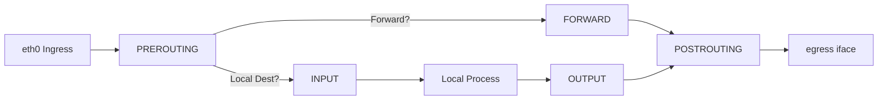
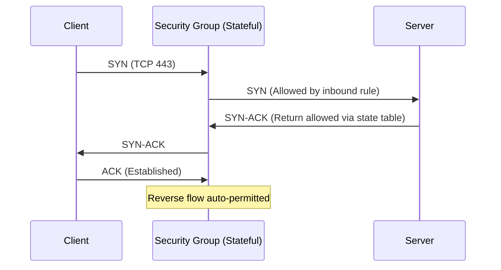
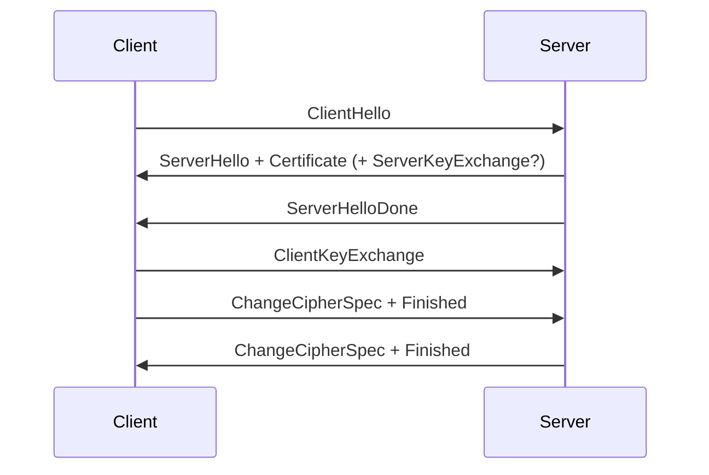
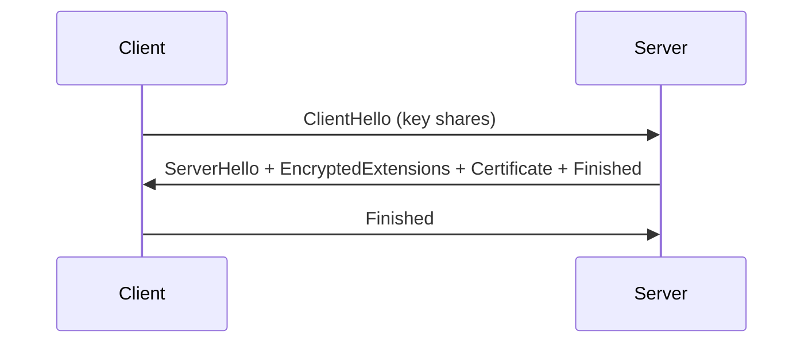
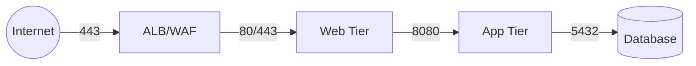

# Day 19: Firewalls, Security Groups & TLS/SSL – Defending Modern Infrastructure

> “Performance issues are annoying. Misconfigured firewalls and expired TLS certs are outages.”

---

## Why This Matters

You can design the cleanest microservice architecture, but without deliberate **traffic control (firewalls & security groups)** and **secure channel establishment (TLS/SSL + optional mTLS)**, your stack is a soft target.  
Today you will: lock down a host, design a 3‑tier perimeter, enable HTTPS, optionally add mTLS, capture a handshake, and reason about real incident scenarios.

---

## 1. Core Concepts (At a Glance)

| Concept | Simple Meaning | Why You Care |
|---------|----------------|--------------|
| Firewall | Policy engine (allow/deny) | Blocks unwanted access |
| Stateless Filter | Evaluates each packet isolated | Fast, but no connection awareness |
| Stateful Firewall | Tracks connection state (ESTABLISHED, RELATED) | Fewer rules; safer defaults |
| Security Group (SG) | Cloud stateful L3/L4 micro‑perimeter on ENI | Fine-grained ingress/egress |
| NACL | Stateless subnet ACL | Coarse baseline filtering |
| WAF | Layer 7 HTTP filter | Stops XSS, SQLi, bots |
| TLS/SSL | Encrypted transport with identity | Confidentiality + integrity + auth |
| Certificate | Signed public key + identity metadata | Trust chain & validation |
| Cipher Suite | Algorithms bundle (KEX + auth + cipher + MAC) | Security & performance |
| PFS (Forward Secrecy) | Ephemeral session keys | Limits blast radius of key theft |
| mTLS | Mutual certificate auth | Zero trust / service identity |
| Conntrack | Kernel table tracking flows | Enables stateful decisions |
| Ephemeral Ports | High-numbered client-side ports | Needed for return traffic / NAT |

---

## 2. Packet & Flow Fundamentals

### 2.1 Linux Simplified Packet Path



### 2.2 Stateless vs Stateful

| Aspect | Stateless (NACL / raw ACL) | Stateful (iptables/nftables, SG) |
|--------|----------------------------|----------------------------------|
| Tracks return flows? | No | Yes (conntrack) |
| Reverse rule needed? | Yes | No |
| Typical placement | Subnet edge / router | Host / cloud instance |
| Logging context | Limited | Rich (state-based decisions) |

---

## 3. Cloud Security Constructs

| Control | Layer | Stateful | Scope | Typical Purpose |
|---------|-------|----------|-------|-----------------|
| SG | L3/L4 | Yes | ENI/Instance | Instance micro-perimeter |
| NACL | L3/L4 | No | Subnet | Baseline allow/deny |
| WAF | L7 | N/A | HTTP edge | App-layer attack filtering |
| Shield / DDoS | L3–7 | Managed | Edge | Volumetric resilience |
| Host Firewall | L3/L4 | Yes | Kernel/OS | Defense in depth |

### 3.1 Security Group Statefulness



---

## 4. TLS Essentials

### 4.1 Guarantees

| Guarantee | Meaning |
|-----------|---------|
| Confidentiality | Encrypted payload |
| Integrity | Tamper detection |
| Server Authentication | Proves server identity |
| (Optional) Client Authentication | mTLS mutual identity |

### 4.2 TLS 1.2 (Simplified)



### 4.3 TLS 1.3 (Fewer Messages)



---

## 5. Certificates (Types & Use)

| Type | Use Case | Pros | Cons |
|------|----------|------|------|
| Self-Signed | Local dev | Fast | Not trusted externally |
| Internal CA | Internal services | Control lifecycle | Need trust distribution |
| Let’s Encrypt | Public web | Free + automated | 90‑day renew window |
| Wildcard | Many subdomains | Flexible | Larger key compromise blast |
| EV | High-profile brand | Strong validation chain | Minimal modern UX value |
| mTLS Leaf | Service identity | Strong auth | Ops overhead |

---

## 6. Hands-On Labs

> Choose either iptables or nftables for host firewall implementation. Both labs are provided.

### Lab 1: Baseline Inspection

Commands:
```bash
sudo ss -tulpen
sudo iptables -L -n -v 2>/dev/null || echo "iptables not active"
sudo nft list ruleset 2>/dev/null | head -n 50 || echo "nftables empty"
```

Record:
- Listening ports (service, port, protocol)
- Default INPUT/FORWARD policies (ACCEPT/DROP)
- Which framework is currently active?

### Lab 2: Basic iptables Rule Set (Stateful Minimal Policy)

Goal: Allow loopback, established/related, SSH(22), HTTP(80), HTTPS(443). Drop other inbound.

```bash
sudo iptables -P INPUT DROP
sudo iptables -P FORWARD DROP
sudo iptables -P OUTPUT ACCEPT

sudo iptables -A INPUT -i lo -j ACCEPT
sudo iptables -A INPUT -m conntrack --ctstate ESTABLISHED,RELATED -j ACCEPT
sudo iptables -A INPUT -p tcp -m multiport --dports 22,80,443 -j ACCEPT

sudo iptables -L -n -v
```

Test blocked port:
```bash
nc -vz 127.0.0.1 8080 || echo "Blocked as expected"
```

(Optionally persist):
```bash
sudo sh -c 'iptables-save > /etc/iptables/rules.v4'
```

### Lab 3: nftables Equivalent (If You Prefer Modern Stack)

```bash
sudo nft flush ruleset
sudo tee /tmp/day19.nft <<'EOF'
table inet filter {
  chain input {
    type filter hook input priority 0; policy drop;
    iif lo accept
    ct state established,related accept
    tcp dport {22,80,443} accept
  }
  chain forward { type filter hook forward priority 0; policy drop; }
  chain output  { type filter hook output priority 0; policy accept; }
}
EOF
sudo nft -f /tmp/day19.nft
sudo nft list ruleset
```

Optional logging rule:
```bash
sudo nft add rule inet filter input log prefix "DROP_INPUT " counter
journalctl -k -f
```

### Lab 4: Prove Statefulness

```bash
curl -I https://example.com 2>/dev/null | head -n1
```
Explain: Why did the response succeed without an inbound ephemeral port rule? (conntrack state ESTABLISHED handles reverse flow.)

### Lab 5: 3‑Tier Cloud Perimeter Design (Conceptual)

Create a diagram (mermaid allowed) & a table:

| Tier | Inbound Source | Ports | Outbound |
|------|----------------|-------|----------|
| ALB | 0.0.0.0/0 | 443 (maybe 80 redirect) | Web SG on 443 |
| Web | ALB SG | 80,443 | App SG:8080; DNS, NTP |
| App | Web SG | 8080 | DB SG:5432 |
| DB | App SG | 5432 | Backup / monitoring only |

Mermaid:


Explain differences:
- SG (stateful) vs NACL (stateless)
- WAF sits before ALB (optional) for L7 inspection

### Lab 6: Generate Self-Signed TLS & Serve via Nginx

```bash
sudo apt-get update -y
sudo apt-get install -y nginx openssl

mkdir -p ~/tlslab && cd ~/tlslab
openssl req -x509 -newkey rsa:4096 -sha256 -days 90 -nodes \
  -keyout server.key -out server.crt -subj "/CN=localhost"
```

Nginx site:
```bash
sudo tee /etc/nginx/sites-available/day19 <<'EOF'
server {
    listen 443 ssl;
    server_name localhost;
    ssl_certificate     /home/$USER/tlslab/server.crt;
    ssl_certificate_key /home/$USER/tlslab/server.key;

    add_header X-Day19 "PerimeterDemo";
    location / {
        return 200 "Day19 Secure Hello\n";
    }
}
EOF
sudo ln -s /etc/nginx/sites-available/day19 /etc/nginx/sites-enabled/day19
sudo nginx -t && sudo systemctl reload nginx
```

Test:
```bash
curl -vk https://localhost 2>&1 | head -n 20
```

Questions:
- Why browser/curl trust warning? (Self-signed: subject=issuer)
- Production cert should include proper SANs (Subject Alternative Names)

### Lab 7: TLS Certificate & Cipher Inspection

```bash
echo | openssl s_client -connect localhost:443 -servername localhost 2>/dev/null \
 | openssl x509 -noout -subject -issuer -dates

echo | openssl s_client -connect localhost:443 -servername localhost 2>/dev/null \
 | grep -i "Cipher"
```
Record:
- Subject / Issuer
- notBefore / notAfter
- Chosen cipher (identify ECDHE for PFS)

### Lab 8: TLS Handshake Capture (Optional but Recommended)

```bash
sudo tcpdump -i lo port 443 -w tls_handshake.pcap &
PID=$!
curl -k https://localhost >/dev/null
sleep 1
sudo kill $PID
```
View in Wireshark:
- Inspect ClientHello (cipher list, SNI)
- ServerHello (selected cipher)
- Certificate frame

Document 2–3 handshake observations.

### Lab 9: Near-Expiry Cert Simulation

```bash
cd ~/tlslab
openssl req -x509 -newkey rsa:2048 -sha256 -days 1 -nodes \
  -keyout short.key -out short.crt -subj "/CN=localhost-short"
sudo sed -i 's/server.crt/short.crt/; s/server.key/short.key/' /etc/nginx/sites-available/day19
sudo nginx -t && sudo systemctl reload nginx
echo | openssl s_client -connect localhost:443 -servername localhost 2>/dev/null \
 | openssl x509 -noout -dates
```

Restore:
```bash
sudo sed -i 's/short.crt/server.crt/; s/short.key/server.key/' /etc/nginx/sites-available/day19
sudo nginx -t && sudo systemctl reload nginx
```

Explain operational risk of missed renewal; propose monitoring threshold (e.g. alert at <20 days).

### Lab 10: mTLS Mini Demo (Optional Advanced)

Internal CA:
```bash
cd ~/tlslab
openssl genrsa -out ca.key 4096
openssl req -x509 -new -key ca.key -days 365 -out ca.crt -subj "/CN=Day19-CA"
```

Server leaf (reissue signed by CA):
```bash
openssl genrsa -out mtls_server.key 4096
openssl req -new -key mtls_server.key -out mtls_server.csr -subj "/CN=mtls-server"
openssl x509 -req -in mtls_server.csr -CA ca.crt -CAkey ca.key -CAcreateserial \
  -out mtls_server.crt -days 120 -sha256
```

Client cert:
```bash
openssl genrsa -out client.key 4096
openssl req -new -key client.key -out client.csr -subj "/CN=client1"
openssl x509 -req -in client.csr -CA ca.crt -CAkey ca.key -CAserial ca.srl \
  -out client.crt -days 120 -sha256
```

Update nginx:
```bash
sudo sed -i 's#ssl_certificate .*#ssl_certificate /home/'"$USER"'/tlslab/mtls_server.crt;#' /etc/nginx/sites-available/day19
sudo sed -i 's#ssl_certificate_key .*#ssl_certificate_key /home/'"$USER"'/tlslab/mtls_server.key;#' /etc/nginx/sites-available/day19
sudo sed -i '/server_name localhost;/a ssl_client_certificate /home/'"$USER"'/tlslab/ca.crt;\nssl_verify_client on;' /etc/nginx/sites-available/day19
sudo nginx -t && sudo systemctl reload nginx
```

Tests:
```bash
curl --cert ~/tlslab/client.crt --key ~/tlslab/client.key -k https://localhost
curl -k https://localhost -o /dev/null -w "HTTP:%{http_code}\n"
```

Record: success vs failure status codes.

### Lab 11: Incident Simulation & Analysis

Pick any TWO and write: Timeline → Symptom → Root Cause → Resolution → Prevention

| Scenario | Symptom | Likely Root Cause | Prevention Idea |
|----------|---------|------------------|-----------------|
| SSH Lockout | Timeout | Dropped port 22 / no ESTABLISHED rule | Pre-change session + rollback script |
| App→DB Fail | ECONNREFUSED | Missing SG rule or wrong CIDR | IaC & peer review |
| Expired Cert | Browser errors / failing jobs | Failed renewal automation | Expiry monitoring + ACME |
| mTLS Fail | 400 / 401 / handshake abort | Wrong CA bundle / mismatched CN | Automate trust distribution |
| Conntrack Exhaustion | Drops / latency | High short-lived connection churn | Tune nf_conntrack_max, reuse pools |
| NAT Port Exhaustion | Outbound stalls | Too many parallel ephemeral flows | Increase ranges / SNAT scaling |
| TLS CPU Spike | High CPU, slow handshakes | No session reuse, old ciphers | TLS 1.3, reuse, offload |

---

## 7. Debugging & Toolbelt

| Goal | Commands |
|------|----------|
| List iptables | `iptables -L -n -v`, `iptables-save` |
| List nft | `nft list ruleset` |
| Open sockets | `ss -tulpen` |
| Conntrack sample | `sudo conntrack -L | head` |
| Test port | `nc -vz host 443` |
| Quick scan (careful) | `nmap -sS -p 22,80,443 host` |
| TLS details | `openssl s_client -connect host:443 -servername host` |
| Enumerate ciphers | `nmap --script ssl-enum-ciphers -p 443 host` |
| Cert expiry | `echo | openssl s_client -connect host:443 2>/dev/null | openssl x509 -noout -dates` |
| Handshake capture | `tcpdump -n -i eth0 port 443 -w tls.pcap` |

---

## 8. Performance & Pitfalls

| Pitfall | Cause | Impact | Mitigation |
|---------|-------|--------|-----------|
| Overly permissive SG | Quick testing | Attack surface | Least privilege + IaC |
| Rule sprawl | Manual edits | Complexity / errors | Periodic pruning / versioning |
| Conntrack full | Burst connections | Drops / latency | Tune + scale + pooling |
| NAT ephemeral exhaustion | High outbound fan-out | Stalled flows | Expand range / scale NAT |
| Weak ciphers enabled | Legacy defaults | MITM risk | Harden config / TLS 1.3 |
| TLS handshake CPU | No reuse / RSA | Latency, cost | Session tickets / TLS 1.3 |
| Expired cert | Missed renew job | Outage | Alert < 20–30 days |
| Unlogged drops | No visibility | Slow RCA | Rate-limited logging |

---

## 9. Hardening Checklist

| Area | Action |
|------|--------|
| Ingress Policy | Default DROP (host & SG) |
| Loopback | Always allow |
| SSH | Restrict CIDR / MFA bastion |
| Services | Bind only required interfaces |
| TLS | Enforce 1.2+ (prefer 1.3), strong ciphers |
| Cert Lifecycle | Auto-renew + expiry alerts |
| Keys | 600 perms; minimal exposure |
| Logging | Drop logging (rate-limited) |
| Observability | Dashboards: conntrack, drops, handshake failures |
| mTLS | Internal sensitive APIs / service mesh |
| IaC | Terraform / Ansible for rules & cert provisioning |

---

## 10. Design Patterns

| Pattern | Description | Example |
|---------|-------------|---------|
| Choke Point | Single controlled ingress layer | ALB + WAF bundle |
| Defense in Depth | Multiple layered controls | SG + host firewall + app ACL |
| Zero Trust Drift | Auth every hop | mTLS between services |
| Segmentation | Contain lateral movement | Web/App/DB tiering |
| Policy as Code | Versioned reproducible security | Terraform SG modules & nft templates |

---

## 11. Reflection Questions

1. Why does reply traffic not need an explicit inbound rule on a stateful firewall?  
2. One sentence: SG vs NACL difference?  
3. Advantage of nftables over iptables (design or management)?  
4. Where do you see Perfect Forward Secrecy in the cipher output?  
5. Operational risk illustrated by the 1‑day certificate test?  
6. Give one concrete internal use case for mTLS.  
7. Describe a mitigation for conntrack table exhaustion.  
8. Which design pattern (choke point, defense in depth, zero trust) did you partially implement today and how?  
9. One automation you’d add tomorrow to reduce perimeter toil?  

---

## 12. Submission Guidelines (day19solution.md)

Include:

1. Baseline outputs: `ss`, firewall policy, active framework  
2. Final ruleset (iptables-save OR `nft list ruleset` excerpt)  
3. Statefulness explanation (Lab 4)  
4. 3-tier model (table + mermaid or diagram) + SG vs NACL vs WAF one-liners  
5. TLS evidence: curl snippet, cert subject/issuer/dates, cipher line  
6. Near-expiry (1‑day cert) output + monitoring note  
7. (Optional) Handshake capture observations (ClientHello, cipher chosen)  
8. (Optional) mTLS success vs failure HTTP codes  
9. Two incident analyses (structured)  
10. Reflection answers (all)  
11. (Optional) Hardening checklist: mark applied items  

Share progress with:  
`#getfitwithsagar #100DaysOfSRE #CloudSecurity #TLS #DevSecOps #NetworkDefense`

---

## 13. Safety Notes

- Use `tmux`/`screen` before changing firewall if remote.  
- Prepare rollback (cron or script) when imposing DROP defaults.  
- Never commit private keys.  
- Only scan systems you own or are authorized to test.  
- Keep at least one active session while tightening rules.

---

## 14. Cleanup (Optional)

```bash
sudo rm /etc/nginx/sites-enabled/day19
sudo rm /etc/nginx/sites-available/day19
sudo systemctl reload nginx
# Revert firewall manually if needed (e.g., set INPUT policy ACCEPT)
```

---

## 15. Success Criteria

You can:  
- Explain stateful vs stateless & show working policy  
- Present a 3-tier SG design with correct segmentation rationale  
- Serve HTTPS, inspect cert + cipher, identify PFS component  
- Simulate expiry risk & propose monitoring  
- (Optionally) Demonstrate mTLS acceptance vs rejection  
- Produce credible incident root cause analyses  

If yes → You’ve internalized Day 19.

---

Happy securing,  
Sagar Utekar
