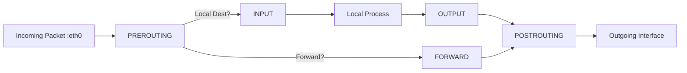
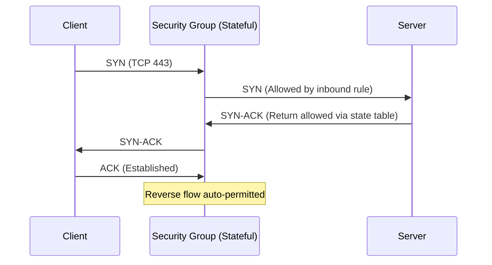
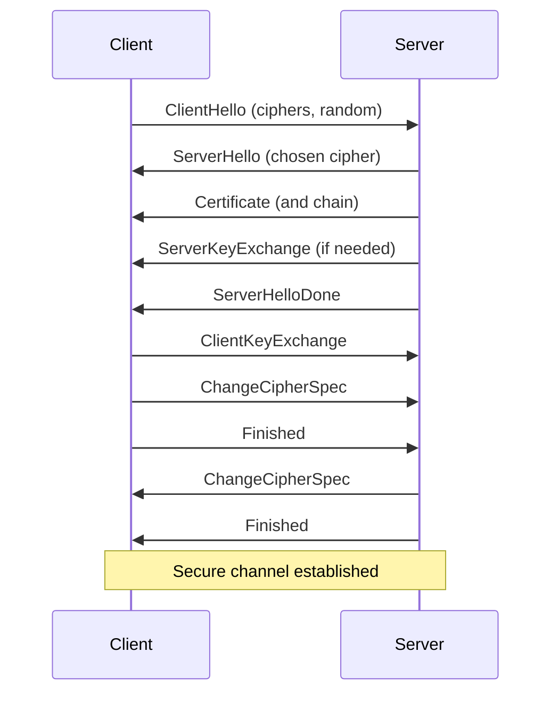
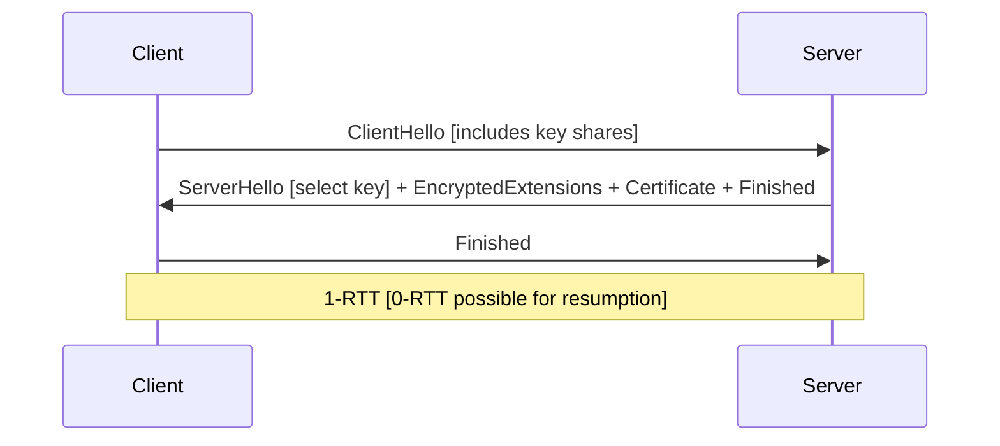
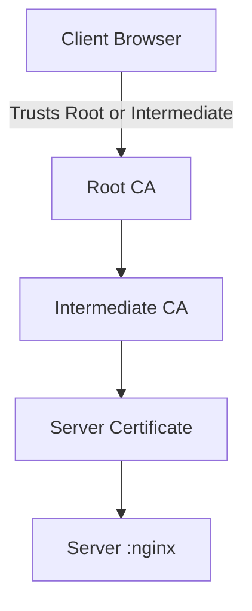
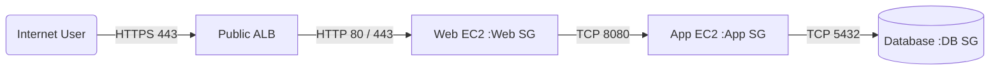

# **Day 19: Firewalls, Security Groups & TLS/SSL – Defending Modern Infrastructure**

---

## Why Day 19 Matters

You can design the cleanest microservice architecture, but without proper **traffic control (firewalls & security groups)** and **secure channel establishment (TLS/SSL)**, your stack is a soft target.  
Today you’ll learn how packets are permitted, denied, shaped, inspected, and encrypted across **Linux hosts, cloud boundaries, and client–server connections**.

> “Performance issues are annoying. Misconfigured firewalls and expired TLS certs are outages.”

---

## 1. Core Concepts (At a Glance)

| Concept | What It Is (Simple) | Why You Care |
|--------|----------------------|--------------|
| Firewall | Traffic filter (allow/deny based on rules) | Prevents unwanted access |
| Stateless Filter | Checks each packet independently | Fast but dumb (e.g., classic ACL) |
| Stateful Firewall | Tracks connection state (established, related) | Smarter, less rules needed |
| Security Group (Cloud) | Virtual, stateful firewall at instance ENI level | Controls what talks in/out |
| NACL (Cloud) | Subnet-level stateless rule set | Coarse filtering, both directions |
| WAF | Layer 7 (HTTP) attack filter | Stops SQLi, XSS, bots |
| TLS/SSL | Protocol for encrypted channels | Protects data + identity |
| Certificate | Digital ID for a domain/service | Trust & authenticity |
| mTLS | Both sides present certs | Zero-trust & service-to-service auth |
| Cipher Suite | Algorithms for key exchange + encryption + MAC | Affects performance & security |
| PFS | New ephemeral key per session | Limits blast radius of key leakage |

---

## 2. Firewalls Explained

### 2.1 What Is a Firewall?
A firewall enforces **policy**: what traffic is allowed or denied based on attributes like protocol, source, destination, port, interface, or connection state.

### 2.2 Layers
- Layer 3/4: IP, protocols, ports (iptables/nftables, Security Groups)
- Layer 7: HTTP semantics (WAF, reverse proxies)
- Deep Packet Inspection: Payload-level inspection (IDS/IPS)

### 2.3 Packet Flow (Simplified Linux Host)



### 2.4 Stateless vs Stateful

| Aspect | Stateless (e.g., NACL, raw ACL) | Stateful (iptables conntrack, SG) |
|--------|---------------------------------|-----------------------------------|
| Tracks Connections? | No | Yes |
| Requires Reverse Rule? | Yes | No (auto allows reply) |
| Performance | Slightly faster for simple rules | Near parity with modern kernels |
| Use Case | Edge routers, simple filtering | Hosts, cloud workloads |

### 2.5 iptables vs nftables vs firewalld

| Feature | iptables | nftables | firewalld |
|---------|----------|----------|-----------|
| Status | Legacy (still everywhere) | Modern replacement | Abstraction layer |
| Performance | Per-table / chain evaluation | Unified flow engine | Depends on backend |
| Rule Management | Append oriented | Atomic replace | Zones & services |
| Recommended? | Legacy maintenance | YES (future-proof) | For ease if not scripting |

---

## 3. Cloud Security Constructs

| Control | Layer | Stateful? | Scope | Typical Use |
|---------|-------|-----------|-------|-------------|
| Security Group | L3/L4 | Yes | ENI / Instance | Instance ingress/egress micro-perimeter |
| NACL | L3/L4 | No | Subnet | Baseline allow/deny |
| WAF | L7 | N/A | HTTP/S endpoints | App-layer attack filtering |
| Shield / DDoS | L3–7 | Managed | Edge | Volumetric protection |
| Host Firewall | L3/L4 | Yes | OS Kernel | Defense-in-depth |

### 3.1 Security Group Statefulness (Inbound → Outbound Return)



---

## 4. TLS / SSL Essentials

### 4.1 What TLS Provides
| Guarantee | Meaning |
|-----------|---------|
| Confidentiality | Encrypted payload |
| Integrity | Tamper detection |
| Authentication | Identity via certificates |
| (Optional) Client Auth | mTLS for mutual identity |

### 4.2 TLS 1.2 Handshake (Simplified)



### 4.3 TLS 1.3 Differences (Faster, More Secure)



### 4.4 Certificate Chain



### 4.5 Cipher Suite Anatomy (TLS 1.2 Example)
`TLS_ECDHE_RSA_WITH_AES_256_GCM_SHA384`
- ECDHE: Key exchange (PFS)
- RSA: Authentication
- AES_256_GCM: Bulk cipher (AEAD)
- SHA384: Hash for PRF/integrity

### 4.6 TLS 1.2 vs 1.3

| Aspect | TLS 1.2 | TLS 1.3 |
|--------|---------|---------|
| Handshake RTT | 2 | 1 (0 with resumption) |
| Cipher Suites | Many (legacy risk) | Streamlined / only AEAD |
| Key Exchange | RSA / (EC)DHE | Always (EC)DHE (PFS enforced) |
| Algorithms Removed | RC4, SHA1, etc. | Already gone |
| Session Resumption | Session IDs / Tickets | Tickets / PSK |
| Security Level | Good if hardened | Better defaults |

---

## 5. Certificates – Types & Use Cases

| Type | Use | Pros | Cons |
|------|-----|------|------|
| Self-Signed | Dev/testing | Fast | No external trust |
| Internal CA | Internal services | Control | Requires internal trust distro |
| Let’s Encrypt | Public sites | Free, automated | 90-day renewal |
| Wildcard | Many subdomains | Flexible | Risk if private key leaked |
| EV | High-profile public orgs | Strong validation signal | Cost / diminishing value |
| mTLS Certs | Service-to-service | Strong mutual auth | Operational overhead |

---

## 6. mTLS (Mutual TLS)

Both sides present a certificate. Use cases:
- Service Mesh (Istio, Linkerd)
- gRPC microservice auth
- Zero-trust internal APIs

Flow:
1. TLS handshake begins
2. Server sends Certificate
3. Server requests client Certificate
4. Client sends Certificate + proves possession of private key
5. Both validate chain → secure + mutually authenticated

---

## 7. Hands-On Labs (Follow in Order)

### Lab 1: Inspect Current Firewall State (Linux)

```bash
sudo iptables -L -n -v
sudo iptables -t nat -L -n -v
sudo nft list ruleset
sudo ss -tulpen
```

Questions:
1. Which ports are open?
2. Any default ACCEPT policies? (Risky on exposed hosts.)

---

### Lab 2: Basic iptables Rule Set

Goal: Allow SSH (22), HTTP (80), HTTPS (443); drop everything else inbound; allow all outbound.

```bash
# WARNING: If remote, keep an existing SSH session open to recover.
sudo iptables -P INPUT DROP
sudo iptables -P FORWARD DROP
sudo iptables -P OUTPUT ACCEPT

# Allow loopback
sudo iptables -A INPUT -i lo -j ACCEPT

# Allow established/related
sudo iptables -A INPUT -m conntrack --ctstate ESTABLISHED,RELATED -j ACCEPT

# Allow SSH, HTTP, HTTPS
sudo iptables -A INPUT -p tcp -m multiport --dports 22,80,443 -j ACCEPT

# View counters
sudo iptables -L -n -v
```

Persist (varies by distro):
```bash
sudo sh -c 'iptables-save > /etc/iptables/rules.v4'
```

Task:
- Try connecting to a random blocked port (e.g., 8080) → should fail.

---

### Lab 3: Security Group Design (3-Tier Example)

Architecture:
- Public ALB (443)
- Web Tier (EC2 behind ALB)
- App Tier (private)
- DB Tier (private)

Rules (Simplified):

| Tier | Inbound Allowed | Outbound Allowed |
|------|-----------------|------------------|
| ALB | 0.0.0.0/0 → :443 | Web SG → :443 | 
| Web SG | ALB SG → :80/:443 | App SG → :8080; 0.0.0.0/0 DNS/NTP as needed |
| App SG | Web SG → :8080 | DB SG → :5432 |
| DB SG | App SG → :5432 | (Optional) Backup host SG |

Task:
- Document in a diagram (draw.io / mermaid).
- Justify: Why no direct internet to App/DB?

Mermaid Flow:



---

### Lab 5: Generate Self-Signed TLS Cert & Use with NGINX

```bash
mkdir -p ~/tlslab && cd ~/tlslab
openssl req -x509 -newkey rsa:4096 -sha256 -days 90 -nodes \
  -keyout server.key -out server.crt -subj "/CN=localhost"

sudo apt-get install -y nginx
sudo tee /etc/nginx/sites-available/tlsdemo <<'EOF'
server {
    listen 443 ssl;
    server_name localhost;
    ssl_certificate     /home/$USER/tlslab/server.crt;
    ssl_certificate_key /home/$USER/tlslab/server.key;

    add_header X-App "Day19Demo";
    location / {
        return 200 "Secure Hello (TLS Demo)\n";
    }
}
EOF

sudo ln -s /etc/nginx/sites-available/tlsdemo /etc/nginx/sites-enabled/tlsdemo
sudo nginx -t && sudo systemctl reload nginx
```

Test:
```bash
curl -vk https://localhost
openssl s_client -connect localhost:443 -servername localhost -tls1_2 </dev/null
```

Answer:
- Why does curl show `self-signed certificate` warnings?
- What SANs should production certs include?

---

### Lab 6: Incident Simulation Scenarios

| Scenario | Symptom | Root Cause | Your Fix |
|----------|---------|-----------|----------|
| Locked out of server | SSH timeout | Dropped inbound 22 rule | Add console recovery / out-of-band |
| App can't reach DB | ECONNREFUSED | SG missing outbound or DB inbound | Adjust SGs with least privilege |
| High CPU + retransmits | Slow responses | Stateful inspection under load | Offload to dedicated firewall tier |
| Cert expired | Browser error | Cron renewal failed | Implement monitoring + auto-renew |
| mTLS failure | 400 Bad Cert | Wrong CA trust at server | Sync CA bundle |

Task:
Pick 2 and write incident analysis: timeline + resolution + prevention.

---

## 8. Debugging & Toolbelt

| Goal | Commands |
|------|----------|
| See rules (iptables) | `iptables -L -n -v` `iptables-save` |
| See rules (nftables) | `nft list ruleset` |
| Connection states | `ss -s` `ss -tan` |
| Conntrack table | `sudo conntrack -L | head` |
| Test port remotely | `nc -vz host 443` `telnet host 443` |
| Port scan (careful!) | `nmap -sS -p 1-1024 host` |
| TLS inspect | `openssl s_client -connect host:443 -servername host` |
| Cipher test | `nmap --script ssl-enum-ciphers -p 443 host` |
| Certificate expiry | `echo | openssl s_client -servername host -connect host:443 2>/dev/null | openssl x509 -noout -dates` |
| Quick server (dev TLS) | `python3 -m http.server --bind 0.0.0.0 8000` (no TLS) |
| testssl.sh | `./testssl.sh host:443` |

---

## 9. Performance & Pitfalls

| Pitfall | Cause | Mitigation |
|---------|------|------------|
| Overly permissive SG | “Allow all for quick test” | Review + least privilege |
| Rule bloat | Unmanaged growth | Use grouping / abstractions |
| Duplicate rules | Manual edits | Automate via Terraform / Ansible |
| Expired cert outage | No alerts | Monitor expiry + auto-renew |
| Weak ciphers | Defaults not updated | Enforce modern cipher suites |
| Full conntrack table | High connection churn | Tune nf_conntrack_max + scale out |
| NAT exhaustion | Too many ephemeral flows | Increase ephemeral port range / reuse pooling |
| TLS CPU spikes | Expensive handshake load | Enable TLS session reuse / 1.3 / offload |

---

## 10. Hardening Checklist

| Area | Action |
|------|--------|
| Host | Default DROP inbound; allow loopback & established |
| SSH | Restrict source IPs |
| Services | Bind to least interfaces |
| TLS | Use TLS 1.2+ (prefer 1.3), disable outdated protocols |
| Certs | Automate renewal; monitor expiry < 20 days |
| Secrets | Store private keys with correct permissions (`600`) |
| Logging | Enable firewall drop logging (rate-limited) |
| Cloud | Separate SGs per tier; restrict DB to App SG |
| mTLS (internal) | Use service mesh or internal PKI |
| Observability | Dashboards: connections, drop counts, handshake failures |
| Automation | Infra as Code for rules & cert provisioning |

---

## 11. Design Patterns

| Pattern | Description | Example |
|---------|-------------|---------|
| Choke Point | Single inspection layer at edge | ALB + WAF |
| Defense-in-Depth | Multiple layers (edge → SG → host) | SG + host firewall + app ACL |
| Zero Trust | Always verify identity | mTLS between services |
| Segmentation | Limit blast radius | Separate VPC subnets |
| Policy as Code | Versioned declarative security | Terraform SGs, nftables templates |

---

## Submission Guidelines

Create `day19solution.md` including:

1. Command outputs:
   - `iptables -L -n -v` (before & after)
   - `nft list ruleset` (if used)
   - `ss -tuln`
   - `openssl s_client` output (sanitized)
2. Screenshots / notes:
   - Wireshark TLS handshake
   - Security group design diagram
3. mTLS test results (`curl` success vs failure)
4. Incident simulation write-up (at least 2 scenarios)
5. Reflection answers
6. (Optional) Hardening checklist—what you applied

Share on socials with:
`#getfitwithsagar #100DaysOfSRE #CloudSecurity #TLS #DevSecOps #NetworkDefense`

---

## Community & Support

- [Discord](https://discord.gg/mNDm39qB8t)
- [Google Group](https://groups.google.com/forum/#!forum/daily-devops-sre-challenge-series/join)
- [YouTube](https://www.youtube.com/@Sagar.Utekar)

---

## Safety Notes

- Always test firewall changes in a **screen/tmux** session or with console access.
- For remote hosts, add a “rollback” cron job before applying strict DROP policies.
- Never share private keys in public repos.

---

**Mastering Day 19 gives you the confidence to guard availability, integrity, and confidentiality—from kernel packet paths to encrypted application sessions.**

Ready to build a fortress? Let’s ship it.  

Happy securing,  
Sagar Utekar
