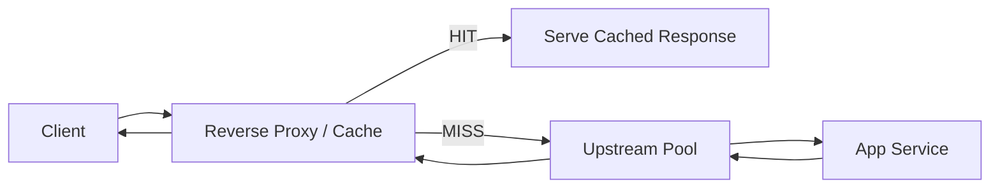
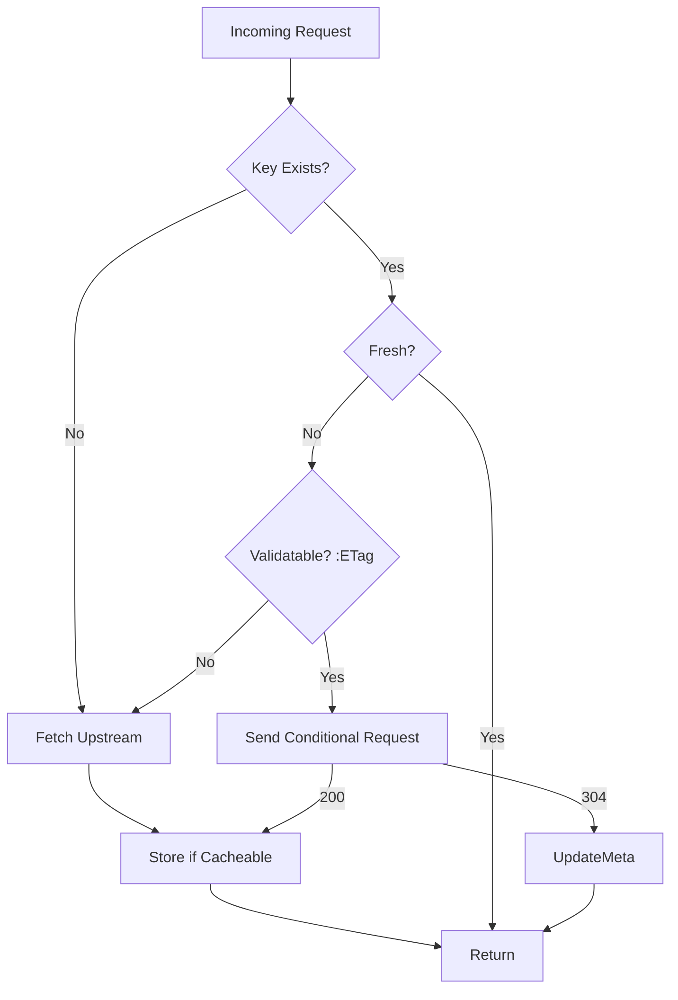

# **Day 20: Application Layer 7 – Reverse Proxies, Caching, Performance & Observability**

---

## Why this Matters

Most real-world outages aren’t kernel panics; they’re **502s, 503s, latency spikes, cache misconfigurations, bad headers, or upstream timeouts**.  
Layer 7 (HTTP) is where reliability, performance, and security meet. Mastering this layer lets you:
- Slash origin load with caching
- Expose reliable APIs behind reverse proxies
- Debug 502 vs 504 vs 499 quickly
- Optimise compression, connection reuse, and multiplexing
- Trace requests across layers with structured logs and headers

> “If you can read headers, logs, and timings, you can solve 80% of web production issues.”

---

## 1. Core Concepts (At a Glance)

| Concept | Meaning (Simple) | Why It Matters |
|---------|------------------|----------------|
| Method (GET/POST/etc.) | Action on a resource | Safe vs unsafe; idempotency |
| Status Code Classes | 1xx info, 2xx success, 3xx redirect, 4xx client error, 5xx server error | Fast triage |
| Headers | Metadata before body | Routing, caching, debugging |
| Body | Payload (HTML, JSON, binary) | API / page content |
| Connection Persistence | Keep-Alive vs new TCP per request | Latency + scalability |
| Reverse Proxy | Intermediary forwarding to upstream | Control point (NGINX / Envoy) |
| Gateway / API Gateway | Adds auth, rate limits, transforms | API governance |
| Cache | Store response to reuse later | Performance + cost reduction |
| CDN | Global cache + edge network | Latency + DDoS absorption |
| Observability Fields | latency, upstream time, status, bytes | SLA / SLO measurement |

---

## 2. Reverse Proxy vs Load Balancer vs API Gateway

| Component | Focus | Examples | Adds |
|-----------|-------|----------|------|
| Reverse Proxy | Fronts and forwards requests to upstreams | NGINX, HAProxy, Caddy | TLS, routing, basic caching |
| Load Balancer | Distributes load across backend pool | ALB, ELB, HAProxy, Envoy | Health checks, balancing algorithms |
| API Gateway | Manages API lifecycle | Kong, APIGW, Tyk, Zuul | Auth, quotas, transforms, versioning |
| Service Mesh Sidecar | Per-service proxy | Envoy/Istio, Linkerd | mTLS, routing policies, telemetry |

---

## 3. Critical HTTP Headers (You Should Recognise Instantly)

| Category | Header | Purpose |
|----------|--------|---------|
| Client Identity | X-Forwarded-For, X-Real-IP | Preserve original IP through proxy chain |
| Protocol & Host | Host, X-Forwarded-Proto | Virtual hosting, HTTPS redirect logic |
| Caching – Freshness | Cache-Control (max-age, s-maxage), Expires | Decide if cached copy usable |
| Caching – Validation | ETag, Last-Modified, If-None-Match, If-Modified-Since | Conditional revalidation |
| Auth | Authorization, WWW-Authenticate | API / Basic / Bearer tokens |
| Content | Content-Type, Content-Length, Transfer-Encoding | Parse and stream body |
| Compression | Accept-Encoding, Content-Encoding | gzip, br support |
| Security | Strict-Transport-Security, X-Frame-Options, Content-Security-Policy, Set-Cookie (HttpOnly/Secure/SameSite) | Mitigate attacks |
| Control / Debug | Via, X-Trace-Id, X-Request-Id, X-Upstream-Response-Time | Distributed tracing |
| Variation | Vary | Cache key dimension changes |

---

## 4. Observability KPIs (Track These)

| Metric | Reason |
|--------|--------|
| p50 / p95 / p99 latency | User experience & performance tuning |
| Upstream response time vs total time | Find proxy vs backend delay |
| Active connections | Capacity planning |
| 4xx / 5xx ratio | Error detection |
| Cache HIT ratio | Cost + speed optimization |
| Request size / response size | Abuse detection / tuning |
| 499 count (client closed) | User aborts / timeout mismatch |
| Open file descriptors | Resource limits |

---

## 5. Mermaid Architecture & Flows

### 5.1 Request Flow (Reverse Proxy + Cache)



### 5.2 Cache Decision Logic



---

## 6. Hands-On Labs

## Problem Statement

You are the on-call SRE. A small internal service (a simple Python HTTP backend) is getting slower under load, and the product wants:
1. Faster repeated responses
2. Fewer upstream timeouts
3. Basic visibility into performance
4. Ability to explain a 502 vs 504 if it happens

Your task: Put NGINX in front of the backend as a reverse proxy with minimal caching + basic observability, then demonstrate:
- A normal proxied request
- A cached response
- A slow request + how a timeout manifests (and how you fix it)
- A short log-based latency summary

You will deliver a single file `solution.md` documenting what you did and the answers to reflection questions.

---

## 1. Setup (Backend + Reverse Proxy)

### 1.1 Start a very simple backend

```bash
mkdir -p ~/day20 && cd ~/day20
cat > app.py <<'EOF'
from http.server import BaseHTTPRequestHandler, HTTPServer
import time, datetime

class H(BaseHTTPRequestHandler):
    def do_GET(self):
        # /slow simulates slowness
        if self.path.startswith("/slow"):
            time.sleep(2)
        body = f"PATH={self.path} TIME={datetime.datetime.utcnow().isoformat()}Z\n"
        self.send_response(200)
        self.send_header("Content-Type", "text/plain")
        # Let proxy decide caching; still send something explicit:
        if self.path.startswith("/cache"):
            self.send_header("Cache-Control", "max-age=30")
        else:
            self.send_header("Cache-Control", "no-store")
        self.end_headers()
        self.wfile.write(body.encode())

HTTPServer(("127.0.0.1", 9000), H).serve_forever()
EOF

python3 app.py
```

(Leave it running in one terminal.)

### 1.2 Install and configure NGINX (reverse proxy + tiny cache)

```bash
sudo apt-get update -y
sudo apt-get install -y nginx
```

Create config:

```bash
sudo tee /etc/nginx/conf.d/day20.conf <<'EOF'
# Simple cache definition
proxy_cache_path /var/cache/nginx/day20 levels=1:2 keys_zone=day20cache:10m max_size=50m inactive=2m use_temp_path=off;

upstream backend_pool {
    server 127.0.0.1:9000;
}

# Custom log format (pipe-separated so it's easy to parse)
log_format mini '$remote_addr|$time_local|$request|$status|$body_bytes_sent|$request_time|$upstream_response_time|$upstream_cache_status';

server {
    listen 8080;
    server_name localhost;

    access_log /var/log/nginx/day20_access.log mini;

    # Default (no caching) proxy
    location / {
        proxy_pass http://backend_pool;
        proxy_set_header Host $host;
        proxy_set_header X-Forwarded-For $remote_addr;
        # Short upstream read timeout to show 504 on /slow initially
        proxy_read_timeout 1s;
    }

    # Caching block (/cache path)
    location /cache {
        proxy_pass http://backend_pool;
        proxy_cache day20cache;
        proxy_cache_valid 200 30s;
        add_header X-Cache $upstream_cache_status always;
        proxy_set_header Host $host;
        proxy_set_header X-Forwarded-For $remote_addr;
    }
}
EOF

sudo nginx -t && sudo systemctl reload nginx
```

---

## 2. Demonstrate Core Behaviours

In a new terminal:

### 2.1 Normal proxied request

```bash
curl -i http://localhost:8080/
```

Expected: 200, no `X-Cache` header (not in /cache), fresh timestamp each call.

### 2.2 Cached request (HIT vs MISS)

First call (MISS):
```bash
curl -i http://localhost:8080/cache
```

Second call (HIT):
```bash
curl -i http://localhost:8080/cache
```

Check headers for: `X-Cache: MISS` then `X-Cache: HIT`

### 2.3 Trigger a 504 (slow path + tight timeout)

```bash
curl -i http://localhost:8080/slow
```

Because backend sleeps 2s and `proxy_read_timeout` is 1s, you should see a 504 Gateway Timeout.

### 2.4 Fix the timeout

Edit just the timeout line:

```bash
sudo sed -i 's/proxy_read_timeout 1s;/proxy_read_timeout 3s;/' /etc/nginx/conf.d/day20.conf
sudo nginx -t && sudo systemctl reload nginx
curl -i http://localhost:8080/slow
```

Now it should succeed with 200 after ~2 seconds.

---

## 3. Lightweight Observability

Grab last few log lines:

```bash
tail -n 20 /var/log/nginx/day20_access.log
```

Example line format:
```
IP|TIME|REQUEST|STATUS|BYTES|REQ_TIME|UPSTREAM_TIME|CACHE_STATUS
```

Quick status breakdown:

```bash
awk -F'|' '{print $4}' /var/log/nginx/day20_access.log | sort | uniq -c
```

Average request time:

```bash
awk -F'|' '{sum+=$6; n+=1} END {if(n>0) print "avg_request_time_secs="sum/n;}' /var/log/nginx/day20_access.log
```

Cache hits vs misses:

```bash
awk -F'|' '$8!="" {print $8}' /var/log/nginx/day20_access.log | sort | uniq -c
```

---

## 4. 502 vs 504 (You Only Simulated 504 Today)

Explain in your solution:
- 502 = proxy talked to upstream but got a bad/invalid/closed response
- 504 = upstream did not respond before timeout

(You can optionally fake a 502 by stopping the backend: Ctrl+C backend → `curl http://localhost:8080/` → likely 502.)

---

## 5. What to Include in `day20solution.md`

Minimum:
1. Commands you ran (copy/paste sequence)
2. Output snippets:
   - First MISS then HIT (`X-Cache`)
   - 504 example (before fix)
   - Successful `/slow` after timeout change
3. At least 5 log lines + your short interpretation (e.g., which was cached? which timed out?)
4. Answers to reflection questions (below)

Optional:
- A sentence describing how you’d extend this (rate limiting? gzip?).

---

## 6. Reflection Questions (Answer Briefly)

1. What changed between MISS and HIT responses?
2. Why did `/slow` first return 504?
3. After increasing the timeout, what risk do you accept (hint: tying up connections longer)?
4. How would a 502 differ (root cause wise) from the 504 you saw?
5. How does basic caching reduce backend load in this scenario?

---

## 7. Cleanup (Optional)

```bash
sudo rm /etc/nginx/conf.d/day20.conf
sudo systemctl reload nginx
```

---

## 8. Summary (What You Just Learned Quietly)

| Skill | You Did It By |
|-------|---------------|
| Reverse proxy basics | NGINX forwarding to Python server |
| Caching | `/cache` location using `proxy_cache` |
| Cache diagnostics | Observed `X-Cache` MISS → HIT |
| Timeout handling | Forced 504 then tuned `proxy_read_timeout` |
| Log-based insight | Parsed custom access log for status & timing |
| Error differentiation | Defined 502 vs 504 semantics |

---

**Layer 7 mastery lets you design faster, more reliable, more observable systems.**  
Today you built the foundation for API gateways, CDNs, mesh routing, and performance engineering.

Happy optimizing and debugging,  
Sagar Utekar
