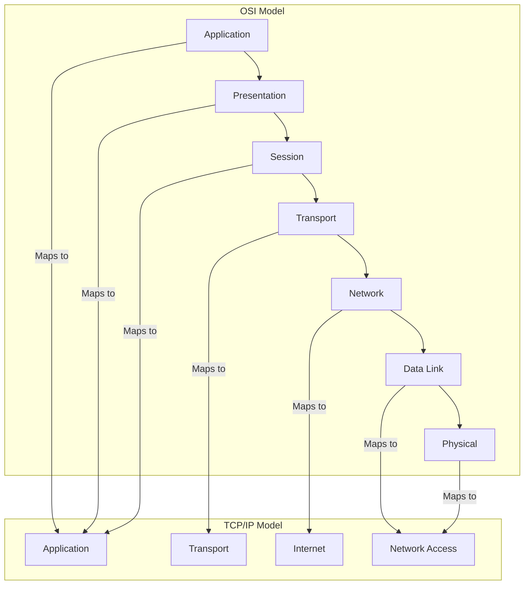

---

## ✅ **Detailed Note: Why TCP/IP is More Practical**

The **TCP/IP model** (Transmission Control Protocol / Internet Protocol) is widely used in real-world networking due to its practicality, simplicity, and direct alignment with how modern networks—including the Internet—operate.

### Key Reasons TCP/IP is more practical:

1. **Adopted in Real Networks**
   TCP/IP is the foundation of the Internet and nearly all networking implementations today. It provides protocols that are tested, standardized, and scalable.

2. **Fewer Layers = Simpler Implementation**
   The TCP/IP model has 4 layers, whereas the OSI model has 7. This makes TCP/IP easier to understand and implement.

3. **Protocol-Oriented vs Theoretical Approach**
   OSI is conceptual and designed as a reference model, while TCP/IP was developed based on practical needs and is protocol-driven, covering everything from addressing to data delivery.

4. **Interoperability and Flexibility**
   TCP/IP supports a wide variety of technologies and networks. It is adaptable, extensible, and resilient, making it ideal for the rapidly evolving Internet.

5. **Focus on End-to-End Communication**
   TCP/IP emphasizes host-to-host communication, routing, and transport reliability, which are central to practical network operations.

6. **Better Suited for Troubleshooting**
   Since TCP/IP closely reflects actual implementations, troubleshooting tools (like `ping`, `traceroute`, `netstat`, etc.) are designed to work at TCP/IP’s layers.

---

## ✅ **OSI Model vs TCP/IP Model – Comparison Table**

| Aspect                | OSI Model                                                                       | TCP/IP Model                                         |
| --------------------- | ------------------------------------------------------------------------------- | ---------------------------------------------------- |
| Number of Layers      | 7 (Application, Presentation, Session, Transport, Network, Data Link, Physical) | 4 (Application, Transport, Internet, Network Access) |
| Approach              | Theoretical reference model                                                     | Practical protocol suite                             |
| Developed by          | ISO                                                                             | Department of Defense (DoD)                          |
| Implementation        | Not always implemented as described                                             | Widely implemented in real-world networks            |
| Layer Separation      | Strictly defined boundaries                                                     | More flexible, layers overlap in practice            |
| Focus                 | Process communication framework                                                 | Host-to-host communication                           |
| Troubleshooting Tools | Less directly aligned                                                           | Aligned with real protocols (ping, traceroute, etc.) |
| Interoperability      | Designed but complex                                                            | Highly interoperable                                 |
| Use Case              | Teaching, standardizing protocols                                               | Actual Internet and network design                   |
| Reliability Features  | Conceptual                                                                      | Protocol-specific mechanisms (TCP for reliability)   |

---

## ✅ **Mermaid Diagram for OSI and TCP/IP Models**

---

## ✅ **Layer Mapping Explanation**

* **Application Layer (TCP/IP)** combines the **Application, Presentation, and Session layers** of OSI.
* **Transport Layer (TCP/IP)** is the same as the **Transport Layer of OSI**, handling end-to-end delivery.
* **Internet Layer (TCP/IP)** corresponds to the **Network Layer of OSI**, focusing on addressing and routing.
* **Network Access Layer (TCP/IP)** encompasses both the **Data Link and Physical layers** from OSI, dealing with hardware communication.

---

## ✅ **Conclusion**

The TCP/IP model is preferred for practical networking because it’s simpler, aligns with real-world protocols, and is extensively supported across platforms. The OSI model remains useful for conceptual understanding but is not widely implemented as-is. TCP/IP’s fewer layers and protocol-driven design make it easier to learn, implement, and troubleshoot, especially for challenges and labs in network education and industry environments.

Let me know if you want:
✔ A deep dive into specific layers
✔ Troubleshooting scenarios for TCP/IP
✔ Tools mapping to TCP/IP layers
✔ Detailed explanation of TCP vs UDP, IP addressing, etc.
