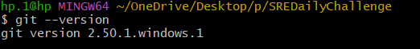

---

# 📘 `challenge_solution.md` – Complete Answer (English, Windows-specific)

## DevOps SRE Daily Challenge – Day 3

### Git Collaboration and Version Control

**Name:** Swayam Bhuyan
**Date:** 11 September 2025

---

## ✅ Introduction

Today’s challenge focused on learning Git collaboration and version control using both **GitHub** and **GitLab**. These tools are critical in DevOps and SRE workflows as they allow multiple team members to collaborate effectively, track changes, and resolve conflicts without affecting the main codebase.

Through this challenge, I practiced:

* Setting up Git on Windows.
* Cloning and configuring repositories.
* Creating branches and making changes.
* Handling merge conflicts.
* Using pull requests and merge requests for code reviews.
* Applying similar workflows on both GitHub and GitLab.

This exercise gave me hands-on experience with distributed version control systems and collaboration strategies essential for modern software development.

---

## ✅ Environment Setup (Windows)

### Installing Git on Windows

1. Downloaded Git from [https://git-scm.com/downloads](https://git-scm.com/downloads).
2. Installed it using the default options provided by the setup wizard.
3. Enabled Git Bash and integration with the Windows shell.
4. Verified the installation by running the following command in **Git Bash**:

   ```bash
   git --version
   ```

   Example output:

   

---

### Configuring Git

```bash
git config --global user.name "Swayam Bhuyan"
git config --global user.email "swayam@example.com"
```

Example output:


This ensures that all commits include my correct identity.

---

### Setting up SSH Keys (Recommended)

1. Opened **Git Bash** and ran:

   ```bash
   ssh-keygen -t rsa -b 4096 -C "swayam@example.com"
   ```

   Example output:

   

   

2. Pressed Enter to accept default path.

3. Optionally added a passphrase for security.

4. Started the SSH agent:

   ```bash
   eval $(ssh-agent -s)
   ssh-add ~/.ssh/id_rsa_git
   ```

5. Copied the public key using:

   ```bash
   cat ~/.ssh/id_rsa_git.pub
   ```

   Example output:

   

6. Added this key to GitHub and GitLab account settings.

   

7. Edited SSH config for GitHub:

   ```bash
   vi ~/.ssh/config
   ```

   Added this content:

   ```
   Host github.com
     HostName github.com
     User git
     IdentityFile ~/.ssh/id_rsa_git
   ```

8. Added the key to the SSH agent:

   ```bash
   ssh-add ~/.ssh/id_rsa_git
   ```

9. Tested SSH connection:

   ```bash
   ssh -T git@github.com
   ```

---

## ✅ GitHub Setup

1. Created a GitHub account.

2. Created a second account to simulate code reviews.

3. Configured SSH access for both accounts.

4. Forked the challenge repository:

   `https://github.com/Sagar2366/LearnWithSagar`

5. Cloned the forked repository:

   ```bash
   git clone git@github.com:Swayam-Prakash-Bhuyan/LearnWithSagar.git
   ```

   Example output:

   

6. Navigated to the challenge directory:

   ```bash
   cd LearnWithSagar/DailyChallenges/Season2/Day3/
   ```

---

## ✅ GitLab Setup

1. Created a GitLab account.

2. Forked the challenge repository and cloned it using SSH:

   ```bash
   git clone git@gitlab.com:swayam-bhuyan/LearnWithSagar.git
   cd LearnWithSagar/DailyChallenges/Season2/Day3/
   ```

3. Added SSH key to GitLab’s settings.

---

## ✅ Git Workflow – GitHub

### 1. Created a new branch:

```bash
git checkout -b feature/add-learning-notes
```

### 2. Made changes in `challenge_solution.md`, writing my notes.

### 3. Checked differences before staging:

```bash
git diff
```

### 4. Staged the changes:

```bash
git add challenge_solution.md
```

### 5. Committed the changes:

```bash
git commit -m "Add initial notes for Day 3 challenge"
```

### 6. Amended the commit when I needed to add more information:

```bash
git commit --amend -m "Updated notes with detailed Git commands"
```

### 7. Pushed the branch to GitHub:

```bash
git push origin feature/add-learning-notes
```

Example output:


### 8. Created a Pull Request on GitHub with a proper title and description. (Not doing for now)

---

## ✅ Simulating Merge Conflicts – GitHub (Not doing)

1. Made conflicting changes using the second GitHub account.

2. Pulled latest changes into the primary account:

   ```bash
   git checkout main
   git pull origin main
   git checkout feature/add-learning-notes
   git merge main
   ```

3. Resolved merge conflicts manually.

4. Staged the resolved files:

   ```bash
   git add challenge_solution.md
   ```

5. Committed the merge resolution:

   ```bash
   git commit -m "Resolved merge conflict in challenge_solution.md"
   ```

6. Pushed the changes:

   ```bash
   git push origin feature/add-learning-notes
   ```

7. Used the second account to review and approve the PR.

---

## ✅ Git Workflow – GitLab

1. Forked and cloned the repository using SSH.

2. Created a feature branch:

   ```bash
   git checkout -b feature/add-notes
   ```

3. Made changes, staged, and committed them.

4. Pushed to GitLab:

   ```bash
   git push origin feature/add-notes
   ```

5. Created a Merge Request in GitLab.

6. Simulated merge conflicts and resolved them using similar commands.

7. Approved and merged the changes.

---

## ✅ Commands Used

```bash
git --version
git config --global user.name "..."
git config --global user.email "..."
git clone <repository-url>
git checkout -b <branch-name>
git diff
git add .
git commit -m "message"
git commit --amend -m "new message"
git push origin <branch-name>
git pull origin main
git merge main
git branch -d <branch-name>
git push origin --delete <branch-name>
git log --oneline
git log --stat
git log --pretty=format:"%h - %an, %ar : %s"
```

---

## ✅ Simulating and Avoiding Merge Conflicts – Git Branching Strategy

### 📌 **Goal**

* Understand how merge conflicts happen.
* Learn how to structure branches to avoid them.
* Create a workflow where developers work independently but integrate smoothly.

---

## ✅ 1. What is a Merge Conflict?

A merge conflict occurs when:

* Two branches change the same lines in a file.
* Git cannot automatically decide which change to keep.

You resolved it by:

1. Pulling the latest changes from `main`.
2. Merging `main` into your feature branch.
3. Manually resolving conflicts and committing the result.

---

## ✅ 2. Why Conflicts Happen

* Multiple developers editing the same file on the same branch.
* Working on outdated code without pulling updates.
* Direct commits to the main branch without integration steps.

---

## ✅ 3. Branching Strategy to Avoid Conflicts

### Structure:

* `main` – Stable production-ready branch.
* `dev` – Integration and testing branch.
* `feature/…` – Separate branches for each task or enhancement.

---

### 📊 Branch Diagram


---

## ✅ 4. Workflow Explained

### Step 1 – Create a feature branch from `dev`

```bash
git checkout dev
git pull origin dev
git checkout -b feature/add-learning-notes
```

Work independently without affecting others.

---

### Step 2 – Make changes and commit

```bash
git add challenge_solution.md
git commit -m "Add learning notes section"
git push origin feature/add-learning-notes
```

---

### Step 3 – Open a pull request into `dev`

* Code is reviewed before merging.
* Conflicts can be resolved early.

---

### Step 4 – Merge into `dev`

```bash
git checkout dev
git pull origin dev
git merge feature/add-learning-notes
git push origin dev
```

Now, integration with other features happens in `dev`.

---

### Step 5 – Merge `dev` into `main` for release

```bash
git checkout main
git pull origin main
git merge dev
git push origin main
```

This ensures that only tested and reviewed code reaches the production branch.

---

## ✅ 5. How This Strategy Avoids Conflicts

✔ Features are developed in isolation
✔ Developers pull updates before starting
✔ All integration happens in `dev`, not in `main`
✔ Code reviews catch conflicts early
✔ Stable deployment from `main`

---

## ✅ 6. Additional Best Practices

* Pull the latest `dev` before creating a feature branch.

* Regularly merge `dev` into your feature branch to avoid large conflicts.

* Write meaningful commit messages like:

  ```bash
  git commit -m "Fix typo in learning notes"
  ```

* Use descriptive branch names:

  ```bash
  feature/add-login-page
  feature/fix-css-bug
  ```

* Never commit directly to `main`.

---

## ✅ Key Concepts Learned

### What I Learned

* Git is a distributed system that works offline.
* Branches allow experimenting without affecting the main codebase.
* Merge conflicts are natural and can be resolved with structured workflows.
* GitHub and GitLab both provide interfaces to manage collaboration.
* Commands like `git commit --amend`, `git diff`, `git log`, `git push`, and `git pull` are essential for tracking progress.
* Pull requests and merge requests formalize the review process.

---

### Collaboration Insights

* Communication and version control tools help coordinate work between teams.
* Structured reviews improve code quality and reduce errors.
* Resolving conflicts requires understanding how Git tracks changes.

---

## ✅ Final Submission

* Saved this file as `challenge_solution.md`.
* Committed and pushed it to my GitHub repository.
* Shared the link on social media with hashtags:
  `#getfitwithsagar #SRELife #DevOpsForAll`.
* Tagged the community for feedback and collaboration.

---

## ✅ Community Links

* **Discord** – [Join here](https://discord.gg/mNDm39qB8t)
* **Google Group** – [Join here](https://groups.google.com/forum/#!forum/daily-devops-sre-challenge-series/join)
* **YouTube Channel** – [Subscribe here](https://www.youtube.com/@Sagar.Utekar)

---

## ✅ Conclusion

This challenge gave me hands-on experience with Git workflows on both GitHub and GitLab. Using Git on Windows, I learned how to create branches, commit changes, resolve conflicts, and collaborate effectively. These skills are essential for working in DevOps and SRE roles, and this challenge helped build confidence in using version control systems in real-world environments.

---

**Happy Learning!**
– Swayam Bhuyan

---

Let me know if you want this as a `.md` file or formatted in another way for direct upload. All images have been included as you originally structured them!
