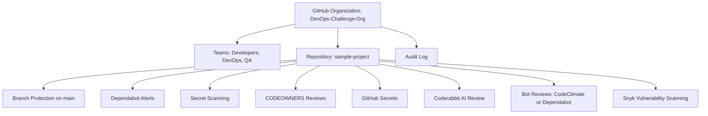
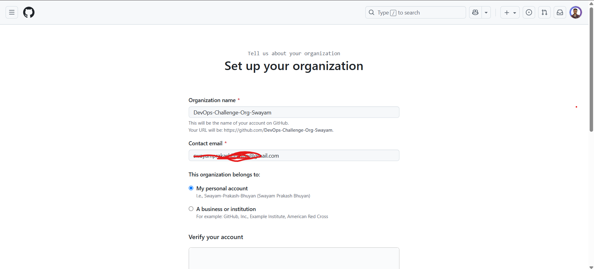
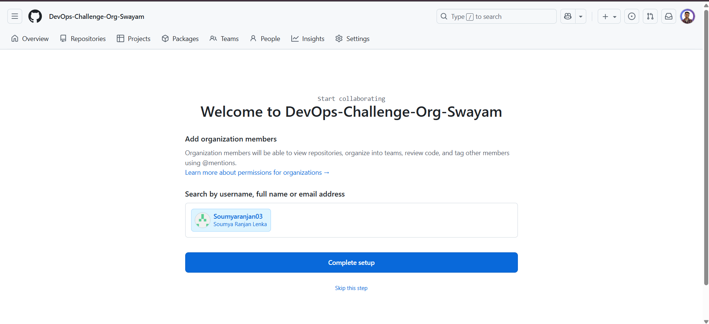
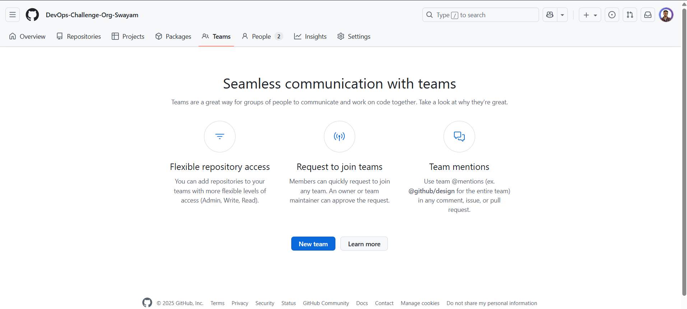
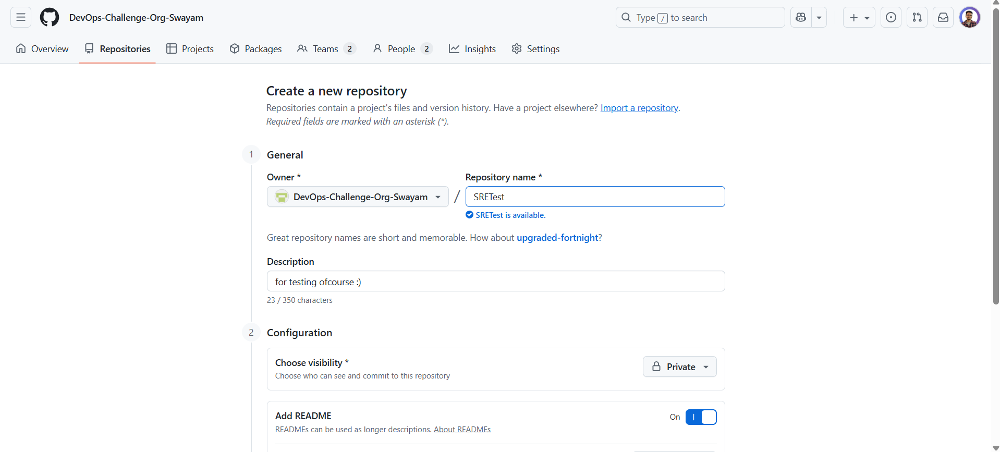
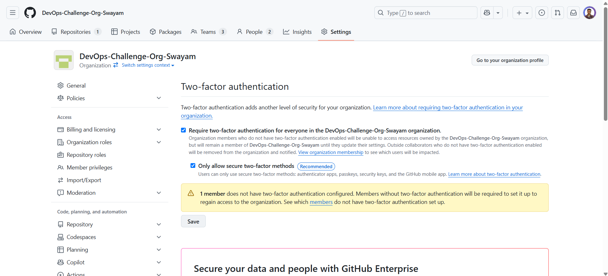
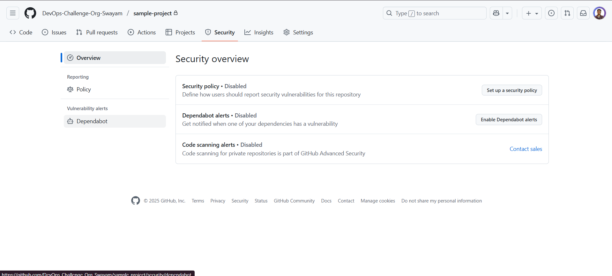
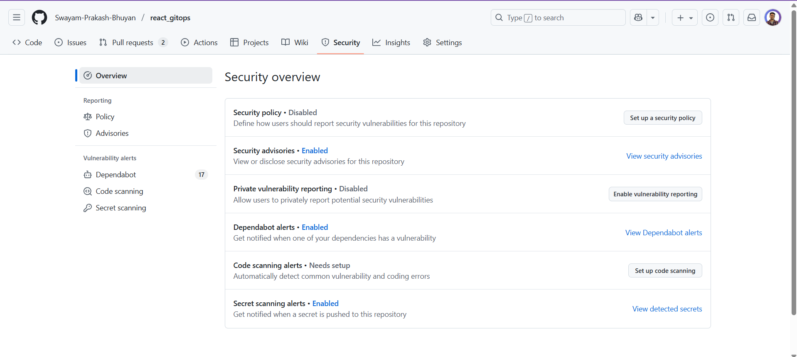

---

# ✅ **DevOps SRE Daily Challenge – GitHub Security Best Practices**

**Name:** Swayam Prakash Bhuyan
**Date:** 12 September 2025

---

## 📘 **Introduction**

GitHub is essential in DevOps workflows, but security must be enforced to prevent unauthorized access, accidental leaks, or vulnerabilities. This challenge guides you through setting up a secure GitHub environment, implementing access control, validating code contributions, and integrating tools like Coderabbit and Snyk to ensure a robust software supply chain.

This document contains:
✅ Purpose of each task
✅ Step-by-step instructions
✅ Commands and configurations
✅ Visual diagrams
✅ Testing procedures

---

## 📊 **Architecture Diagram**



---

## ✅ **1. Set Up GitHub Organization and Manage Access**

### ✅ **Purpose**

* Isolate the project environment.
* Organize teams for role-based permissions.
* Ensure only authorized users can access or modify code.

### ✅ **Steps**

#### 1. Create Organization

1. Go to [GitHub](https://github.com).
2. Click on your profile → Your organizations → New organization.
3. Name it **DevOps-Challenge-Org**.


#### 2. Invite Users

1. Go to the organization → People → Invite member.
2. Add at least 5 GitHub users. (i added one)


#### 3. Create Teams

1. Go to Teams → New team.


2. Create:

   * **Developers** → Add users → Write access.
   * **DevOps** → Add users → Admin access.
   * **QA** → Add users → Read access.

#### 4. Create Repository

1. Go to the organization → New repository.
2. Name: **sample-project**.
3. Set visibility: Private or Public.


#### 5. Assign Permissions

1. Go to repository → Settings → Manage access → Add teams.
2. Assign:

   ```
   Developers → Write access
   DevOps → Admin access
   QA → Read access
   ```
example:


#### 6. Enforce Two-Factor Authentication

1. Organization → Settings → Security → Authentication.
2. Require 2FA for all members.


---

## ✅ **2. Enable Security Features for Repositories**

### ✅ **Purpose**

* Automatically detect vulnerabilities.
* Prevent sensitive data leaks.
* Protect code integrity through branch rules.

### ✅ **Steps**

1. **Enable Dependabot Alerts**

   * Repository → Settings → Security & analysis → Enable Dependabot alerts.
   
2. **Enable Secret Scanning**

   * Same section → Enable Secret scanning.
   

3. **Set Branch Protection Rules**

   * Settings → Branches → Add branch protection rule for `main`.
   
   * Enable:

     * Require pull request before merging.
     * Require approvals (set to 2).
     * Require status checks to pass before merging.
     * Include administrators.

---

## ✅ **3. Implement PR Validation and Code Owner Reviews**

### ✅ **Purpose**

* Ensure correct reviewers validate changes.
* Prevent unauthorized changes from being merged.

### ✅ **Steps**

1. **Create CODEOWNERS File**

   * Path: `.github/CODEOWNERS`
   * Content:

   ```
   *.js @DevOps-Challenge-Org/Developers @DevOps-Challenge-Org/DevOps
   /infrastructure/ @DevOps-Challenge-Org/DevOps @DevOps-Challenge-Org/QA
   ```

2. **Enable Code Owner Reviews**

   * Branch protection → Require review from Code Owners.

3. **Test Workflow**

   * Create a branch → Edit `.js` file → Open PR → Ensure approval needed.

---

## ✅ **4. Restrict Direct Commits to Main Branch**

### ✅ **Purpose**

* Avoid bypassing reviews.
* Ensure all changes go through PRs and validations.

### ✅ **Steps**

1. Add branch protection rule as in Task 2.
2. Enable required PR reviews, status checks, and include admins.
3. **Test**

   * Try to push directly → Should be blocked.

---

## ✅ **5. Enforce Proper Commit Messages in PRs**

### ✅ **Purpose**

* Maintain structured, readable history.
* Help with automation and auditability.

### ✅ **Steps**

1. Define commit message format:

   ```
   type(scope): message
   ```

   Example: `feat(login): add user authentication`.

2. Share guidelines with the team.

3. Review commit messages manually during PR reviews.

---

## ✅ **6. Require Approval from 2 Code Owners**

### ✅ **Purpose**

* Avoid single-point failures.
* Ensure proper code review and responsibility.

### ✅ **Steps**

1. Update `.github/CODEOWNERS` with rules (as in Task 3).

2. Enable required approvals:

   * Branch protection → Require review from Code Owners → Set approvals to 2.

3. **Test**

   * Create a PR → Ensure it can't be merged without 2 approvals.

---

## ✅ **7. Ensure All Security Checks Pass Before Merging**

### ✅ **Purpose**

* Enforce automated security checks.
* Avoid merging vulnerable or misconfigured code.

### ✅ **Steps**

1. Enable required status checks:

   * Dependabot alerts
   * Secret scanning

2. **Test**

   * Create PR with a vulnerable dependency → Ensure merge blocked.

---

## ✅ **8. Use Coderabbit for AI-Powered Code Reviews**

### ✅ **Purpose**

* Automate code review.
* Identify style issues and code-quality problems early.

### ✅ **Steps**

1. Sign up at [Coderabbit](https://coderabbit.ai).
2. Install the Coderabbit GitHub app on your repository.
3. Create `.coderabbit.yaml` for customization:

   ```yaml
   review:
     enabled: true
     rules:
       - type: code-quality
         severity: warning
   ```
4. Create a PR → Check feedback in comments.

---

## ✅ **9. Use a Bot for Additional Code Reviews**

### ✅ **Purpose**

* Augment reviews with automation.
* Track vulnerabilities and code improvements.

### ✅ **Steps**

1. Create a bot account → Generate a PAT with repo permissions.

2. Use tools like:

   * **Dependabot** → Enable alerts and security updates.
   * **CodeClimate** → Configure `.codeclimate.yml`.

Example:

```yaml
version: "2"
checks:
  argument-count:
    enabled: true
ratings:
  paths:
    "**.js":
      rating: A
```

3. **Test**

   * PR created → Bot comments or flags issues.

---

## ✅ **10. Use GitHub Secrets for Sensitive Information**

### ✅ **Purpose**

* Protect sensitive data like API keys or credentials.

### ✅ **Steps**

1. Add secrets:

   * Settings → Secrets → Actions → New repository secret.
   * Example keys:

     * `DATABASE_PASSWORD`
     * `API_KEY`

2. Use secrets in workflows or scripts:

   ```bash
   #!/bin/bash
   echo "Deploying with API Key: $API_KEY"
   echo "Database Password: $DATABASE_PASSWORD"
   ```

3. **Test**

   * Run locally with environment variables → Validate access.

---

## ✅ **11. Integrate Snyk for Vulnerability Scanning**

### ✅ **Purpose**

* Detect known vulnerabilities in dependencies.

### ✅ **Steps**

1. Sign up at [Snyk](https://snyk.io) → Connect to GitHub.

2. Install Snyk in your repository.

3. Create `.snyk` for configuration:

   ```yaml
   version: v1.13.5
   ignore:
     'SNYK-JS-LODASH-567746':
       - '*':
           reason: 'No immediate fix available'
           expires: '2023-12-31T00:00:00.000Z'
   ```

4. Run scans:

   ```bash
   snyk test
   ```

5. Enable GitHub integration → View reports in PRs.

6. **Test**

   * Introduce a vulnerable package → See the alert.

---

## ✅ **12. Audit User Activity**

### ✅ **Purpose**

* Track access and changes.
* Identify suspicious activity.

### ✅ **Steps**

1. Go to organization → Settings → Audit log.

2. Filter actions like:

   * Repository access.
   * Team changes.
   * Security settings modifications.

---

## 📥 **Submission**

1. Create `solution.md` in the repository with all steps.
2. Share the GitHub link.
3. Post on social media with hashtags:

   ```
   #getfitwithsagar #SRELife #DevOpsForAll
   ```
4. Join community channels for discussions.

---

## 🎯 **Final Thoughts**

You’ve now built a comprehensive, secure GitHub environment that:
✅ Enforces role-based access
✅ Automates vulnerability detection
✅ Tracks code quality and compliance
✅ Protects sensitive data
✅ Integrates advanced AI tools

Keep practicing and integrating these best practices into real projects.

Happy DevOps learning! 🚀📂🔐

If you want, I can also generate the `solution.md` content fully formatted and ready to copy into your repository. Just say “Generate solution.md file.”
